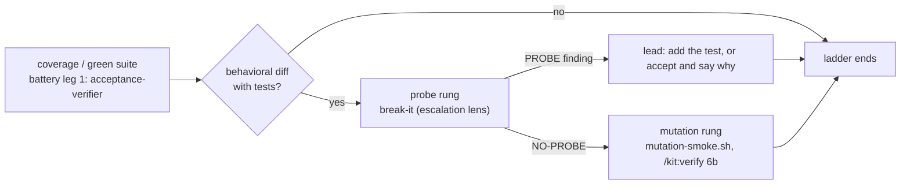

# Decision Brief: break-it (adversarial prober lens)

Board: ID-643. Source: Thoughtworks Future of Software Engineering Europe 2026 report, the
verification ladder for an AI-written suite: run coverage, then have an agent actively try to
break the code WITHOUT breaking any test, then apply mutation testing.

## Verdict: BUILD

## Core thesis

A green suite proves the tests ran, never that they constrain the code; a read-only agent that
must name one concrete input the suite does not constrain turns "green" into a falsifiable claim.

## Strongest argument for

The kit has no probe rung. `lib/gate/mutation-smoke.sh` asks a narrower question (does a mutated
CHANGED LINE keep the suite green), from a small fixed operator set, on changed hunks only. It
cannot find an unconstrained INPUT: an empty string, a path with `..`, a second call after the
first, a boundary at zero, an ordering the tests never exercise. The battery's other arms are
structurally blind to this too: the verifier trusts a green result, the reviewers read statically
for defects, the advisor looks for cross-artifact drift. None asks "what would still pass?"

## Strongest argument against

Precision, not compute, is the bottleneck. A prober told to find something will always find
something. A battery that emits a speculative probe every run trains the lead to skip the section,
which is the impact-vs-noise tax the kit already recorded against its advisory gates. The lens is
worth building only if `NO-PROBE` is a first-class, respectable verdict and a finding must carry a
concrete input plus expected-vs-observed plus the test file it claims does not constrain it.

## If BUILD: recommended scope for v1

One read-only agent definition (`agents/break-it.md`, the `code-reviewer` tool roster), one output
grammar, dispatched from `/kit:battery` as an escalation-tier lens on the branch diff and its
tests, sequenced after the acceptance arm and before mutation-smoke. The lead decides per finding:
add the test, or accept and say why. No test generation, no probe execution harness, no new ledger
verb, no metrics plane.

## What gets cut

1. Automatic test generation from a finding. The board row is explicit: the lead adds the test or accepts.
2. A probe execution harness. The agent may run the existing suite; it builds no fuzzer and executes no arbitrary input.
3. A scoring or metrics plane for probe yield. The battery report line carries the count; nothing new is persisted.

## What breaks at scale

The false-positive tax, before any performance limit. Ten battery runs producing ten speculative
probes cost the lead more attention than the one real hole saves. The guard is the finding
contract, not a rate limit: no concrete input means no finding.

## North-star alignment

Serves N3 (quality is test-first, shaped per type, and proof-stored): the probe attacks the
evidence a proof rests on. Conflicts with none. It stays advisory, so ADR-0024's
advisory-mid / hard-at-ship boundary is intact.

## Exit criteria

Over the next 10 battery runs on behavioral branches: at least 1 probe finding the lead converts
into a test, and `NO-PROBE` returned on at least half of them. A lens that never returns NO-PROBE
is crying wolf; a lens that never finds a probe is ceremony. Both numbers read off the battery
report lines.

## Survival scenarios

<!-- scenario-gen: guarantee inversion on "the lens names a real hole or honestly says there is none" -->

| # | Scenario | Category |
|---|---|---|
| 1 | The branch has no tests at all, so every input is unconstrained and the lens could enumerate forever | guarantee inversion (a finding is specific) |
| 2 | The diff is docs, config, or prose only, with no behavior to probe | guarantee inversion (there is something to break) |
| 3 | The probe the lens finds is already recorded as an accepted limitation in the spec's non-goals | guarantee inversion (a finding is news) |
| 4 | The lens reports a probe the suite does cover, in a test file it never opened | guarantee inversion (the lens read the tests) |
| 5 | Battery runs against a foreign PR target whose suite cannot run in this environment | guarantee inversion (observed behavior was observed) |

---

> **Design lane note.** This beat ran under bypassPermissions in an unattended worker, where
> `AskUserQuestion` auto-resolves. The per-section approval loop therefore did not happen. Every
> call below is settled with its rejected alternatives stated, so the operator can overturn any of
> them by reading one section rather than re-running the lane.

## Solution

### Approaches considered

| # | Approach | Trades away |
|---|---|---|
| A | break-it as a permanent fourth battery leg, dispatched on every run | Pays the probe cost and the false-positive tax on docs-only and config-only branches, against battery's own contract that specialized lenses escalate per diff |
| B | break-it as an escalation-tier lens in battery's `## Lens escalation` table, triggered by a behavioral diff that carries tests | Nothing material; the operator must not skip a qualifying lens silently, which battery already states as a rule |
| C | break-it as a deterministic script under `lib/gate/`, a sibling of `mutation-smoke.sh` | The work is judgment, not a fixed operator set. Bash cannot invent an unconstrained input. ADR-0029 also holds that every review is an agent |

### Chosen approach + why

**B.** One read-only agent (`agents/break-it.md`, the `code-reviewer` tool roster, `model: opus`
because inventing a probe is the hardest reasoning in the battery), dispatched from
`/kit:battery` when the diff carries behavioral code and tests. It reads the branch diff, the
tests that claim to cover it, and the spec's non-goals, then returns either a `PROBE` finding or
an explicit `NO-PROBE` naming what it tried.

### The sequencing decision (load-bearing)

`mutation-smoke.sh` is invoked today from `commands/verify.md` Step 6b, not from battery. Two ways
to put the probe rung before it:

| # | Option | Verdict |
|---|---|---|
| S1 | Add a `mutation-smoke.sh run` call to battery, after break-it | REJECTED. A second call site for one advisory gate, two engines for one check, and it re-scopes SPEC-131's wiring |
| S2 | break-it lands in battery; battery prints the rung ladder and names mutation-smoke as the NEXT rung, owned by `/kit:verify` Step 6b, to be run only after break-it returns NO-PROBE | CHOSEN. Single engine, one call site, prose-invoked exactly like the gate it sequences against |

**Residual hazard, deliberately left open.** A cycle that runs `/kit:verify` before `/kit:battery`
inverts the ladder. The deterministic fix (make Step 6b skip when the rid carries no break-it
verdict) would turn an advisory gate into a conditional block, which is the operator's call under
ADR-0024, not this spec's. Recorded as an open question.

**What "apply mutation testing only if probing succeeds" means here.** Probing SUCCEEDS when the
code survives it: verdict `NO-PROBE`. A `PROBE` finding means the suite has a proven hole, so the
ladder stops, the lead adds the test or accepts, and mutation-smoke runs on the next pass. The
reading is the cost-ladder one: do not spend the expensive rung on code already known to be
under-constrained. Flagged for the operator.

### Interfaces (the output contract)

A finding, in the battery's finding grammar, carrying the `probe:` finding-key prefix (the
convention `advisor.md` established with `stale-adr:`):

```
PROBE: the suite does not constrain <X>
  probe:            <the concrete input or call sequence>
  expected:         <what the spec, docstring, or contract promises>
  observed:         <what the code does>      | UNVERIFIED: <why the suite could not run>
  unconstrained-by: <test-file>:<line>        (the nearest test that should have caught it)
  severity:         HIGH | MEDIUM | LOW
```

Or, when the code survives:

```
NO-PROBE
  tried:            <one line per probe family attempted>
  constrained-by:   <test-file>:<line> per family that the suite does pin
```

A candidate with no concrete input is not a finding. Speculation is dropped, not downgraded.

### Extensibility & boundaries

The load-bearing dimension is the probe-family checklist, and it grows by editing one list in one
agent file. The lens owns no state, adds no ledger verb, and writes nothing: battery records its
result inside the existing `battery` gate line. Removing the lens is deleting one file and one
table row.

## Design

### Diagram



### ADR link(s)

- ADR-0028 (autonomous-loop hardening): P5 established the additive extra-lens pattern this lens copies, and the meta-agent-builds / effectiveness-validator-trusts loop that gates it.
- ADR-0029 (review function naming and form): every review is an agent; `break-it` is a named-noun lens like `advisor`, not an `-er`-suffixed reviewer of one artifact class.
- ADR-0024 (gate-ledger and ship enforcement): the lens is advisory mid-flight and records under the existing `battery` gate; it promotes nothing to a block.

## Failure modes

| Mode | Guard |
|---|---|
| Cries wolf: a speculative probe every run | No concrete input means no finding. `NO-PROBE` is a first-class verdict, not a failure to try |
| Reports a hole the tests already cover | The finding must cite the `unconstrained-by` test file it actually read |
| Reports a known accepted limitation | Check the spec's non-goals and the rejected-findings ledger before reporting |
| Asserts behavior it never observed | `observed:` becomes `UNVERIFIED: <why>` whenever the suite could not run, as on a foreign PR target |
| Enumerates forever on a branch with no tests | One line ("the branch carries no tests; every input is unconstrained"), then stop |

## Survival scenarios (carried forward from the think sketch)

All five rows survive the design unchanged; each now names the guard above that answers it. No row
was dropped.

## Brief-reviewer patch (2026-09-07)

The brief-reviewer returned FAIL:fixable against the pre-Design draft. Findings 1 (the
mutation-smoke sequencing was described but not wired), 2 (no escalation trigger named) and 5 (the
finding contract was conditional, not a requirement) are closed by the `## Solution` section above.
Two remain, closed here:

- **Model tier.** `opus`, against the kit's cheap-first default. Battery already runs its review leg at the high tier, and inventing an input the tests do not constrain is harder than reading a diff for known defect shapes. A cheap prober's failure mode is plausible speculation, which is the exact risk this lens is built to avoid.
- **Rejected-findings ledger.** break-it consults `docs/verification/rejected-findings.md` exactly as `advisor.md` does (SPEC-144): fail-open, whole-cell anchored on the finding-key, matched on the key and never on file path alone, with matches reported on a `Previously rejected:` line rather than dropped. This is the kit's own answer to the false-positive tax and there is no reason to build a second one.
