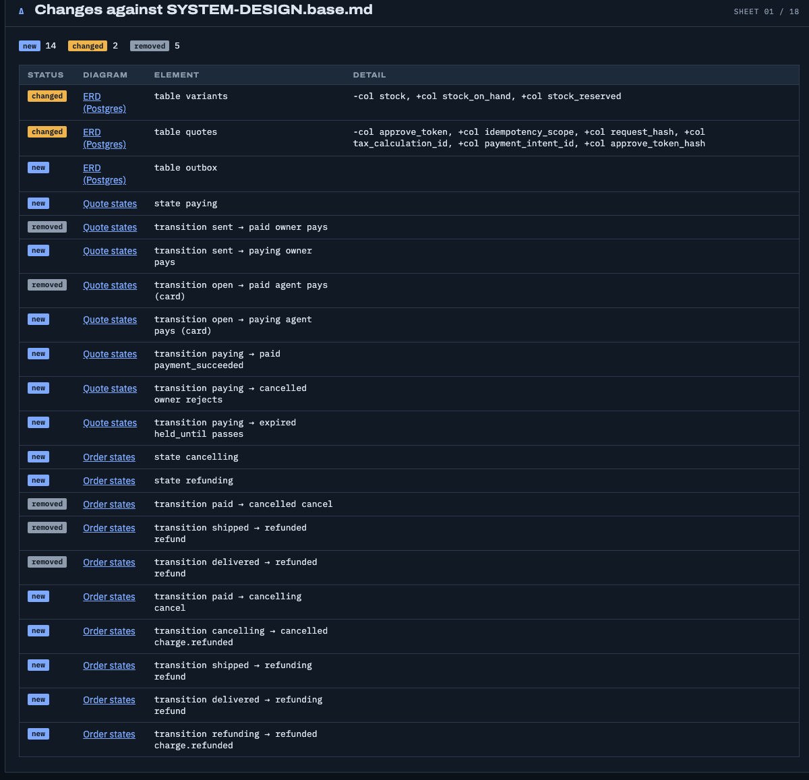
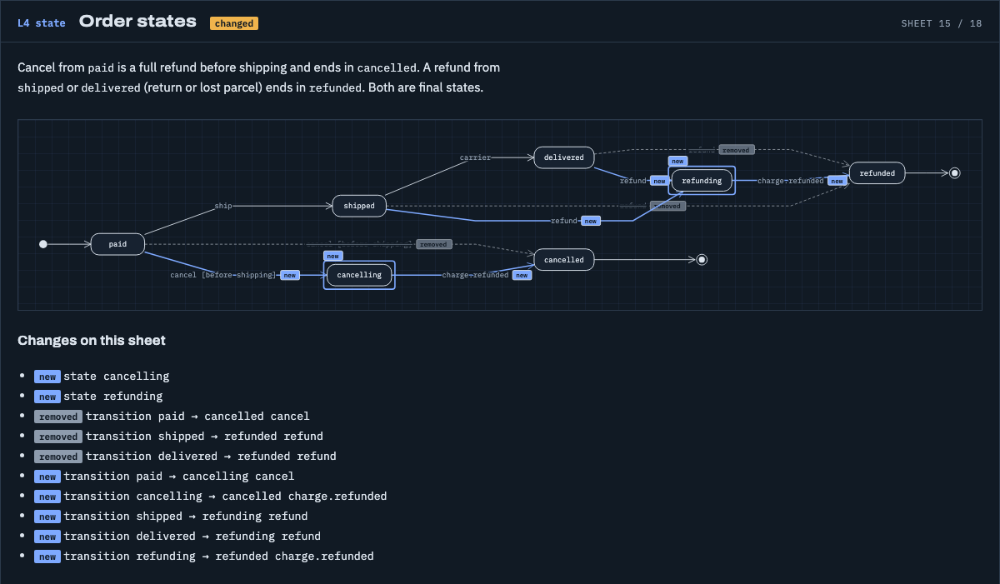
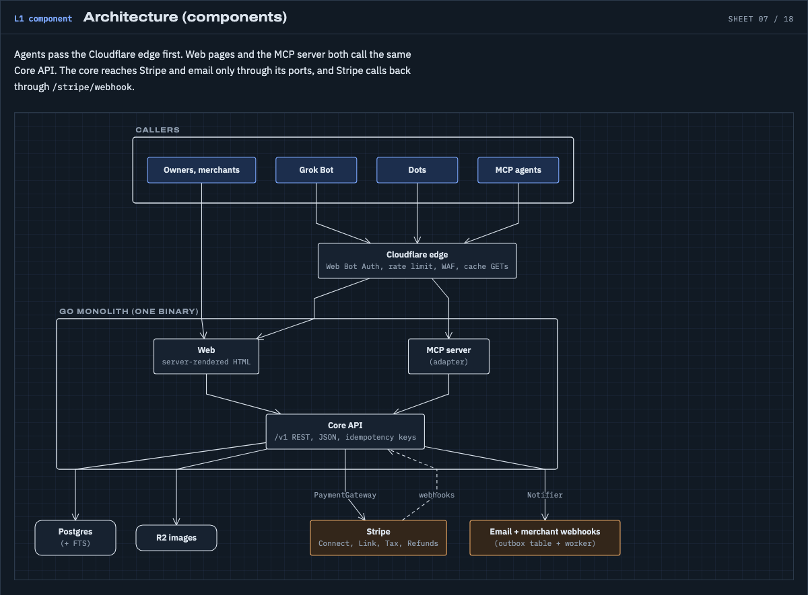
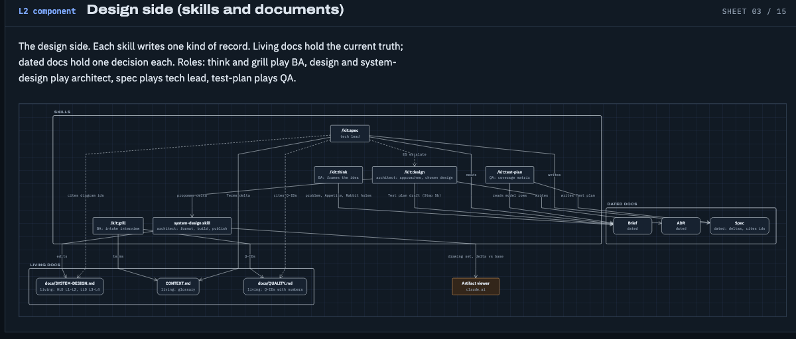

## dwarves-kit v2.3.0: design review as a diagram delta

Minor release. New commands and behaviour, no breaking change to a public surface. Full entry list: [docs/CHANGELOG.md](../CHANGELOG.md) under `[2.3.0]`.

### Headline: system design review (#961, #962)

`/kit:design` now reviews a feature design as a delta against the repo's `docs/SYSTEM-DESIGN.md`. The `system-design` skill renders the model as a UML drawing set and marks every element `new`, `changed` or `removed` against a base ref. The reviewer reads sheets, not prose. The approved delta then feeds two downstream steps: a draft test plan (E1, `commands/design.md` Step 5b) and a stop in `/kit:spec` when a feature touches L1 or L2 without an approved design (E5, `commands/spec.md` Step 3).

The sheets below come from the installed skill, `bash ~/.claude/skills/system-design/build`, on the marketplace example (with its base file) and on the design-process model. Screenshots are real renders, one element per sheet.

**Delta sheet (marketplace).** 14 new, 2 changed, 5 removed against `SYSTEM-DESIGN.base.md`.



**Order state machine with new and changed marks (marketplace).** `cancelling` and `refunding` are new states, the old direct `paid -> cancelled` and `refund` edges are shown dashed as removed.



**Architecture components (marketplace).** The L1 sheet that E5 guards.



**Component sheet (design-process).** The same renderer on a second, unrelated model, no base file.



#### E1: test plan drafted from the delta

After the user approves the diagram delta, Step 5b appends this section to the brief. One row per changed element, mapped by element kind, proof left `TBD`.

```markdown
## Test plan (draft from design)

| # | Changed element | Diagram id | Element key | Test kind | Proof |
|---|---|---|---|---|---|
| 1 | State transition | sm-order | transition paid -> cancelling (cancel, before shipping) | Transition case, plus one illegal sample for `cancelling` | TBD |
| 2 | State transition | sm-order | transition cancelling -> cancelled (charge.refunded) | Transition case | TBD |
| 3 | State transition | sm-quote | transition sent -> paying (owner pays) | Transition case, plus one illegal sample for `paying` | TBD |
| 4 | ERD constraint or key | schema | table variants (+col stock_on_hand, +col stock_reserved) | Constraint-violation case: reserved stock above on-hand stock is rejected | TBD |
| 5 | Component edge | architecture | edge core -> stripe (PaymentGateway) | Contract test | TBD |
```

Row 4 cites the changed columns because the example model declares no named constraint. Row 5 cites an edge that exists in both the base and the current model, so the delta sheet does not list it; it is a contract row on the new `paying` path, shown for the component-edge kind.

#### E5: the L1/L2 stop in `/kit:spec`

When the feature adds or changes an L1 or L2 element and the brief has no approved design for it, `/kit:spec` stops before it writes anything and routes back. The rule is in `commands/spec.md` Step 3. The message below shows its shape with an illustrative element.

```text
STOP: L1/L2 change without an approved design.
Feature: refund worker
Changes: architecture (L1/L2): new component `refund-worker`, new edge core -> refund-worker
Brief: docs/briefs/DECISION-BRIEF-refund-worker.md has no approved design for it.
Next: run /kit:design to record an ADR and the L1/L2 delta, then re-run /kit:spec.
Specs may add L3/L4 detail on their own; this change is above that line.
```

### Also in this release

- `wrap land --no-pull` never writes the main checkout; `wrap land` holds up to 300 s for late `pull_request` checks (#954, #947).
- `wrap` refuses to remove a worktree a live process still holds (#948).
- `board health`, `board brief`, `board hermes link|check`: a periodic board digest per cluster and a Hermes skill link with a stale-skill check (#941, #945, #946).
- `tests/run-all.sh --failed` and a no-weaken rule for the fix agent (#959).

### Deprecated

`bin/learn` forwards to `bin/reflect` for this one release (ADR-0036) and is removed from 2.4.0. Repoint any external caller to `bin/reflect` now.

### Upgrade

No migration. Re-run `install.sh` to pick up the new hooks and verbs. The release is not tagged yet: the tag push is the operator's step, as for 2.1.0 and 2.2.0.
