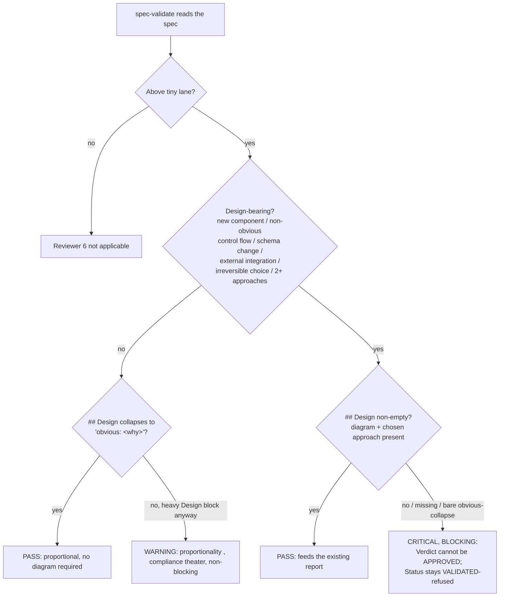

# Spec: Design record before build (understanding gate, before-half)
Generated: 2026-07-03
Status: VALIDATED
Lane: normal (touches `commands/spec.md`, `commands/spec-validate.md`, `commands/design.md`,
one `WORKFLOW.md` matrix row, tests/fixtures; no auth/data/hook/migration risk , same surface
class as SPEC-008, which used `normal` for the same two command files).

## Problem

ADR-0031 §1 ("The understanding gate", accepted 2026-07-03) names a gap the kit's own
retro surfaced: the pipeline runs `/kit:think` -> `/kit:spec` -> `/kit:spec-validate` ->
`/kit:execute`, and the only architecture-shaped content in a spec is a one-line hint --
`### Architecture (diagram if it helps)` under `## Solution` (SPEC-008's template). Nothing
requires the hint to be filled, nothing requires a diagram, and nothing stops a spec from
reaching `VALIDATED` with an empty architecture note even when the spec adds a new component,
changes a schema, or makes an irreversible call. The human ends up gating a diff, not a
diagram , exactly the failure ADR-0031 names ("does the human understand the change enough
to shape the next loop?").

This is the BEFORE half of the understanding gate (ADR-0031 §1). The AFTER half
(`/kit:explain` + quiz) is out of scope; SG-03/04 own it.

## Solution

### Approaches considered
1. **A new top-level `## Design` section in the SPEC.md template, required (non-empty) only
   when the spec is design-bearing, enforced by a new `/kit:spec-validate` reviewer.**
   Promotes the existing `### Architecture` hint out of `## Solution` into its own gated
   block. Mirrors SPEC-008's own A+B split (template scaffold + advisory reviewer), except
   this reviewer's finding is BLOCKING (per ADR-0031, `/kit:spec-validate` "refuses"
   VALIDATED), not merely advisory like Reviewers 1-5.
2. **Fold the diagram+ADR-link requirement into the existing `### Architecture` line, no new
   section.** Rejected: a sub-heading buried inside `## Solution` cannot carry its own
   proportionality collapse (`obvious: <why>`) or its own blocking check without conflating
   it with the Solution reviewer's (advisory) verdict; ADR-0031 names `## Design` as its own
   block explicitly.
3. **A new `/kit:design-check` command that runs standalone.** Rejected: adds a 14th command
   for a check that belongs inside the phase that already exists to gate the spec
   (`/kit:spec-validate`); duplicates the existing per-reviewer idiom for no benefit.

### Chosen approach + why
Approach 1. It reuses the exact scaffold-plus-reviewer shape SPEC-008 already proved works
for solution depth, adds one heading and one reviewer, and keeps the ADR's "refuses VALIDATED"
language literal (only Reviewer 6 in `/kit:spec-validate` can withhold the flip; Reviewers 1-5
stay advisory, unchanged). Approach 2 was rejected because the proportionality collapse
(`obvious: <why>`) needs its own top-level block to be checkable in isolation; approach 3 was
rejected as needless command sprawl.

### Extensibility & boundaries
- Load-bearing dimension: the design-bearing TRIGGER LIST (new component, non-obvious control
  flow, schema change, external integration, irreversible choice, 2+ approaches). Adding a
  new trigger is a one-line edit to the reviewer's checklist and the template comment; it does
  not touch the block's shape.
- Unit boundaries: the template edit (`commands/spec.md`) is pure scaffold (no enforcement
  logic); the enforcement (`commands/spec-validate.md` Reviewer 6) is the only place that can
  block; `commands/design.md` only SEEDS the block's content (diagram + ADR links) for specs
  that opt into the interactive lane. Each piece is independently readable without the others.

## Design
<!-- Dogfooding ADR-0031 §1: this spec is itself design-bearing (it changes a template's
     required structure, adds a blocking reviewer, and wires a downstream command , new
     control flow in /kit:spec-validate's decision path). -->

### Approaches considered + chosen
Same as `## Solution` above (approach 1, the scaffold + a blocking reviewer). Not
re-litigated here; the design view below is the CONTROL-FLOW shape of the new check itself.

### Diagram (flowchart , the reviewer's decision path)



### ADR link(s)
- ADR-0031 (`docs/decisions/0031-understanding-gate.md`) §1 is the decision this spec
  implements; §3 ("Firing modes") and the explainer/quiz half are out of scope here (SG-03/04).
- No new lasting/irreversible decision is introduced beyond what ADR-0031 already records;
  this spec is the implementation, not a new decision.

### Boundaries & failure modes
Touches the spec-authoring contract every downstream spec inherits (same blast radius as
SPEC-008), not data or an external integration, so a full failure-modes table is not owed.
Two boundaries worth naming:
- **Reviewer 6 only blocks on design-bearing + empty Design.** It never blocks on quality of
  the diagram, or on a non-design-bearing spec's Design content (that stays advisory, same as
  Reviewers 1-5). Blast radius: refusing a `VALIDATED` flip is reversible , the spec author
  fills the block and re-runs `/kit:spec-validate`.
- **A misclassified "design-bearing" call (false positive or false negative) is a calibration
  bug in Reviewer 6's own judgment, not a hard failure of the mechanism.** The PROPORTIONALITY
  CONTROL fixture (below) is the regression guard against the reviewer over-firing on
  genuinely obvious work.

## Technical Design

### Interfaces (I/O contract)
- **Consumes:** the spec's own `## Design` section text (present/absent/collapsed), plus the
  spec's `Lane:` header (to gate "above tiny").
- **Produces:** the existing `Spec Validation Report` gains a Reviewer 6 finding; the
  `VALIDATED` flip is conditioned on Reviewer 6 having no blocking finding, in addition to the
  existing report-approval step.
- **Invariant:** Reviewers 1-5 remain advisory (SPEC-008's contract, unchanged); only Reviewer
  6 can withhold `VALIDATED`. A tiny-lane spec never reaches this reviewer (no spec is written
  for tiny).

### Data model changes
None (markdown template + prompt-text changes only).

### API changes
None.

### UI changes
None.

### Infrastructure changes
None.

## After state
- [ ] `commands/spec.md`'s SPEC.md template carries a `## Design` section between `## Solution`
  and `## Technical Design`, with the design-bearing trigger list, a diagram-by-fit menu
      (sequence/state/ER/flowchart/C4-lite), an ADR-link sub-heading, and a
      boundaries/failure-modes sub-heading, plus the `obvious: <why>` collapse instruction.
      (Today: only a one-line `### Architecture (diagram if it helps)` hint exists, unenforced.)
- [ ] `commands/spec-validate.md` has a 6th reviewer ("Design Record Auditor") whose finding is
      explicitly BLOCKING (unlike Reviewers 1-5): a design-bearing spec with an empty/missing
      `## Design` cannot reach `VALIDATED`. (Today: 5 reviewers, all advisory.)
- [ ] `commands/design.md` (the opt-in `/kit:design` facilitator) asks for + records a diagram
      pick and ADR link(s) when the design is design-bearing, and appends them as a `## Design`
      section to `docs/specs/DECISION-BRIEF.md` alongside its existing `## Solution` append;
      `/kit:spec`'s Step 1 folds both into the new spec. (Today: `/kit:design` only ever writes
      `## Solution`.)
- [ ] `WORKFLOW.md`'s Lane×phase depth matrix carries one new row ("Design record
      (design-bearing, ADR-0031 §1)") naming the ceremony per lane, distinct from the existing
      "Design (opt-in)" row (the different, interactive `/kit:design` facilitator lane).
      (Today: no row names this gate's depth.)
- [ ] `bash tests/test-design-record.sh` passes all three named controls (below) plus the
      dotfiles `Design:` field diff is captured.
- [ ] `bash tests/test-meta.sh` stays green with the documented count delta.

## Acceptance Criteria (global)
- [ ] All tasks pass their individual acceptance criteria
- [ ] The 3 fixtures (refuse-empty NC, pass-with-diagram, obvious-collapse) are all green
- [ ] No regressions in `tests/test-meta.sh` or `tests/test-hooks.sh`
- [ ] Reviewers 1-5 in `/kit:spec-validate` are untouched (byte-diff limited to the new
      Reviewer 6 section + the Output-format note)

## Verification
```
bash tests/test-design-record.sh
bash tests/test-meta.sh
```

## Test plan

Coverage matrix (per ADR-0031 §1's three load-bearing claims):

| # | AC / claim | Fixture | Expected | Covers |
|---|---|---|---|---|
| 1 | a design-bearing spec with NO `## Design` block is refused `VALIDATED` | `tests/fixtures/design-record/design-bearing-empty.md` | reviewer-6 check FAILS (refusal marker present in spec-validate.md's own logic, asserted via a scripted grep+heuristic in the test harness since spec-validate is a prompt, not code) | NEGATIVE CONTROL (AC1) |
| 2 | a design-bearing spec WITH a mermaid diagram + chosen approach PASSES | `tests/fixtures/design-record/design-bearing-filled.md` | reviewer-6 check PASSES | AC1 (positive) |
| 3 | an obvious/tiny-shaped spec collapses `## Design` to one line and is NOT required to diagram | `tests/fixtures/design-record/obvious-collapse.md` | reviewer-6 check PASSES, no diagram demanded | PROPORTIONALITY CONTROL (AC2) |
| 4 | `commands/spec.md` template carries the new `## Design` section shape | structural grep on `commands/spec.md` | heading + sub-headings present | AC (template) |
| 5 | `commands/spec-validate.md` carries Reviewer 6 + the blocking language | structural grep on `commands/spec-validate.md` | Reviewer 6 heading + "refuses"/"blocking" language present | AC (enforcement) |
| 6 | `commands/design.md` wires diagram + ADR-link capture | structural grep on `commands/design.md` | diagram/ADR-link language present in Step 4/5 | AC (design lane wiring) |
| 7 | `WORKFLOW.md` carries the new Design-record row | structural grep on `WORKFLOW.md`'s depth matrix | row present, distinct from "Design (opt-in)" | AC (workflow row) |
| 8 | dotfiles subgoal-template gains a `Design:` field | manual diff captured in the report | field present | AC (dotfiles half) |

**COVERAGE-DELTA:** rows 1-3 exercise the actual DECISION the reviewer makes (real spec text
in, pass/refuse out) via a lightweight harness script since `/kit:spec-validate` is a prompt
command, not executable code, so the test asserts the STRUCTURAL contract (the section exists,
is non-empty, collapses correctly) rather than driving the LLM reviewer live , that is the
honest boundary of testing a prompt-based command, named rather than hidden. Deliberately NOT
covered: the reviewer's live LLM judgment quality (same limitation SPEC-008 already accepted
for Reviewers 1-5); a live run is review-verified in use, not unit-tested.

## Edge Cases
1. A spec predates this template (no `## Design` heading at all, like SPEC-001..121 pre-dating
   this change). Reviewer 6 treats a MISSING section the same as an EMPTY one for a
   design-bearing spec (blocking); for a non-design-bearing legacy spec, its absence is not
   penalized (mirrors SPEC-008's Reviewer 5 legacy-grace clause).
2. A spec is design-bearing but the author writes a heavy `## Design` block on genuinely
   obvious work. Non-blocking PROPORTIONALITY warning (compliance-theater flag), not critical.
3. `/kit:design` (the opt-in lane) was never run, and the author fills `## Design` directly in
   `/kit:spec`. Fully supported; `/kit:design` only ever seeds it, the spec's own `## Design`
   is what Reviewer 6 checks, regardless of how it was filled.

## Out of Scope
- The AFTER-gate explainer + quiz (`/kit:explain`), the significance classifier, the debt
  ledger, and the weekend-batch mechanics , all SG-02/03/04/ops-toolkit-side per ADR-0031.
- Making design record a HARD build-block (`/kit:execute` refusing to run) , ADR-0031 keeps
  this advisory-at-validate, never a build halt.
- Four-level C4 diagrams , C4 is LITE (one level) or not used at all.
- Rewriting the understanding-axis narrative in `WORKFLOW.md`/`AGENTS.md` , reserved for SG-06
  (docs-last); this spec adds only the one Design-record row the matrix needs.

## Decision Log
- DEC-001: Reviewer 6's finding is the ONE blocking check in `/kit:spec-validate`; Reviewers
  1-5 stay advisory (SPEC-008's contract). Rationale: ADR-0031 explicitly says "refuses
  VALIDATED"; conflating it with the advisory reviewers would silently soften the ADR's intent.
- DEC-002: the `## Design` block is a NEW top-level section (not a rename of the existing
  `### Architecture` sub-heading in place). Rationale: a top-level section can carry its own
  `obvious: <why>` collapse and be checked in isolation from `## Solution`'s advisory reviewer.
- DEC-003: `WORKFLOW.md` gets exactly one new depth-matrix row, not a new phase in the cycle
  table. Rationale: this is enforcement inside the existing Spec/Validate phases, not a new
  command/phase; adding a cycle-table row would cascade into the V-model lens per the file's
  own "when a new phase is added" rule, which is out of this sub-goal's scope (SG-06 owns the
  narrative).

## Open questions
(none)
