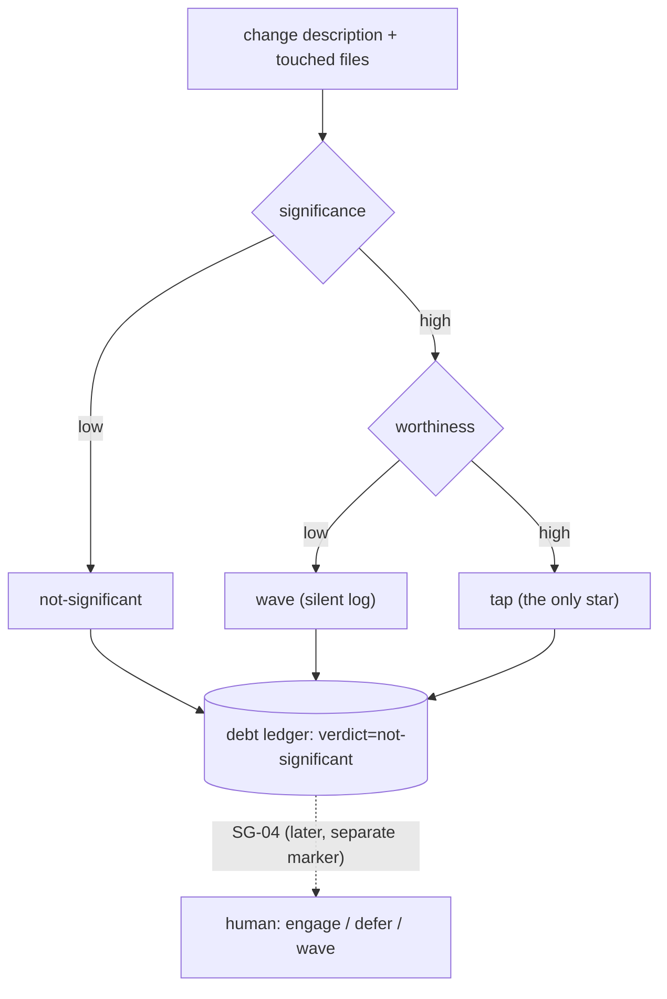

# SPEC-122: understanding-worthiness classifier (two signals)

Status: VALIDATED
Lane: full
Type: spec-feature

## Problem

ADR-0031 adds an understanding axis to the kit's V-model: a design record BEFORE build (SG-01,
out of scope here) and an explainer + quiz AFTER a significant change ships (SG-03/SG-04, out of
scope here). Neither knows WHEN to fire. Without a classifier, the gate either fires on every
change (quiz fatigue, fights the operator's deliberate hands-off-on-code default) or never fires
(cognitive debt returns untracked -- "the humans involved may have simply lost the plot").

ADR-0031's Refinement (2026-07-03) resolves this as TWO signals, not one: **significance** ("did
a lot change") catches big-but-boring refactors that are not worth a human's attention, so a
second signal, **understanding-worthiness** ("will not understanding this cost me in a later
loop?"), gates the tap. The gate must fire on high x high only; the rest is logged, never
quizzed. Nothing in the kit computes either signal today.

## Solution

`lib/significance-classify.sh`, a sibling to `lib/lane-classify.sh` (pure bash + grep, no LLM,
deterministic, same-input-same-output). It composes `lane-classify.sh` for the "full lane" leg of
significance rather than duplicating its risk-flag list (drift guard), and calls
`gate-ledger.sh debt` to write the verdict as a new additive marker, the same shape as the
existing `| TOKENS |` line: readers keyed on `$2=="GATE"` (check/override/descent) ignore it, so
it can never fake or be mistaken for a gate.

### Signals (pinned)

**Significance = HIGH if ANY of:**

| Trigger | How it's detected |
|---|---|
| full lane | `lane-classify.sh classify` (passing `--files` through when given) returns `full` |
| design-bearing | regex: `new (component\|module)\|non-obvious control flow\|schema (change\|migration)\|data[ -]model (change\|shift)\|external integration\|irreversible (choice\|decision)\|2\+ (viable )?approaches\|multiple approaches considered\|2 or more (viable )?approaches` |
| new-public-surface | regex: `new (public )?(api\|cli\|command\|endpoint\|interface)\|expose[sd]? a new\|new public (function\|method\|surface)` |

Otherwise significance = LOW, and the verdict is `not-significant` regardless of worthiness (the
top row of the decision matrix below collapses both cells).

**Understanding-worthiness** counts distinct triggers from ADR-0031 Refinement point 2, each
pinned to a regex (name <-> regex, index-aligned in the lib, mirroring `lane-classify.sh`'s own
parallel-array discipline):

| Name | Trigger (ADR-0031 wording) | Regex |
|---|---|---|
| `primitive` | introduces a primitive/concept future work builds on | `new primitive\|introduces? a (primitive\|concept\|abstraction)\|building block\|future work (will )?build[s]? on\|other (work\|code\|features?) (will )?build on\|base (class\|abstraction)\|foundation(al)? (piece\|component)` |
| `irreversible` | irreversible or costly-to-reverse (data model, API contract, security boundary) | `irreversible\|costly to reverse\|hard to reverse\|data model\|schema change\|api contract\|breaking change\|security boundary\|access control boundary\|auth(entication\|orization)? boundary` |
| `novel` | first-of-kind/novel pattern | `first[ -]of[ -](its[ -])?kind\|novel (pattern\|approach)\|no precedent\|never (done\|built) before\|greenfield` |
| `blast-radius` | high blast radius if misunderstood | `blast radius\|widely (used\|shared)\|every (caller\|consumer\|downstream)\|core (path\|module\|surface)\|critical path\|shared (by\|across) (multiple\|many)` |
| `must-explain` | the human will have to explain/defend/decide on it | `must (explain\|defend\|justify)\|will (need to \|have to )?(explain\|defend\|justify)\|design decision\|architecture(al)? decision\|human (must\|will) (decide\|approve)` |
| `impl-notes-feed` | a non-empty `docs/implementation-notes/<slug>.md` (an unspecified decision the agent made) | not a regex: `--impl-notes <path>` file exists AND matches `grep -qE '^## '` (has at least one dated entry) |

**Worthiness = HIGH if the count of fired triggers >= `SIGNIFICANCE_WORTHINESS_MIN`** (env var,
default `1`). This is the ONE tunable knob (documented here, not a magic number): raise it (e.g.
`2`) to demand corroborating triggers before tapping, if the tap rate proves too eager in
practice. The default stays maximally sensitive because the double gate (significance AND
worthiness both high) already does most of the anti-fatigue work; a single knob keeps the tuning
surface legible instead of exposing five independent thresholds.

### Verdict (the decision matrix, ADR-0031 Refinement point 2)



|              | worthiness LOW      | worthiness HIGH        |
|---           |---                  |---                     |
| **sig LOW**  | not-significant     | not-significant        |
| **sig HIGH** | wave (silent log)   | **tap** (the only star)|

### Approaches considered

1. **One combined "importance" score (single signal).** Rejected: collapses "did a lot change"
   and "will this cost me later" into one number, which is exactly the failure ADR-0031's
   Refinement calls out (big-but-boring refactors would tap as often as small-but-load-bearing
   decisions). Two independent signals is the ADR's explicit correction.
2. **Re-implement lane/risk detection inside significance-classify.sh.** Rejected: would fork
   `lane-classify.sh`'s hard/soft flag list, guaranteeing drift the next time either file changes.
   Chosen approach calls `lane-classify.sh classify` for the "full lane" leg instead.
3. **A new top-level ledger file for understanding-debt.** Rejected: the kit already has one
   append-only, per-run ledger (`gate-ledger.sh`'s `$RUNS_DIR/<rid>.log`) with an established
   additive-marker precedent (`| TOKENS |`, SPEC-110). A second ledger file would duplicate
   plumbing (durable-dir resolution, redaction, one-line-per-call newline collapsing) for no
   benefit; a new marker line in the SAME file reuses all of it. **Chosen.**
4. **LLM-judged worthiness.** Rejected by the sub-goal's own contract: deterministic bash, like
   `lane-classify.sh`, not a fourth non-deterministic classifier in a kit that otherwise commits
   to grep-based, same-input-same-output classifiers for this exact reason (auditable, testable
   in isolation, no network/model dependency).

### Chosen approach

`lib/significance-classify.sh` with four subcommands, mirroring `lane-classify.sh`'s CLI shape:

- `classify [--files "<paths>"] [--impl-notes "<path>"] "<desc>"` -- prints the verdict only.
- `explain [--files ...] [--impl-notes ...] "<desc>"` -- verdict + both signals + fired triggers,
  for auditability (mirrors `lane-classify.sh explain`).
- `record <rid> [--files ...] [--impl-notes ...] "<desc>"` -- classifies, then writes
  `gate-ledger.sh debt <rid> significance=... worthiness=... verdict=... reason=...`, and prints
  the verdict. This is the call SG-04's future nudge and SG-05's future weekend-batch paydown
  both read.
- `signals` -- lists the worthiness trigger names (audit / discoverability, mirrors
  `lane-classify.sh flags`).

`gate-ledger.sh` gains one new subcommand, `debt <rid> significance=<low|high>
worthiness=<low|high> verdict=<tap|wave|not-significant> [reason=...]`, built exactly like the
existing `tokens()` function: a `printf ... | tee`-free append of one `| DEBT |` line, validated
enum values, no interaction with `check()`/`override()`/`descent()` (they all key on
`$2=="GATE"`, so `| DEBT |` is invisible to gate-completeness logic by construction -- the same
guarantee `| TOKENS |` already has).

**Marker format (pinned):**

```
<UTC ISO8601> | DEBT | significance=<low|high> worthiness=<low|high> verdict=<tap|wave|not-significant> [reason=<one-line, newline-collapsed>]
```

## Design

(See the mermaid decision-matrix diagram and the "Approaches considered" / "Chosen approach"
sections above -- this spec folds the ADR-0031 §3 design-bearing content directly into the
Problem/Solution narrative rather than repeating it in a separate block, since the whole spec
IS the design record for this new component.)

**Boundaries:** this classifier only ever WRITES a `| DEBT |` marker (via `record`); it never
reads or reacts to the human's engage/defer/wave choice (that marker line belongs to SG-04, a
SEPARATE, LATER append to the same per-run ledger file -- append-only, no in-place edits).
**Failure mode:** `record` requires an existing rid (created by `gate-ledger.sh rid`, which
itself fails loudly off a work branch); a missing/unwritable `$RUNS_DIR` degrades the same way
`tokens()`/`action()` already do (mkdir -p, best-effort).

## Verification

```bash
cd dwarves-kit
bash tests/test-significance-classify.sh   # all AC green, incl. every negative control
bash tests/test-meta.sh                    # no regression in the corpus-wide suite
```

## Test plan

| # | Case | Expected | Category |
|---|---|---|---|
| 1 | significant (full lane via `--files`) AND worthy (`irreversible` + `primitive` triggers) | `tap` | worthy-tap |
| 2 | **NEGATIVE CONTROL (anti-fatigue):** significant (full lane) but LOW worthiness (mechanical, reversible, test-covered phrasing, no worthiness trigger fires) | `wave`, not `tap` | anti-fatigue NC |
| 3 | not significant (plain cosmetic/obvious task, no lane/design/surface trigger) | `not-significant` | obvious |
| 4 | FEED: identical mechanical description, once with no `--impl-notes`, once with a non-empty impl-note file | `wave` -> `tap` (worthiness flips low->high) | impl-notes feed |
| 5 | `record` on each of the above appends exactly one `\| DEBT \|` line to the run's ledger with the matching `significance=`/`worthiness=`/`verdict=` fields | present, well-formed | debt-ledger marker |
| 6 | same input classified twice (`classify` or `explain`) | byte-identical output | determinism |
| coverage delta | before this spec, `grep -c 'DEBT'` over `tests/` = 0; after, >0, and `gate-ledger.sh debt` has a dedicated assertion path distinct from `tokens()`'s | delta > 0 | coverage |

## After state

- `lib/significance-classify.sh` exists, is executable, and exposes `classify`/`explain`/
  `record`/`signals`.
- `lib/gate-ledger.sh` exposes a `debt` subcommand that appends a `\| DEBT \|` marker line,
  invisible to `check()`/`override()`/`descent()`.
- `tests/test-significance-classify.sh` passes with every negative control green.
- `WORKFLOW.md` names the one point in the cycle where `significance-classify.sh record` fires
  (Ship, alongside the existing gate-ledger recording); `docs/implementation-notes/significance-
  classify.md` carries the delta-from-spec log.
- Out of scope (unchanged by this spec): what happens on a `tap` (SG-04's nudge), the explainer
  itself (SG-03), the design-bearing trigger enforcement on specs (SG-01 owns the BEFORE gate).

## Open questions

None blocking. A future refinement may want `significance-classify.sh` to accept a real `git
diff --stat` instead of a free-text description (the way `--files` already narrows the lane
check); left for whichever sub-goal first wires a live caller, per the SPEC-105 precedent of
shipping the discriminator/interface before the wiring.
