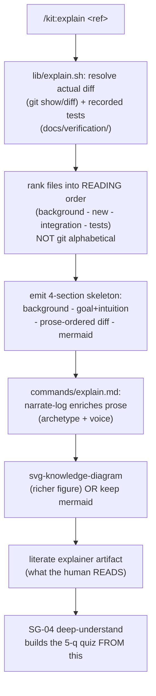

# SPEC-124: /kit:explain literate-diff explainer

Status: VALIDATED
Lane: normal
Type: spec-feature
Relates-to: ADR-0031 §2 (understanding gate, the AFTER gate), SPEC-113 (mermaid-first, GitHub-native), the ops-toolkit `understanding-gate` mega-goal (SG-03), the composed skills `narrate-log` + `svg-knowledge-diagram`, `deep-understand` (SG-04 consumes this artifact)

## Problem

The kit ships only VERIFICATION gates (proof-of-done, review-team, ship-gate); all answer "is it
correct?". ADR-0031 adds an **understanding axis**: when a significant change ships, the human should
consume an artifact that makes them a PARTICIPANT in the next loop, not click-to-merge a raw diff.

A raw diff fails at this: it is "a pile of files edited in alphabetical order with no explanation"
(Litt). Reading it is effortful and easy to fake. The kit has no command that turns a merged change
into something a human READS to understand.

**The hard constraint (Litt's caveat):** the explainer must be grounded in the ACTUAL diff + recorded
test results, NEVER an agent's own narrative of what it did, else it teaches the agent's misconceptions
(plausible-but-wrong). If the output is just `git diff` with headers, it failed: prose ordering (reading
order, concepts before code) is the whole point.

This is the AFTER gate's explainer half (ADR-0031 §2). The 5-question QUIZ is SG-04 (`deep-understand`);
this sub-goal produces the MATERIAL the quiz is built from, not the quiz.

## Solution

A new `/kit:explain <commit|PR|spec>` that emits a **literate-diff explainer** in four sections:
**background** (existing context the reader needs) -> **goal + intuition** (concepts before code) ->
a **prose-ORDERED diff** (hunks in reading order, NOT `git diff` alphabetical order, each with
explanation) -> a **diagram** (mermaid default, svg-knowledge-diagram for a richer conceptual figure).

It **composes** the existing learning skills rather than reinventing pedagogy:
- `narrate-log` supplies the session->prose arc (archetype + voice) for the background/intuition prose.
- `svg-knowledge-diagram` (or mermaid) supplies the diagram.

Two planes, split so the grounding is testable and cannot drift into narrative:

1. **`lib/explain.sh`** , the mechanical grounding + ordering engine. Takes a git `<ref>` ONLY (never a
   narrative arg). Resolves the actual diff (`git show`/`git diff`), pulls recorded test results from
   `docs/verification/`, ranks the changed files into READING order, and emits the four-section skeleton
   + a syntactically valid mermaid change-map. Because its only input is git, the artifact it grounds
   physically cannot parrot a false narrative , this is the architectural guarantee behind the hard
   constraint.
2. **`commands/explain.md`** , the command prompt. Runs `lib/explain.sh render <ref>` for the grounded
   skeleton, then enriches the background/intuition prose via `narrate-log` (archetype/voice) and, when a
   conceptual figure earns it, replaces the default mermaid with an SVG via `svg-knowledge-diagram`. The
   command NEVER lets the agent's recollection override the grounded skeleton.

**Prose-ordering heuristic (the "reading order" rule, deterministic + defensible):** rank each changed
file, then within a rank keep git's order:
- rank 0 = background: `docs/`, specs, ADRs (`SPEC-`, ADR files) , the context/goal the reader needs first.
- rank 1 = the new concept: newly-ADDED files (git status `A`) , the thing introduced, before its wiring.
- rank 2 = integration: modified non-test files , how the new thing is wired in.
- rank 3 = verification: test files (`tests/`, path matches `test`/`spec`) , read last.

Alphabetical (`git diff --name-only`) interleaves these; the reading order does not. For any change
spanning >1 rank where alphabetical would interleave, the two orders differ , which is the assertion.

**Recorded-test grounding:** `lib/explain.sh` reads the change's proof record under `docs/verification/`
(runs ledger or a named proof file) and folds the RECORDED verdict into the explainer, never an invented
one. Absent a record, it says so honestly (`[no recorded test result for <ref>]`).

## Design

Design-bearing (ADR-0031 §1): a NEW command surface + a new lib component + composes external skills.

### Approaches considered

- **A. Pure-prompt command (no lib).** `commands/explain.md` alone instructs the agent to read the diff
  and write the explainer. Rejected: nothing is testable (an LLM prompt has no bash-assertable output),
  and the hard-constraint grounding lives only in prose discipline , exactly the "agent narrates its
  intent" failure ADR-0031 warns against. No architectural guarantee.
- **B. Fork the learning skills into the kit.** Reimplement narrate-log/svg-knowledge-diagram inside the
  kit. Rejected by ADR-0031: the kit does not reinvent pedagogy; it COMPOSES the operator's skills.
- **C. (chosen) Split plane , a grounded lib + a composing command.** The deterministic grounding +
  ordering + default diagram live in `lib/explain.sh` (git-only input, fully testable). The command
  composes narrate-log + svg-knowledge-diagram for prose + richer figure ON TOP of the grounded skeleton.
  The lib's git-only input is the structural guarantee that the artifact traces to the diff, not a
  narrative. Testable + faithful to "compose, don't reinvent".

### Chosen approach + why

C. The grounding constraint is load-bearing and must be structural, not a prose promise. A lib whose
only input is a git ref cannot emit a false narrative; the test exercises that directly (feed a ref whose
diff contradicts a supplied narrative, assert the artifact follows the diff). The command layer is where
composition happens (narrate-log/svg-knowledge-diagram), keeping pedagogy in the operator's skills.

### Pipeline



### Boundaries + failure modes

- `lib/explain.sh` input is a git ref ONLY. It never accepts a narrative/intent argument (the guarantee).
- No recorded test result for a ref: emit `[no recorded test result for <ref>]`, do not invent a verdict.
- A single-rank change (e.g. one file): reading order == git order trivially; the ordering claim is only
  asserted for multi-rank changes (the interesting case).

## Verification

```bash
cd dwarves-kit
bash tests/test-explain.sh    # AC1-AC4 all green, incl. the grounded-in-diff negative control
bash tests/test-meta.sh       # green: new command frontmatter + architecture inventory row parity
# command + lib present and shaped
head -1 commands/explain.md | grep -qF -- '---'
grep -q 'description:' commands/explain.md
grep -q 'narrate-log' commands/explain.md && grep -q 'svg-knowledge-diagram' commands/explain.md
bash lib/explain.sh render HEAD >/dev/null    # runs against a real ref without error
```

## Test plan

Coverage matrix (AC -> case -> category). Target: one case per acceptance criterion + the negative
control + the coverage-delta row.

| # | Acceptance criterion | Case | Category |
|---|---|---|---|
| AC1 | `/kit:explain <ref>` produces the 4-section literate explainer | render a real merged change; assert sections background -> goal/intuition -> prose-ordered diff -> diagram appear IN THAT ORDER | happy-path |
| AC2 | prose ordering, NOT git/alphabetical | multi-rank fixture; assert the artifact's file-heading order != `git diff --name-only` (alphabetical) order | ordering |
| AC3 | the diagram renders | assert a ```mermaid fence is emitted and is syntactically valid (balanced fence, a graph/flowchart directive, >=1 edge) | diagram |
| AC4 | grounded-in-diff negative control | fixture whose diff adds `subtract` while a supplied narrative claims "adds multiply"; run explainer on the REF (narrative not passed); assert artifact names `subtract` and does NOT say `multiply` | **negative control** |
| CD | coverage delta | before: no `lib/explain.sh`, no `tests/test-explain.sh` (0 cases). after: 4 cases (AC1-AC4). delta = +4, from 0 grounded checks to a git-grounded, prose-ordered, NC-guarded explainer | coverage-delta |

## After state

- `commands/explain.md`: the `/kit:explain` command , composes narrate-log + svg-knowledge-diagram on
  the grounded skeleton; frontmatter `description:`; the hard-constraint rule stated.
- `lib/explain.sh`: grounding + ordering + skeleton + mermaid engine; git-ref-only input.
- `tests/test-explain.sh`: AC1-AC4 (4-section order, prose!=alphabetical, mermaid valid, grounded NC).
- `docs/verification/explain-command/`: the captured explainer artifact + the run-table.
- `docs/architecture.md`: a `/kit:explain` row in the Command/agent V-phase inventory (parity pin).
- `README.md`: `/kit:explain` in the workflow list + command table; command count 27 -> 28.
- `MANUAL.md`: an operator entry for `/kit:explain`.
- `docs/implementation-notes/explain-command.md`: the DELTA from this spec.
- `docs/verification/explain-command/proof-of-done.md`: the table-first proof.

## Scope edges

**In:** `commands/explain.md`, `lib/explain.sh`, `tests/test-explain.sh`, the captured artifact, and the
doc companions a new command requires for CI (architecture inventory row, README table + count, MANUAL).
**Out:** the 5-question quiz (SG-04); the significance/worthiness trigger (SG-02); the weekend-batch flow
(SG-05); the debt ledger (SG-02).
**Not:** a new narrative/diagram engine (compose the existing skills); an explainer built from the
agent's narrative instead of the diff; interactive micro-worlds (ADR-0031 deferred); editing the frozen
release surfaces (`plugin.json`, `marketplace.json`, `VERSION`, `CHANGELOG.md`) , they enumerate no
commands, so a new command needs no edit there.

## Open questions

The GitHub-render "capture" for the mermaid diagram is verified by syntactic validity (balanced fence +
directive + >=1 edge), not a pixel screenshot , the same shape SPEC-113 used for its mermaid hero (a
screenshot rots; the syntactic pin does not, and GitHub renders ```mermaid natively).
