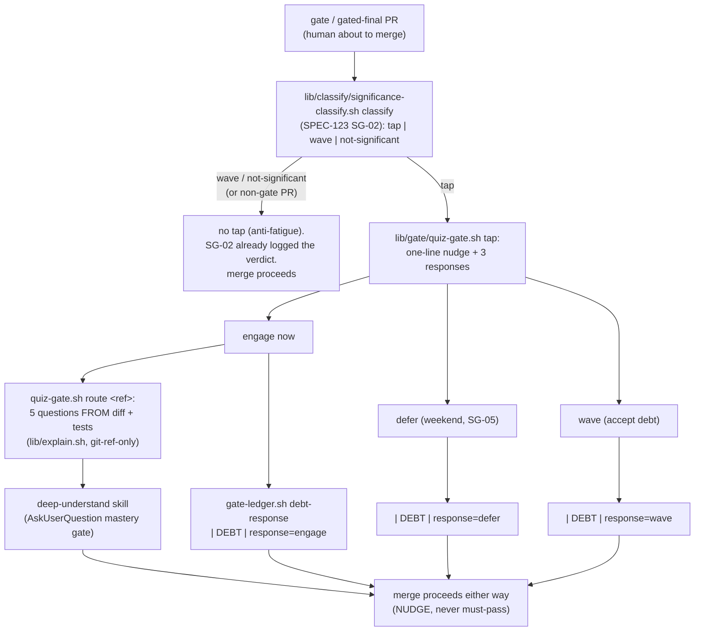

# SPEC-125: quiz-gate nudge before merge

Status: VALIDATED
Lane: full
Type: spec-feature
Relates-to: ADR-0031 §2 + §3 + the Refinement (the understanding gate; the AFTER gate's quiz half, the ★-tap nudge, the debt-budget model), SPEC-123 (`lib/classify/significance-classify.sh` , the WHEN, verdict `tap|wave|not-significant`), SPEC-124 (`lib/explain.sh` , the diff-grounded MATERIAL the quiz is built from), ADR-0024 (`lib/gate/gate-ledger.sh` , the `| DEBT |` marker), the ops-toolkit `deep-understand` skill (the AskUserQuestion mastery-gate engine the quiz routes through), the `understanding-gate` mega-goal (SG-04)

## Problem

Wave-1 built the WHEN (SPEC-123 significance classifier: a `tap|wave|not-significant` verdict + a
`| DEBT |` marker) and the MATERIAL (SPEC-124 `lib/explain.sh`: a diff-grounded literate explainer). What
is missing is the human-facing beat that ADR-0031 §2/§3 calls the **speed regulator**: when a change is
BOTH significant AND understanding-worthy (verdict `tap`) on a `gate`/gated-final PR, the human should be
NUDGED , offered a 5-question quiz built from the actual change , before they click-to-merge.

Three constraints make this non-trivial:

1. **It is a NUDGE, never must-pass-to-merge** (ADR-0031 Refinement point 3). It gates the human's
   ATTENTION, not the merge. A waved change still merges. It never hard-blocks a correct build. The only
   real failure is UNTRACKED debt, so all three human responses (engage / defer / wave) are RECORDED.
2. **The quiz is grounded in the DIFF + recorded test results, NEVER the agent's narrative** (Litt's
   plausible-but-wrong caveat, ADR-0031 §2). A quiz on the agent's own story teaches its misconceptions ,
   worse than no quiz. This is the same structural guarantee SPEC-124 enforced.
3. **The kit does not reinvent pedagogy** (ADR-0031, alternatives). The quiz ROUTES through the operator's
   existing `deep-understand` AskUserQuestion mastery-gate engine; the kit builds the QUESTIONS (from the
   diff), not a second quiz/scoring system.

## Solution

Two planes, split so the grounding + wiring are testable and cannot drift into narrative or into a hard
block:

1. **`lib/gate/quiz-gate.sh`** , the mechanical half (four verbs):
   - `questions <ref>` , emits exactly **5 quiz questions** built from the ACTUAL diff + recorded test
     results. Its only input is a git `<ref>` (never a narrative arg), reusing `lib/explain.sh order`
     (reading-order files) + `lib/explain.sh tests` (the recorded verdict) + the raw `git diff` `+` lines.
     Because there is no narrative channel, a false story physically cannot leak in , the SPEC-124
     architectural guarantee, reused.
   - `tap <rid> [--files F] [--impl-notes P] [--pr-kind K] "<desc>"` , the WIRING decision. It asks
     `lib/classify/significance-classify.sh classify` for the verdict; it prints the one-line nudge + the three
     responses ONLY when the verdict is `tap` AND the PR is a `gate`/gated-final. On `wave` or
     `not-significant` (or a non-gate PR) it prints nothing and exits 0 (the anti-fatigue guard, keyed on
     the classifier , SPEC-123's SG-02 verdict).
   - `respond <rid> <engage|defer|wave> [--ref R]` , records the human's choice to the debt ledger via
     `gate-ledger.sh debt-response` (a `| DEBT |` line). For `engage` (and when `--ref` is given) it also
     emits the `deep-understand` routing directive (the dispatch payload). Always exits 0 , advisory,
     never a block.
   - `route <ref>` , emits the `deep-understand` dispatch payload: the skill name + its AskUserQuestion
     mastery-gate + the 5 questions + a pointer to the SPEC-124 explainer material. This is what
     `commands/quiz-gate.md` hands to the skill; the kit does not score the quiz itself.

2. **`commands/quiz-gate.md`** , the human-facing command surface (the live dispatch path). At the merge
   boundary of a `gate`/gated-final PR, after SPEC-123's `| DEBT |` verdict marker is recorded, it runs
   `quiz-gate.sh tap`; on a `tap` it presents the nudge and, if the human picks **engage**, invokes the
   `deep-understand` skill with the `route` payload (the 5 diff-grounded questions). All three responses
   are logged. It never merges, never blocks the merge.

3. **A new additive verb `gate-ledger.sh debt-response`** , writes the human's engage/defer/wave choice as
   a SEPARATE `| DEBT |` line (the `debt()` header already anticipates this SG-04 line). It is additive:
   `check()/override()/descent()/_rows()` ignore `| DEBT |`, so it can never fake or mask a `| GATE |`.

**Open-fork 2 (ROADMAP) RESOLVED here:** the quiz-gate strictness is a **NUDGE** (engage/defer/wave, all
logged), never must-pass-to-merge.

## Design

Design-bearing (ADR-0031 §1): NEW control flow (a decision + three-way human response at the merge
boundary) + a new lib + a new command + an additive lib verb + composes an external skill.

### Approaches considered

- **A. Must-pass quiz (hard gate before merge).** Block the merge until the human passes the quiz.
  Rejected by ADR-0031 §3 Refinement: the goal is CONSCIOUS debt, not zero debt; the operator is
  deliberately hands-off-on-code, so a must-pass quiz fights his default and re-introduces a hard block
  the ADR explicitly forbids. Waving must be a first-class, recorded option.
- **B. Reimplement a quiz engine in the kit** (question bank + scoring + mastery loop). Rejected by
  ADR-0031: the kit does not reinvent pedagogy; `deep-understand` already owns the AskUserQuestion
  mastery gate. The kit builds the diff-grounded QUESTIONS and ROUTES.
- **C. Generate the quiz from the agent's narrative / commit message.** Rejected , the exact
  plausible-but-wrong failure. The questions must trace to the diff + recorded tests, the SPEC-124
  guarantee (git-ref-only input, no narrative channel).
- **D. (chosen) A grounded question-builder + a wiring decision keyed on the SG-02 verdict + a
  three-way logged nudge, routing engage to `deep-understand`.** `lib/gate/quiz-gate.sh` builds questions from
  the ref only (D-style guarantee), decides to fire ONLY on `tap` (anti-fatigue, keyed on the classifier),
  and records all three responses; the command layer composes `deep-understand`. Testable + faithful to
  every ADR-0031 constraint.

### Chosen approach + why

D. Each constraint maps to a structural property, not a prose promise: (1) never-must-pass = every verb
exits 0 and no hook blocks merge on the quiz; (2) grounded = `questions`/`route` take a git ref ONLY;
(3) anti-fatigue = `tap` gates on `significance-classify`'s `tap` verdict; (4) all-logged = every response
lands a `| DEBT |` line; (5) no-reinvention = engage dispatches `deep-understand`, the kit scores nothing.

### The tap decision + three responses + ledger writes



### Boundaries + failure modes

- `questions`/`route` input is a git ref ONLY , no narrative/intent argument (the grounding guarantee).
- `tap` fires ONLY on verdict `tap` + a `gate`/gated-final PR; every other verdict prints nothing (absent).
- Every verb exits 0 on the advisory path; nothing in `lib/gate/quiz-gate.sh` or any hook blocks a merge on the
  quiz. A `wave` (or ignoring the nudge entirely) still merges.
- `debt-response` is additive (`| DEBT |`); it can never be read as a `| GATE |` line (ADR-0024 discipline).
- No recorded test result for the ref: the verification question says so honestly (reuses `explain.sh
  tests`'s `[no recorded test result]`), it does not invent a verdict.

## Verification

```bash
cd dwarves-kit
bash tests/test-quiz-gate.sh    # AC1-AC6 all green, incl. the grounded NC + the wiring NC + never-must-pass
bash tests/test-meta.sh         # green: new command frontmatter + architecture inventory row parity
# command + lib present and shaped
head -1 commands/quiz-gate.md | grep -qF -- '---'
grep -q 'description:' commands/quiz-gate.md
grep -q 'deep-understand' commands/quiz-gate.md
bash lib/gate/quiz-gate.sh questions HEAD | grep -c '^Q[1-5]'   # == 5
```

## Test plan

Coverage matrix (AC -> case -> category). Target: one case per acceptance criterion + the two negative
controls + the coverage-delta row.

| # | Acceptance criterion | Case | Category |
|---|---|---|---|
| AC1 | a high×high change generates 5 quiz questions FROM the actual diff + test results | multi-rank fixture; `quiz-gate.sh questions <ref>` emits exactly 5 numbered questions; assert each references real changed files / added lines / the recorded verdict | happy-path |
| AC2 | the three responses (engage/defer/wave) each land in the debt ledger | `respond <rid> engage`, `... defer`, `... wave`; assert 3 `\| DEBT \| response=` lines, one per choice | ledger |
| AC3 | engage routes through deep-understand's mastery-gate engine | `respond <rid> engage --ref <ref>` output names `deep-understand` + `AskUserQuestion`; `commands/quiz-gate.md` names them too; assert quiz-gate.sh reimplements NO scorer (dispatch, not reimplementation) | routing |
| AC4 | GROUNDED NC: narrative differs from the diff -> quiz from the DIFF | fixture whose diff adds `subtract` while the commit body / an untracked file claims `multiply`; run `questions <ref>` (narrative not passed); assert questions name `subtract`, never `multiply` | **negative control** |
| AC5 | WIRING NC: tap fires on `tap`, ABSENT on `wave` AND on `not-significant` | drive `quiz-gate.sh tap` with descs/files that classify `tap` / `wave` / `not-significant`; assert nudge printed only for `tap`, empty for the other two | **negative control** |
| AC6 | NEVER must-pass: a waved change still merges (no hard block) | `respond <rid> wave` exits 0; assert no hook blocks merge on the quiz + every quiz-gate verb exits 0 on the advisory path | never-block |
| CD | coverage delta | before: no `lib/gate/quiz-gate.sh`, no `gate-ledger.sh debt-response`, no `tests/test-quiz-gate.sh` (0 cases). after: 6 cases (AC1-AC6). delta = +6, from 0 quiz-gate checks to a diff-grounded, verdict-keyed, three-way-logged, never-must-pass nudge | coverage-delta |

## After state

- `lib/gate/quiz-gate.sh`: the mechanical half , `questions` (5 diff-grounded questions), `tap` (fire only on
  the SG-02 `tap` verdict + gate PR), `respond` (log engage/defer/wave), `route` (deep-understand payload).
- `lib/gate/gate-ledger.sh`: a new additive `debt-response <rid> <engage|defer|wave> [reason]` verb (a `| DEBT |`
  line for the human choice; the `debt()` header already anticipated it).
- `commands/quiz-gate.md`: the `/kit:quiz-gate` command , the human-facing nudge at the merge boundary,
  routing engage to `deep-understand`; frontmatter `description:`; the never-must-pass + grounding rules.
- `tests/test-quiz-gate.sh`: AC1-AC6 (5-from-diff, 3-responses-logged, deep-understand routing, grounded
  NC, wiring NC, never-must-pass).
- `docs/verification/quiz-gate/proof-of-done.md` + the captured run-table.
- `docs/architecture.md`: a `/kit:quiz-gate` row in the Command/agent V-phase inventory (parity pin).
- `README.md` + `MANUAL.md`: a `/kit:quiz-gate` entry.
- `WORKFLOW.md`: one WHEN-it-fires wiring line after the Understanding-debt marker bullet (the SG-04 nudge
  on a `tap`); `commands/ship.md`: a one-line pointer at the gate/gated-final merge boundary.
- `docs/implementation-notes/quiz-gate.md`: the DELTA from this spec.

## Scope edges

**In:** `lib/gate/quiz-gate.sh`, the additive `gate-ledger.sh debt-response` verb, `commands/quiz-gate.md`,
`tests/test-quiz-gate.sh`, the minimal WHEN-it-fires wiring lines (WORKFLOW + ship), and the doc companions
a new command requires for CI (architecture inventory row, README, MANUAL).
**Out:** the explainer artifact (SG-03, SPEC-124, done); the weekend-batch flow (SG-05); the significance /
worthiness heuristic (SG-02, SPEC-123, done); the understanding-axis NARRATIVE in WORKFLOW/AGENTS (SG-06).
**Not:** a hard build-block / must-pass quiz (advisory per ADR-0031); a new quiz/scoring engine (route
through `deep-understand`); a quiz on non-significant changes (that IS the fatigue failure mode); editing
the frozen surfaces (`VERSION`, `CHANGELOG.md`, `plugin.json`, `marketplace.json`, `tool.toml`).

## Open questions

None , open-fork 2 (quiz-gate strictness) is RESOLVED to a nudge (engage/defer/wave, all logged), never
must-pass-to-merge, per ADR-0031 Refinement point 3.
