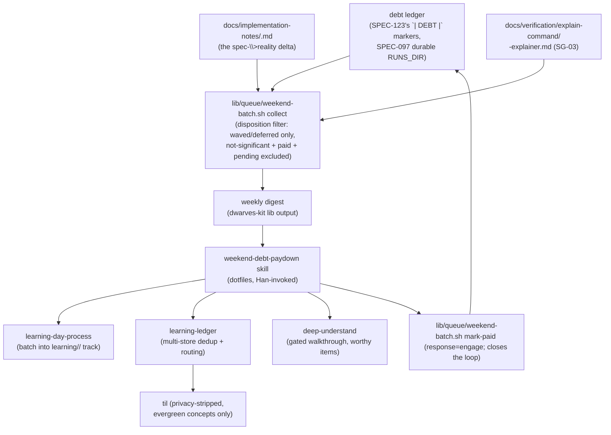

# SPEC-126: weekend batch debt-paydown flow

Status: VALIDATED
Lane: normal
Type: spec-feature
Relates-to: ADR-0031 §3 (Refinement, points 1-4: the conscious-debt-budget model), SPEC-123
(significance-classify, the debt-ledger `| DEBT |` marker this reads), SPEC-124 (explain-command,
the explainer artifact this reads), the ops-toolkit `understanding-gate` mega-goal (SG-05), the
operator's learning skills (`learning-day-process`, `learning-ledger`, `deep-understand`,
`knowledge-capture`)

## Problem

ADR-0031's Refinement establishes a **conscious cognitive-debt budget**: the gate does not quiz
every significant change (fatigue); a ★-tap nudge (SG-04, not yet built) lets the human **engage
now**, **defer** to a weekend session, or **wave** the debt through, and all three land in the
debt ledger (`gate-ledger.sh debt`, a `| DEBT |` marker; SPEC-123). The only real failure is
**untracked** debt: a deferred or waved item that is never revisited becomes exactly the "lost
the plot" failure the whole axis exists to prevent.

Today nothing reads that ledger back. SG-02's classifier writes `| DEBT |` markers (significance x
worthiness x verdict); SG-03's `/kit:explain` writes literate-diff explainers; `docs/
implementation-notes/<slug>.md` accumulates the spec->reality deltas. Three artifacts, no
consumer, no paydown. This sub-goal is the debt-paydown flow **and** the point where the SDD kit
and the operator's existing ops-toolkit learning kit merge (ADR-0031, Alternatives: "a brand-new
learning engine in the kit" is rejected; SG-05 REUSES `learning-day-process` / `learning-ledger` /
`deep-understand` / `til`, it does not fork a second batching or dedup engine).

**Cross-repo shape (load-bearing constraint):** the collection mechanics (read the ledger, resolve
impl-notes/explainers, close the loop) are kit-generic and belong in `dwarves-kit` (this repo,
`lib/`). The ORCHESTRATION into the operator's personal learning tracks (`learning-day-process`,
`learning-ledger`, `deep-understand`, `til`) is operator-specific tooling that lives in
`~/workspace/<owner>/dotfiles` as a Claude Code skill, per the same split SG-01 used for its
`plan-for-mega-goal` subgoal-template half (SPEC-107's precedent: `tests/test-meta.sh` proves the
dwarves-kit-local surfaces; the dotfiles-side surface is proven by a captured local run because its
path is absent in CI).

## Solution

### 1. `lib/queue/weekend-batch.sh` (dwarves-kit, new)

A pure-bash reader/closer over the debt ledger (`$LOG_DIR/runs/*.log`, the same corpus SPEC-123's
`gate-ledger.sh debt` writes to). No new ledger, no new dedup engine, no new storage: it reads the
EXISTING `| DEBT |` markers and the EXISTING `docs/implementation-notes/` + `docs/verification/
explain-command/` artifacts.

```
weekend-batch.sh list    [--days N] [--since <ISO8601>] [--repo <name>] [--all-repos]
weekend-batch.sh collect [--days N] [--since <ISO8601>] [--repo <name>] [--all-repos] [--repo-root <path>]
weekend-batch.sh mark-paid <rid> [--note "<text>"]
```

- **`list`**: tab-separated `rid  disposition  significance  worthiness  recorded-ts`, one line per
  COLLECTIBLE item (see disposition rules below). Machine-consumable for a skill's loop.
- **`collect`**: a markdown digest, one `## <rid>` block per collectible item: disposition,
  significance/worthiness/reason, recorded timestamp, and BEST-EFFORT-resolved `impl-notes:` /
  `explainer:` paths (found/absent), relative to `--repo-root` (default: `git rev-parse
  --show-toplevel` of cwd, matching `lib/explain.sh`'s own repo-root resolution).
- **`mark-paid <rid>`**: reads the rid's LAST debt-ledger line (its significance/worthiness/verdict
  are still valid, only the disposition changes), and re-emits a marker with `response=engage` via
  `gate-ledger.sh debt` (the SAME command SPEC-123 already uses -- no second ledger writer). This
  closes the loop: a paid item is `response=engage` and `list`/`collect` never surface it again.

**Disposition rules (the two-signal x three-response matrix, ADR-0031 Refinement point 3), read
off the LAST `| DEBT |` line for a given rid (append-only ledger, so "last" = "current"):**

| last line's fields | disposition | collected? |
|---|---|---|
| `verdict=not-significant` | n/a | NO (never debt) |
| `response=engage` (any verdict) | paid | NO (closed) |
| `verdict=wave`, no `response` | waved (silent, SG-02 anti-fatigue path) | YES |
| `response=wave` | waved (explicit, SG-04's future nudge) | YES |
| `response=defer` | deferred | YES |
| `verdict=tap`, no `response` | pending (open ★-tap, still Flow A's to resolve) | NO (not batch's job yet) |

The `verdict=not-significant` row matters even though `significance-classify.sh record` currently
writes a `| DEBT |` line for EVERY verdict including `not-significant` (SPEC-123's `record`
subcommand always calls `gate-ledger.sh debt`, unconditionally) -- so a not-significant change DOES
reach the physical ledger file. What must NEVER happen is a not-significant item surfacing as
COLLECTIBLE debt; `list`/`collect` filter it out by disposition, same as they filter a `pending`
open tap. "Never entered the ledger" in this sub-goal's proof (SG-05 contract, `Proof` §3) is read
as "never entered the COLLECTIBLE view" -- the distinction is verified directly (a not-significant
fixture line present in the ledger file, absent from `collect`'s output).

**The `pending` row is a deliberate exclusion, not an oversight.** An open ★-tap with no response
yet is still live in Flow A (SG-04, inline); scooping it into the weekend batch before the human
has chosen engage/defer/wave would race Flow A and could silently convert "I haven't decided" into
"deferred". The batch only ever picks up what the human (or SG-02's own silent-wave path) already
disposed of.

### 2. `gate-ledger.sh debt`: additive `response=` field (dwarves-kit, small extension)

`debt()`'s existing signature (`significance=<low|high> worthiness=<low|high>
verdict=<tap|wave|not-significant> [reason=...]`) gains one more OPTIONAL key,
`response=<engage|defer|wave>`, written between `verdict=` and `reason=` when present. This is the
convention SG-04's future ★-tap nudge should reuse when it lands (engage/defer/wave, ADR-0031
Refinement point 3) -- SG-05 defines it now because `mark-paid` is the first caller that needs an
"already engaged" concept to close the loop; SG-04 is a downstream consumer of the SAME field, not
a second one. Purely additive: existing callers (SPEC-123's `record`) are unaffected, existing
`grep -qE '\| DEBT \| significance=... verdict=...'` assertions in `tests/test-significance-
classify.sh` still match (they are prefix greps, not anchored to end-of-line).

### 3. `weekend-debt-paydown` skill (dotfiles, new)

A Han-invoked Claude Code skill at `home/dot_claude/skills/weekend-debt-paydown/SKILL.md`
(chezmoi source; symlinked to `~/.local/share/chezmoi` as `~/.local/share/chezmoi/dot_claude/
skills/weekend-debt-paydown/SKILL.md`). It ORCHESTRATES, it does not reimplement:

1. For each repo Han names (default: the one he is sitting in): `bash lib/queue/weekend-batch.sh
   collect --days 7` -- the digest from part 1.
2. Route the digest's material through `learning-day-process` (the existing "batch a period's
   material into the track structure" skill) to materialize workbook/companion/practice/anki
   artifacts under the right `learning/<topic>/` track, per item (using the explainer when one
   exists, the impl-notes delta otherwise, `/kit:explain <rid>` to generate one on the fly as a
   last resort).
3. Route through `learning-ledger` for the multi-store dedup + routing to durable homes (GLOSSARY,
   research/, etc.) -- the shared spine `concept-explain`/`deep-understand` already use.
4. For an item whose worthiness reason suggests genuine complexity (not just "significant"),
   pull the gated walkthrough via `deep-understand` before considering it paid.
5. Evergreen (cross-project, non-NDA) concepts flush to `til` via `knowledge-capture`'s privacy
   strip -- never raw client/NDA/financial content.
6. Close each processed item: `bash lib/queue/weekend-batch.sh mark-paid <rid> --note "paid via weekend
   batch YYYY-MM-DD"` in the item's repo, so next weekend's `collect` does not resurface it.

It never forks a second batching, dedup, or quiz engine; the proof (`tests/test-weekend-batch.sh`
§4) greps the skill body for live invocations of the three names.

## Design

Design-bearing (ADR-0031 §1): a new component (`lib/queue/weekend-batch.sh`), an external integration
(the dotfiles skill + the operator's ops-toolkit learning skills), and 2+ viable approaches for the
cadence fork.

### Approaches considered (collection mechanics)

- **A. A new ledger/queue for "deferred" items.** Rejected: a second store duplicates SPEC-123's
  debt ledger and immediately drifts (two sources of truth for the same disposition).
- **B. (chosen) Read the EXISTING debt ledger; add one additive field to close it.** `mark-paid`
  reuses `gate-ledger.sh debt` (the SAME writer SPEC-123 already has), adding only the `response=`
  key. Zero new storage, zero new writer paths, and SG-04 (when built) is a second caller of the
  SAME contract, not a competing one.

### Approaches considered (cadence, open-fork 3)

- **A. A scheduled launchd job** (mirroring the existing learning-cadence daemons on the Mini).
  Rejected for now: the operator is not reachable mid-run to confirm a scheduled trigger fired
  correctly, and a batch-learning session is inherently a "am I in the mood / do I have the time"
  decision -- forcing it on a timer fights the operator's own hands-off-by-default posture (the
  same posture ADR-0031's debt-budget model was built to respect, not fight).
  Minimum-infra-first also argues against it: no evidence yet that manual invocation is the actual
  friction (Gating question: "what friction are we actually fixing?" -- none observed).
- **B. (chosen) A Han-invoked skill only.** `weekend-debt-paydown` fires on "run the weekend
  paydown" / "pay down my debt ledger" / similar, exactly like every other Han-invoked learning
  skill (`learning-day-process`, `concept-explain`). No new daemon, no new autostart surface. If a
  scheduled REMINDER (not an autonomous run) later proves useful, that is a distinct, smaller
  follow-up (a nudge, not an executor) -- out of scope here.

**Resolution: open-fork 3 = B, a Han-invoked skill, no scheduled job.**

### Pipeline



### Boundaries + failure modes

- `weekend-batch.sh` never writes prose, never generates a quiz, never dedups concepts itself --
  it only reads the ledger + repo docs and writes ONE kind of closing marker (`response=engage`
  via the existing `gate-ledger.sh debt`).
- Impl-notes / explainer path resolution is BEST-EFFORT (two candidate filenames per artifact,
  documented under Problem: rid-derived slugs and spec-derived slugs both occur in the corpus
  today). An unresolved artifact is reported `absent`, never silently omitted from the digest --
  the rid itself always surfaces so a human can find it manually.
- `mark-paid` on an rid with NO prior debt-ledger line is a hard error (nothing to close).
- Cross-repo resolution (`--all-repos`): impl-notes/explainer paths are NOT resolved (no local
  checkout path is knowable for an arbitrary `repo=` name); the digest states `repo=<name>, paths
  unresolved (--all-repos)` honestly rather than guessing a path.

## Verification

```bash
cd dwarves-kit
bash tests/test-weekend-batch.sh   # AC1 collect, AC2 routing-dispatch (grep, best-effort cross-repo),
                                    # AC3 both negative controls, AC4 skill-reuse grep (best-effort cross-repo)
bash tests/test-meta.sh            # stays green; no new command/frontmatter surfaces added
bash tests/test-significance-classify.sh   # stays green: additive response= field does not regress SPEC-123
```

## Test plan

Coverage matrix (AC -> case -> category). Target: one case per acceptance criterion + both negative
controls + the coverage-delta row.

| # | Acceptance criterion | Case | Category |
|---|---|---|---|
| AC1 | collects the week's deferred+waved items + impl-notes + explainers | fixture ledger: one `verdict=wave` (no response) + one `verdict=tap`+later `response=defer`; both have a matching impl-notes file (one rid-named, one slug-named, proving the dual-candidate resolution) and one has a matching explainer; assert `collect`'s digest includes both rids, correct disposition labels, and `found`/`absent` impl-notes/explainer lines | happy-path |
| AC2 | routes through learning-day-process + learning-ledger; til flush is privacy-stripped -- ROUTING not reimplementation | grep the dotfiles `weekend-debt-paydown/SKILL.md` body for live invocation of `learning-day-process`, `learning-ledger`, and a `til` + privacy-strip mention; best-effort (skip, not fail, if the dotfiles path is absent -- SPEC-107 precedent, path absent in CI) | wiring (cross-repo, best-effort) |
| AC3a | NEGATIVE CONTROL: an already-engaged (paid) item is not re-collected | seed a `tap` debt line, run `mark-paid` on it (the real codepath, not a hand-written fixture line), re-run `list`; assert the rid is ABSENT | **negative control** |
| AC3b | NEGATIVE CONTROL: a non-significant change never enters the collectible view | seed a `verdict=not-significant` debt line (present in the raw ledger file); assert `list`/`collect` never surface that rid | **negative control** |
| AC3c | window scoping: an item older than the `--days` cutoff is excluded | seed a `verdict=wave` line with a recorded timestamp outside the default 7-day window; assert `list --days 7` excludes it, `list --days 400` includes it | scoping |
| AC3d | repo scoping: a different-repo item is excluded by default, included with `--all-repos` | seed a `verdict=wave` line under `repo=other-repo`; assert default (`--repo fixture-repo`) excludes it, `--all-repos` includes it | scoping |
| AC4 | SKILL-REUSE grep: the skill invokes, does not fork | grep the same SKILL.md for the ABSENCE of a second dedup/ledger/quiz-engine tell (e.g. no "custom dedup" / "new ledger" language) alongside the presence checks in AC2; best-effort (same skip rule) | **negative control** (reuse) |
| CD | coverage delta | before: no `lib/queue/weekend-batch.sh`, no `tests/test-weekend-batch.sh` (0 cases). after: 6 cases (AC1, AC2, AC3a-d, AC4). delta = +6, from 0 debt-ledger-consumer checks to a disposition-correct, scope-correct, reuse-proven weekend batch flow | coverage-delta |

## After state

- `lib/queue/weekend-batch.sh`: `list` / `collect` / `mark-paid`, reads `$LOG_DIR/runs/*.log` (SPEC-097's
  resolver), writes only via the existing `gate-ledger.sh debt`.
- `lib/gate/gate-ledger.sh`: `debt()` gains the additive `response=<engage|defer|wave>` key (comment +
  usage line updated).
- `tests/test-weekend-batch.sh`: AC1-AC4 incl. both negative controls + the coverage-delta row.
- `docs/verification/weekend-batch/proof-of-done.md` + captured run output.
- `docs/implementation-notes/weekend-batch.md`: the delta from this spec (the rid-vs-slug naming
  gap, the `pending`-row exclusion decision, the `response=` field convention for SG-04).
- (dotfiles repo, branch `feat/ug-05-weekend-batch`, committed locally, NOT pushed) `home/
  dot_claude/skills/weekend-debt-paydown/SKILL.md`: the Han-invoked orchestration skill.

## Scope edges

**In:** the dwarves-kit collection step (`lib/queue/weekend-batch.sh`, reading SG-02's `| DEBT |`
markers + SG-03's explainer artifacts + impl-notes), the additive `gate-ledger.sh debt` `response=`
field, the dotfiles `weekend-debt-paydown` skill (orchestration only), tests.
**Out:** the inline ★-tap nudge itself (SG-04, Flow A -- this sub-goal only reads what SG-04 will
eventually write); generating explainers (SG-03, already built); the significance/worthiness
heuristic (SG-02, already built).
**Not:** a new batching/dedup/capture engine (`learning-day-process`/`learning-ledger` are reused,
never forked); collecting non-significant or still-open-tap changes; publishing to `til` without
the privacy strip; a scheduled/launchd cadence (open-fork 3 resolved as Han-invoked only).

## Open questions

None outstanding for this sub-goal's scope. SG-04's exact ★-tap nudge wording/UX is that sub-goal's
call; this spec only fixes the `response=` field's three values (`engage|defer|wave`) as the shared
contract both sub-goals write through.
