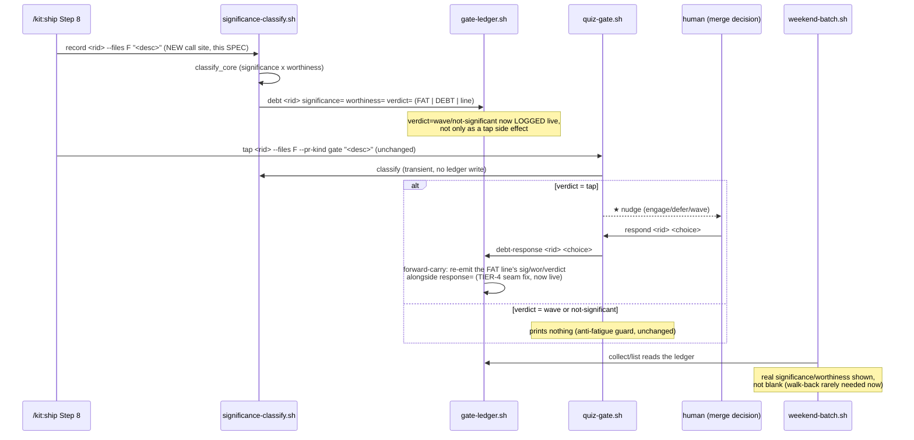

# SPEC-136: wire significance-classify record into /kit:ship

Status: VALIDATED
Lane: full
Type: spec-feature
Relates-to: ADR-0031 Refinement §4 (conscious debt budget; impl-notes as the feed), SPEC-123
(`lib/significance-classify.sh` , the classifier + its `record` verb), SPEC-125
(`lib/quiz-gate.sh` , the ★-tap nudge that `tap` already calls `classify` for), SPEC-126
(`lib/weekend-batch.sh` , the debt-ledger reader whose `collect`/`mark-paid` walk-back logic
exists only because `record` was unwired), SPEC-127/SPEC-135 (`tests/test-understanding-wiring.sh`
, the no-orphan sweep that AC3 currently asserts `record` has NO live caller), the
`debt-ledger-response-seam` TIER-4 close (the forward-carry fix in `gate-ledger.sh debt_response`
that this wiring now exercises for real on its default path)

## Problem

`significance-classify.sh record` (SPEC-123) has existed since the classifier shipped: it runs
`classify_core`, then writes a FAT `| DEBT |` line (`significance=<low|high> worthiness=<low|high>
verdict=<tap|wave|not-significant>`) to the debt ledger via `gate-ledger.sh debt`. Nothing has ever
called it. `commands/ship.md`'s Understanding-gate nudge bullet (Step 8) says the ★-tap runs "after
the Understanding-debt marker is recorded" -- but no command anywhere records that marker; only
`quiz-gate.sh tap` calls `significance-classify.sh classify` (a transient classification, no ledger
write). `tests/test-understanding-wiring.sh` AC3 makes this an EXPLICIT, asserted honest gap (rc=3,
"HONEST GAP") rather than a silent over-claim -- which is correct SG-06 discipline, but it leaves a
real hole open:

1. **The silent-wave case is never logged.** ADR-0031 Refinement §2/§4's whole point is that a
   significant-but-low-worthiness change (`verdict=wave`) is FINE to skip quizzing, as long as it is
   a RECORDED choice ("the only real failure is UNTRACKED debt"). Today a `wave` is only ever
   recorded as a side effect of `quiz-gate.sh tap` running (SPEC-125), and `tap` itself only prints a
   nudge on `verdict=tap` -- it still calls `classify`, not `record`, so **no `| DEBT |` line is ever
   written for a `wave` or `not-significant` change on a `gate`/gated-final PR either.** The debt
   ledger stays empty for exactly the changes ADR-0031 exists to track.
2. **`weekend-batch.sh collect`/`list` show blank significance/worthiness** for any rid whose only
   ledger activity is a human `response=` line with no prior FAT line (the TIER-4-close default
   path, per `debt-ledger-response-seam.md`). The forward-carry fix in `gate-ledger.sh
   debt_response()` (reads back the last FAT line and re-emits it) exists and is tested, but has
   never fired live because there has never been a live FAT-line writer.
3. **impl-notes stay write-only.** ADR-0031 Refinement §4 reverses the ID-234 "drop impl-notes"
   proposal specifically because the classifier reads `docs/implementation-notes/<slug>.md` as a
   worthiness signal (`_impl_notes_signal`) -- but that signal only ever reaches a ledger write
   through `record`, which nothing calls. The impl-notes-feed half of the design is inert until
   `record` is wired somewhere.

## Solution

Wire `significance-classify.sh record` into `/kit:ship` Step 8, immediately BEFORE the existing
`quiz-gate.sh tap` call, using the SAME `--files`/description the tap call already uses (so the
recorded marker and the tap decision are computed from identical inputs and can never disagree).
This is the minimal seam: `record` already does everything needed (classify + write the FAT line);
`ship.md` already has the exact file list and change description in scope for the nudge bullet it
already carries. No new lib code, no new verb, no new ledger shape.

- **`commands/ship.md` Step 8** gains one line before the `quiz-gate.sh tap` call:
  `bash lib/significance-classify.sh record <rid> --files "<files>" "<what changed>" || true`.
  The `|| true` is the advisory exit-0 posture already used elsewhere on this axis (mirrors
  `weekend-batch.sh mark-paid`'s "advisory, never a hard failure" framing and SPEC-125's
  `quiz-gate.sh tap`'s own always-exit-0 contract): a `record` failure (e.g. a ledger-dir write
  error) must never block the ship. `--impl-notes docs/implementation-notes/<slug>.md` is included
  when an impl-note exists for the change, completing ADR-0031 Refinement §4's feed.
- **The prose bullet's own claim becomes true**: "after the Understanding-debt marker is recorded"
  now names a real, preceding call, not an aspirational description.
- **`gate-ledger.sh debt_response`'s forward-carry** (already implemented, TIER-4 close) now has a
  live FAT-line producer: a later human `respond`/`debt-response` call for the same rid picks up
  this recorded `significance=`/`worthiness=`/`verdict=` automatically, no new code.
- **`weekend-batch.sh collect`/`list`** show the recorded sig/wor directly (not via walk-back to a
  hand-seeded fixture) for every rid that reached Ship on a gate/gated-final PR, including waved and
  not-significant ones.

**Why record fires on EVERY gate/gated-final ship, not only when tap would nudge**: `quiz-gate.sh
tap` already deliberately prints nothing on `wave`/`not-significant` (the anti-fatigue guard, SPEC-125)
-- that guard is about the HUMAN NUDGE, not the ledger write. `record`'s own job (SPEC-123) is
exactly to persist the classifier's verdict "independent of the quiz nudge" (its own doc comment).
Firing `record` unconditionally before `tap` on every gate/gated-final ship is what actually closes
the "silent wave, but LOGGED" gap ADR-0031 Refinement §2 names; gating `record` on `tap`'s own
verdict would just move the silent hole one line down.

## Design

Design-bearing: wires a previously-inert verb into a live pipeline boundary (`/kit:ship`), changing
what the debt ledger observably contains for every future gate/gated-final ship. Not a new
component/schema/lib -- the mechanism (`record`, `debt()`, the forward-carry) is unchanged; only the
CALL SITE is new.

### Approaches considered

- **A (chosen). Call `record` in `ship.md` Step 8, immediately before `quiz-gate.sh tap`, same
  files/desc.** Minimal: reuses the exact inputs the nudge bullet already computes. Keeps `record`
  and `tap` as two independent, single-purpose calls (record persists; tap decides whether to nudge)
  rather than merging their concerns into one call. Advisory (`|| true`), matching the rest of the
  axis.
- **B. Fold `record`'s classify+persist into `quiz-gate.sh tap` itself** (have `tap` call `record`
  instead of `classify`). Rejected: `tap`'s contract (SPEC-125) is "decide whether to nudge", not
  "persist the ledger line" -- conflating them would mean every FUTURE caller of `tap` (e.g. a
  non-ship gate boundary, if one is ever added) silently starts writing to the debt ledger as a side
  effect, a surprising coupling. Keeping `record` a separate, explicit call at the one call site
  that wants it (`ship.md`) is more legible and matches SPEC-123's own header ("independent of the
  quiz nudge").
- **C. Fire `record` only when `tap`'s verdict is `wave` (skip it when `tap` already nudges).**
  Rejected: this reintroduces exactly the gap ADR-0031 Refinement §2 forbids for the OTHER verdict
  --a `tap` change that the human then engages/defers/waves would have no independent FAT line if
  the human's later `debt-response` overwrote it before a `record` line ever existed; worse, it makes
  `record`'s behavior implicitly depend on `tap`'s verdict, adding a hidden ordering dependency
  between two calls that should stay independent. Firing `record` unconditionally (before `tap`
  runs) is simpler and uniform across all three verdicts.
- **D. Fire `record` on every ship (not gate/gated-final-only).** Considered, but the Understanding-gate
  nudge bullet this wiring extends is explicitly scoped to "on a `gate`/gated-final PR" (SPEC-125); a
  non-gate ship was never in scope for this axis (ADR-0031 is about the merge-boundary human attention
  gate). Kept the existing `gate`/gated-final scoping unchanged -- this SPEC only fills the gap
  inside that scope, it does not widen the scope.



## Acceptance criteria

1. `commands/ship.md` Step 8 runs `lib/significance-classify.sh record <rid> --files "<files>"
   "<what changed>"` BEFORE `lib/quiz-gate.sh tap`, guarded so a `record` failure never blocks the
   ship (advisory, `|| true` posture).
2. `tests/test-understanding-wiring.sh` AC3 is flipped: it now asserts `record` IS wired, with a
   live dispatch path at `commands/ship.md` (a real grep-based assertion, not a tautology), and the
   `claim_wired` check for `significance-classify.sh record` against `WORKFLOW.md` returns WIRED
   (rc=0), not HONEST GAP (rc=3).
3. `WORKFLOW.md`'s "Known wiring gap" bullet, `commands/quiz-gate.md` (~line 31), `lib/gate-ledger.sh`
   (~242 comment), and `lib/weekend-batch.sh` (~221, ~306 comments) are updated to state `record` is
   wired at Ship (this SPEC), without over-claiming anything that does not actually dispatch.
4. A new end-to-end test proves the full loop: `record` (fat line) -> `weekend-batch.sh collect`
   shows real sig/wor -> a human `debt-response` inherits the classification via forward-carry ->
   `mark-paid` exits 0 and the item is disposed paid (never re-collected).
5. A new test proves the silent-wave case: a `record` call producing `verdict=wave` (no human
   response ever follows) IS collected by `weekend-batch.sh collect`/`list` as `waved` -- the
   newly-live logged-wave path ADR-0031 Refinement §2 names.
6. Grounded NC: `significance-classify.sh record`'s classification derives from the actual
   `--files`/description passed at the call site (already deterministic, SPEC-123's own contract);
   no new narrative channel is introduced by this wiring.
7. No regression: `tests/test-weekend-batch.sh`, `tests/test-quiz-gate.sh`,
   `tests/test-significance-classify.sh`, `tests/test-meta.sh`, and the full CI suite stay green.

## Test plan

| # | Check | Type | Where |
|---|---|---|---|
| 1 | `commands/ship.md` Step 8 contains the `record` call before `tap` | static grep | test-understanding-wiring.sh |
| 2 | AC3 `claim_wired` on WORKFLOW.md for `record` returns WIRED (rc=0) | static | test-understanding-wiring.sh |
| 3 | AC3's old "no caller" assertion is replaced by a "has a caller" assertion | static | test-understanding-wiring.sh |
| 4 | AC4 negative control (fabricated over-claim still caught) unaffected | static | test-understanding-wiring.sh (unchanged) |
| 5 | `record` -> `collect` shows real sig/wor (not blank) | live E2E | test-weekend-batch.sh (new) |
| 6 | `record` -> `debt-response` -> forward-carry -> `mark-paid` exits 0, disposed paid | live E2E | test-weekend-batch.sh (new) |
| 7 | `record` producing `verdict=wave` with no response IS collected as `waved` | live E2E | test-weekend-batch.sh (new) |
| 8 | doc updates: no remaining "un-wired"/"no live caller" claim for `record` in the 4 named files | static grep | manual + this spec's Verification |
| 9 | full CI suite green | regression | Verification section |

Coverage delta: `tests/test-understanding-wiring.sh` flips the AC3 block's assertions (count
roughly unchanged, content flipped from "honest gap" to "wired"); `tests/test-weekend-batch.sh`
gains 2 new sections (E2E loop + silent-wave collection), net new assertions > 0.

## Verification

```
bash tests/test-understanding-wiring.sh
bash tests/test-weekend-batch.sh
bash tests/test-quiz-gate.sh
bash tests/test-significance-classify.sh
bash tests/test-meta.sh
for t in $(grep -oE 'bash tests/test-[a-z0-9-]+\.sh' .github/workflows/test.yml | sort -u | sed 's/bash //'); do bash "$t" >/dev/null 2>&1 && echo "PASS $t" || echo "FAIL $t"; done
```
All green; see `docs/verification/record-at-ship/` for the run-table and captured before/after
`weekend-batch collect` output.
