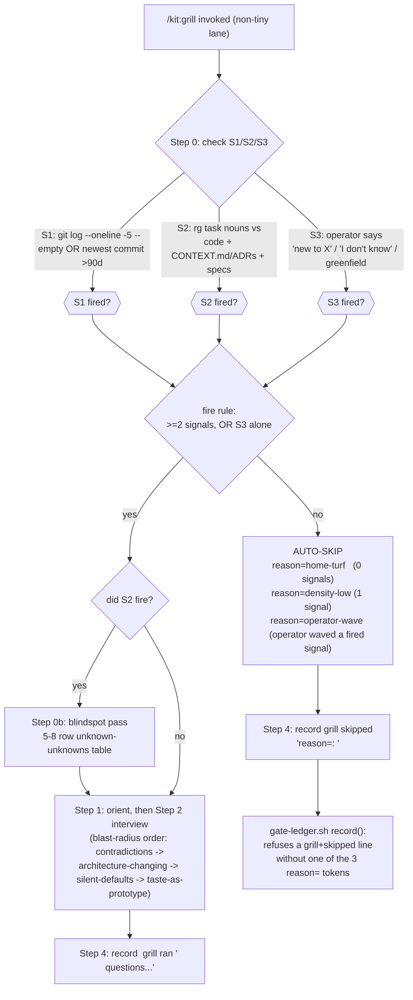

# Spec: grill unknown-density conditioning (3-signal precheck + blindspot pass + `reason=` skips)
Generated: 2026-07-04
Status: VALIDATED
Lane: full
References: ops-toolkit `research/2026-07-04-fable-unknowns-absorption.md` Design 1 (not present
in this repo; mega-goal kit-absorptions, sub-goal 04, ID-247). Sibling grammar contract:
ops-toolkit `_meta/megagoals/harness-observatory/DECISIONS.md` "01-kit-gates-lens" (the
`kit_gates` reader's tolerance for the `| GATE |` reason field, PR #683, merged before this).

## Problem
`/kit:grill` is the kit's own read of the article "A Field Guide to Fable: Finding Your
Unknowns" (Thariq, Claude Code team, 2026-07-03) as its highest-leverage pre-implementation
technique, and its own telemetry says it is the least-used gate: **82% skipped over a 63-run
ledger probe.** Most of those skips are honest, not lazy: unknowns concentrate in UNFAMILIAR
territory (a new domain, a cold code path), and most runs are home turf, where an interview adds
ceremony with no unknowns to close. The current contract asks every non-tiny run to grill, with
no signal for WHEN unknowns are actually dense enough to be worth an interview, and a skip today
is free text with no way to tell an honest home-turf skip from a lazily-waved one after the fact.
Three concrete gaps:
1. No precheck: grill always fires or is skipped by agent judgment call, not by a checkable
   signal, so the skip rate cannot be trusted as "this run didn't need it" vs "the agent
   shortcut it."
2. The interview, when it does fire, asks in whatever order occurred to the agent, not ordered by
   how expensive a wrong answer would be to unwind later.
3. The skip line has no structured, auditable reason, so `lane-telemetry` / the sibling
   `ledger-observatory kit_gates` lens cannot separate legitimate density-low skips from
   ceremony, the exact gap ID-245's ceremony-anomaly lens needs a whitelist for.

## Solution

### Approaches considered
1. **Raise grill's frequency (nag harder).** Make grill's ceremony heavier or add a
   "did you really check?" reminder. Rejected: the telemetry already says the skips are mostly
   honest; a louder nag on home-turf runs is pure ceremony, the opposite of what the kit-run-
   integrity benchmark work has been removing.
2. **A separate `/kit:precheck` command that gates whether `/kit:grill` runs.** Rejected: a new
   command is a new phase to wire into AGENTS.md/WORKFLOW.md/the doc-impact map/test-meta.sh for
   a check that fits in `/kit:grill`'s own preamble; the sub-goal's explicit contract is "no new
   command, no new agent."
3. **Condition grill's firing on a 3-signal precheck inside `grill.md`'s own preamble, with a
   closed-enum `reason=` token on the auto-skip line, no new command, no gate-requirement
   change.** Chosen. The precheck is prose (an agent runs `git log`/`rg` itself, in seconds); the
   only code change is a narrow write-time validator in `lib/gate-ledger.sh` so a grill skip
   cannot land on the ledger without one of three closed reasons.

### Chosen approach + why
Approach 3. Four parts, all inside `commands/grill.md` plus one small guard in
`lib/gate-ledger.sh`:

- **(a) 3-signal precheck** before Step 1: S1 territory novelty (`git log --oneline -5 --
  <target paths>`: empty, or newest commit >90 days old), S2 domain novelty (the task's key
  nouns absent from the repo's code, `CONTEXT.md`/ADRs, AND existing specs), S3 declared novelty
  (the operator's own words: "new to X" / "I don't know" / an explicit greenfield task). Fire the
  interview on **>= 2 signals, or S3 alone**; else AUTO-SKIP.
- **(b) Auditable skip:** the auto-skip line MUST carry `reason=<home-turf|density-low|
  operator-wave>` as the first token of its reason text. `lib/gate-ledger.sh record()` refuses a
  `grill`+`skipped` line whose reason does not start with one of the three tokens (`ran` lines,
  and skips of any OTHER phase, are unaffected: the guard is scoped to exactly `phase==grill &&
  state==skipped`).
- **(c) Interview reordered by blast radius:** contradictions first (unchanged), then questions
  whose answer would change the architecture, then silent-defaults stated as defaults, then
  taste questions offered as a throwaway-prototype offer instead of a question.
- **(d) Blindspot pass as Step 0b, conditional on S2:** when domain novelty (not mere codebase
  novelty) fired, a 5-8 row unknown-unknowns table (what / why it matters / the question to ask)
  runs BEFORE any question, literally named "blindspot pass" / "unknown unknowns" (the article's
  own framing, reported to work verbatim).

Why this shape over the alternatives: it is the one that changes WHEN grill fires without
touching WHICH lanes require it (the lane×phase matrix, `WORKFLOW.md`, is untouched), and it
makes the skip itself the auditable artifact ID-245's ceremony-detector needs, rather than
inventing a second telemetry surface.

### Extensibility & boundaries
- The 3 signals are deliberately cheap (one `git log`, one `rg`, one read of the operator's own
  words); a future signal can be added to the table without changing the fire rule's shape
  (>= 2, or S3 alone).
- The `reason=` enum is closed on purpose (3 values); widening it is a future decision gated by
  what the ceremony-detector's whitelist actually needs (per the research doc's tie-in), not
  pre-built here.
- The blindspot table's row count (5-8) is a size band, not a hard cap; a domain with fewer real
  unknowns should not be padded to 5.

### Architecture
See `## Design` below.

## Design
**Design-bearing:** yes (non-obvious control flow: a 3-signal decision tree gates whether an
existing advisory phase fires at all, plus a write-time enum guard in the enforcement layer
`lib/gate-ledger.sh`; 3 approaches were considered above).

**Chosen approach:** as in `## Solution` above; the diagram is the same decision tree, drawn once
so `commands/grill.md`'s prose and this spec agree on the exact branch order.

## Technical Design

### Interfaces (I/O contract)
- `commands/grill.md`:
  - **Input:** the task text, its type classification, the repo's git history at the target
    paths, the repo's existing code/CONTEXT.md/ADRs/specs, the operator's own framing of the
    task.
  - **Output:** either an interview (Step 1-3 as today, reordered per (c), with an optional
    Step 0b blindspot table when S2 fired) ending in a `grill ran` ledger line, OR a silent
    auto-skip ending in a `grill skipped "reason=<token>: <why>"` ledger line. Exactly one of the
    two, every run.
- `lib/gate-ledger.sh record()`:
  - **Input (new branch only):** `rid`, `phase`, `state`, `reason...` (existing signature,
    unchanged arity).
  - **Invariant added:** IF `normalize_phase(raw) == "grill"` AND `state == "skipped"`, THEN the
    joined reason text (`oneline "$@"`) MUST be EXACTLY `reason=home-turf`, `reason=density-low`,
    or `reason=operator-wave`, OR one of those three followed immediately by `:` (the documented
    `reason=<token>: <why>` convention), ELSE `record()` returns 64 and writes nothing (no
    partial/malformed ledger line). This is a CLOSED-enum match, not a prefix match: a look-alike
    string that merely starts with a token's letters (e.g. `reason=home-turfish-nonsense`) does
    NOT match (test-coverage review MEDIUM finding, fixed pre-ship; see checks 5/5b). Every other
    `(phase, state)` combination is behaviorally identical to before this change.

## After state
- [ ] `commands/grill.md` carries a "Step 0: Unknown-density precheck" section naming the 3
  signals, their checks, and the fire rule (>=2, or S3 alone), plus the 3 `reason=` tokens mapped
  to their trigger condition. (Today: grill always runs Step 1 first, no precheck.)
- [ ] `commands/grill.md` carries a "Step 0b: Blindspot pass" section, conditional on S2, with
  the literal words "blindspot pass" and "unknown unknowns", producing a 5-8 row table (what /
  why it matters / the question to ask). (Today: no such step exists.)
- [ ] `commands/grill.md`'s Step 2 states the blast-radius ordering (contradictions ->
  architecture-changing -> silent-defaults-stated -> taste-as-prototype) before the existing
  Rules/question-bank content. (Today: only contradiction-first is stated; no full ordering.)
- [ ] `commands/grill.md`'s Step 4 documents both ledger lines (interview ran; precheck
  auto-skipped with `reason=`), and the pre-existing literal string `record <rid> grill ran`
  is preserved byte-for-byte (test-meta.sh SPEC-063 assertion). (Today: only the `ran` line is
  documented.)
- [ ] `lib/gate-ledger.sh record()` refuses a `grill`+`skipped` ledger line whose reason does not
  start with `reason=home-turf`, `reason=density-low`, or `reason=operator-wave`; every other
  phase/state combination (including `grill`+`ran`, and `skipped` on any OTHER phase) is
  unaffected. (Today: `record()` accepts any free-text reason for any phase.)
- [ ] The 11 existing type banks in `commands/grill.md` are unchanged in count and headings
  (test-meta.sh's `GRILL_BANKS -eq 11` assertion, SPEC-058); no gate-REQUIREMENT / lane×phase
  matrix cell changes anywhere (`WORKFLOW.md` untouched).
- [ ] Three grill fixture captures exist (proof, not shipped code): home-turf auto-skip with
  `reason=`, declared-novelty (S3) firing the interview, S2 domain-novelty firing with the
  blindspot table first.
- [ ] One live `reason=` skip line exists in a real `~/.local/state/dwarves-kit/logs/runs/*.log`
  file, written by the new `record()` guard, and is confirmed parseable by the sibling
  `kit_gates` reader's documented tolerance (opaque reason field, no special-casing needed).

## Acceptance Criteria (global)
- [ ] All tasks pass their individual acceptance criteria.
- [ ] `bash tests/test-grill-conditioning.sh` (new) and `bash tests/test-meta.sh` both pass, no
  regression in `test-meta.sh`'s existing count (grill bank count, literal-string assertions).
- [ ] The 3 fixture captures + 1 live ledger line + the threshold-edge table (exactly-2-signals
  fires, S3-only fires, 89d-fresh vs 91d-stale S1 boundary, 1-signal auto-skips) are recorded in
  the proof (this spec's `## Verification` output + the PR body).

## Test plan

Coverage matrix (test-design-standard §5b dialect: code-level assertions for the one real code
change, `git`-driven walkthroughs for the prose precheck rule, since `/kit:grill`'s interview
logic is instructions, not code, the same honestly-stated limitation `test-design-record.sh` and
`test-references-field.sh` already document for prompt-text reviewers).

| # | Check | Kind | Where |
|---|---|---|---|
| 1 | `record <rid> grill skipped "reason=home-turf: ..."` succeeds, ledger line carries the token | code assertion | `tests/test-grill-conditioning.sh` |
| 2 | `record <rid> grill skipped "reason=density-low: ..."` succeeds | code assertion | same |
| 3 | `record <rid> grill skipped "reason=operator-wave: ..."` succeeds | code assertion | same |
| 4 | `record <rid> grill skipped "no reason token"` FAILS (exit 64), no ledger line written | code assertion (negative control) | same |
| 5 | `record <rid> grill skipped "reason=bogus-token: ..."` FAILS (exit 64) | code assertion (negative control) | same |
| 5b | `record <rid> grill skipped "reason=home-turfish-nonsense: ..."` (a look-alike PREFIX of a valid token, not the token itself) FAILS (exit 64) | code assertion (negative control, added after test-coverage review) | same |
| 6 | `record <rid> grill ran "<N> questions..."` still succeeds with no reason= requirement | code assertion (regression) | same |
| 7 | `record <rid> spec skipped "<any free text>"` (non-grill phase) still succeeds unchanged | code assertion (regression) | same |
| 8 | `commands/grill.md`'s 11 `### <bank>` headers unchanged in count | structural assertion (regression) | `tests/test-meta.sh` (existing, re-run) |
| 9 | `record <rid> grill ran` literal string still present in `commands/grill.md` | structural assertion (regression) | `tests/test-meta.sh` (existing, re-run) |
| 10 | Fixture 1: home-turf walkthrough (0 signals; recent commit + known nouns) -> AUTO-SKIP, `reason=home-turf` | git-driven walkthrough, captured | proof / PR body |
| 11 | Fixture 2: declared-novelty (S3 alone, operator says "I'm new to this") -> fires, no blindspot table (S2 did not fire) | walkthrough, captured | proof / PR body |
| 12 | Fixture 3: S2 domain-novelty (task nouns absent from repo+specs) + a 2nd signal -> fires, blindspot table (5-8 rows) emitted FIRST | walkthrough, captured | proof / PR body |
| 13 | Threshold edge: exactly 2 signals (S1+S2, no S3) -> fires | walkthrough, captured | proof / PR body |
| 14 | Threshold edge: S3-only (0 or 1 other signal) -> fires | same as fixture 2 | proof / PR body |
| 15 | Threshold edge: S1 boundary, commit dated 89 days ago -> S1 does NOT fire (fresh) | git-driven walkthrough with `GIT_AUTHOR_DATE`/`GIT_COMMITTER_DATE` pinned | proof / PR body |
| 16 | Threshold edge: S1 boundary, commit dated 91 days ago -> S1 DOES fire (stale) | same mechanism | proof / PR body |
| 17 | Threshold edge: exactly 1 signal (S1 only) -> AUTO-SKIP `reason=density-low` | walkthrough, captured | proof / PR body |
| 18 | Live capture: one real ledger log carries a `reason=` skip line, parseable by the sibling `kit_gates` reader (opaque reason field, no crash, no special parse needed) | live capture + cross-repo cross-check | proof / PR body |
| 19 | COVERAGE-DELTA row: what's newly covered that nothing covered before | narrative row | proof / PR body |

**Negative controls:** checks 4, 5, and 5b above (a missing, garbage, or look-alike-prefix
`reason=` on a grill skip must be REJECTED, not silently accepted) are the load-bearing negative
controls: without the `record()` guard, all three would silently succeed. Confirmed live by
reverting `lib/gate-ledger.sh` to its pre-change state and re-running the suite: exactly checks
4/4b/5/5b flip RED, nothing else does (see `docs/verification/grill-conditioning.md`).

## Verification
`bash tests/test-grill-conditioning.sh && bash tests/test-meta.sh`

## Edge Cases
1. **A phase named "grill" is skipped for a reason unrelated to the precheck** (e.g. the
   conversation already resolved every open branch before `/kit:grill` was even invoked, the
   pre-existing SPEC-058 "conversation already resolved the banks" carve-out). This still needs
   one of the 3 tokens; `operator-wave` is the right fit (a human, in the moment, decided no
   interview was needed), so the carve-out is not orphaned by the new enum, it is absorbed into
   an existing token.
2. **S1 and S2 both fire but the operator answers instantly with no real unknowns** (the
   interview fires per the rule, but resolves in one turn). Not a bug: the precheck only decides
   whether to ASK, not how long the interview runs; Step 2's own "stop when" rule still applies.
3. **A repo with zero git history at the target path but the domain is completely familiar**
   (e.g. a brand-new file in a well-known module). S1 fires (empty git log) but S2 does not; 1
   signal alone is `density-low`, not `home-turf` (the distinction the two tokens exist to
   preserve: zero signals vs. one).
4. **The reason text itself contains the literal sequence `" | "`.** `oneline()` already
   collapses newlines but not this sequence; the reason= tokens are chosen to be short, and
   authors are expected to avoid embedding a literal pipe-space in free text (existing kit
   convention, not new to this change; not re-litigated here).

## Out of Scope
- The `kit_gates` reader itself (sibling harness-observatory mega-goal, already merged, PR #683,
  read-only).
- Sub-goal 05 (emit-sweep): wiring the same `reason=` convention into OTHER commands' skip
  emits. This sub-goal touches `commands/grill.md` and `lib/gate-ledger.sh` only.
- `commands/spec.md` / `commands/design.md` / `agents/meta-agent.md` template fields (sub-goal
  03, already merged into `master`).
- Any change to which lanes REQUIRE grill, or to the lane×phase depth matrix (`WORKFLOW.md`
  untouched).
- A learned/statistical router for the fire decision; the 3 signals are fixed and cheap by
  design, not a model to train.
- Widening the `reason=` enum beyond 3 values (a future decision, gated by telemetry, per the
  research doc's ceremony-detector tie-in).

## Decision Log
- DEC-001: the fire rule is `>= 2 signals, OR S3 alone`, not a weighted score. Rationale: the
  research doc pins this exact rule; a weighted score would need calibration data that does not
  exist yet, and a fixed threshold is itself "checkable in seconds," matching the design's own
  constraint.
- DEC-002: the `reason=` enum is enforced in `lib/gate-ledger.sh record()`, at WRITE time, not
  left to the reader. Rationale: the sibling `kit_gates` reader treats the reason field as opaque
  text by design (DECISIONS.md, 01-kit-gates-lens); enforcing the enum downstream would mean a
  malformed skip silently passes through and is only caught later at analysis time, if at all. A
  write-time guard makes every skip auditable from the moment it lands, not retroactively.
- DEC-003: `operator-wave` absorbs the pre-existing "conversation already resolved the banks"
  carve-out (SPEC-058) rather than adding a 4th token for it. Rationale: both describe the same
  shape (a human decision to skip, overriding what the precheck would have said), and a smaller
  enum is easier for a future consumer (sub-goal 05, the ceremony-detector) to reason about.
- DEC-004: the blindspot pass gates on S2 alone, not on the fire decision. Rationale: the
  research doc is explicit ("Blindspot pass = step 0, conditional on S2"); S1 (mere codebase
  novelty with a familiar domain) does not warrant a blindspot table, only genuine domain
  novelty does.
- DEC-005: the `reason=` match is a CLOSED enum (exact token, or token+`:`), not a prefix glob.
  Rationale: `kit:code-reviewer` (test-coverage lens) found live that the original
  `reason=home-turf*` pattern accepted `reason=home-turfish-nonsense` (any string merely
  starting with the token's letters), contradicting the spec's own "closed enum" language. Fixed
  in `lib/gate-ledger.sh` before ship; see `docs/implementation-notes/grill-conditioning.md` for
  the fix detail and check 5b for the regression test.
- DEC-006: the threshold-edge fixture's date construction (`tests/test-grill-conditioning.sh`)
  computes an EXACT epoch offset (`now_epoch - n*86400`) rather than a calendar-day-relative
  timestamp at a fixed wall-clock hour. Rationale: the same reviewer found the original
  construction was TZ-dependent (git parses `GIT_AUTHOR_DATE` in local TZ regardless of a `-u`
  generated string) and additionally time-of-day-dependent (a fixed "noon" commit time makes the
  day-count boundary shift with what time the suite happens to run). The epoch-offset form is
  immune to both, proven by re-running the suite under `TZ=UTC` and `TZ=America/Los_Angeles`.

## Open questions
(none, the sub-goal file states: "no new command, no new agent, no gate-REQUIREMENT change",
which resolves every open-fork this spec would otherwise carry)
