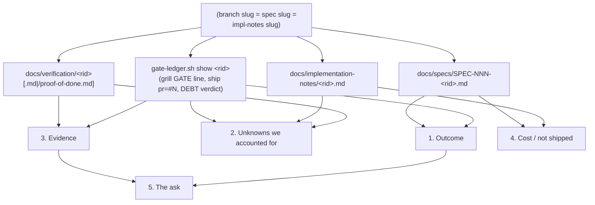

# Spec: `/kit:pitch` -- the outward buy-in assembler (kit-run-integrity sub-goal 06, ID-250)

Generated: 2026-07-04
Status: VALIDATED
Lane: full (new command, a new public surface, plus a new cross-command wiring point in
`commands/ship.md` Step 8; treated as full per the mega-goal's own framing, not because any
single edit is architecturally deep).

## Problem

Every gated run in this kit already produces the raw ingredients a third-party approver needs
to say yes: the spec's Problem/Solution, the proof-of-done's confirmation run-table +
negative controls, `docs/implementation-notes/<slug>.md`'s Deviations, and (since SPEC-138)
the gate ledger's `grill` record. Nobody assembles them for an OUTWARD audience. PR bodies
(`commands/ship.md` Step 8) are written for the merger, in git-diff order; a Dwarves teammate,
a client, or an approver who was not in the room needs a different ordering, outcome first,
because approvals accelerate when (a) the approver's own likely unknowns are pre-answered and
(b) they can see the failure points an expert would have anticipated were actually accounted
for (Thariq, "A Field Guide to Fable", post-implementation move; `research/2026-07-04-fable-
unknowns-absorption.md` Design 4).

`/kit:explain` (ADR-0031 §2, SPEC-124) already solves the adjacent INWARD problem (operator
understanding, ending in a quiz) by composing narrate-log + svg-knowledge-diagram over the
same underlying artifacts. There is no OUTWARD twin.

## Solution

**A thin `commands/pitch.md` wrapping a new mechanical engine, `lib/pitch.sh`.** Mirrors
`lib/explain.sh`'s split exactly: the engine is the ONLY thing that touches disk/the ledger
(so it cannot fabricate, its inputs are literally "spec file present or not", "proof file
present or not", etc.), and the command is a thin instruction to run it, present the output,
and record the bespoke ledger line. `/kit:pitch` is the OUTWARD lens (third-party buy-in,
ends in an ask); `/kit:explain` stays the INWARD lens (operator understanding, ends in a
quiz). Same underlying artifacts, two audiences, zero content duplication -- pitch never
re-explains a hunk, it references the spec/proof/impl-notes verbatim.

### Doc shape (5 sections, outcome-first)

| # | Section | Assembled from | Absence behavior |
|---|---|---|---|
| 1 | Outcome | `docs/specs/SPEC-NNN-<rid>.md` title + Solution (or Problem) paragraph + the ledger's `ship` PR number | `[no spec found for '<rid>'; outcome not assembled]` |
| 2 | Unknowns we accounted for | (a) the ledger's `grill` GATE line (b) `docs/implementation-notes/<rid>.md`'s dated entries (c) `negative control` mentions grepped from the proof | (a) `no grill record for this run` (b) `no implementation-notes file for this run` (c) `no proof recorded, so no negative controls to report` |
| 3 | Evidence | the proof-of-done's acceptance-criteria table / Confirmation-run / Runs section, VERBATIM, plus a PR link built from the ledger's `pr=#N` + `git remote get-url origin` | `[no proof-of-done file for this run]` / `no PR reference recorded for this run` |
| 4 | Cost / not shipped | the spec's `## Out of Scope` section (or an inline `out of scope`/`not changed:` mention), plus any `ponytail` mentions in the spec/impl-notes | `no explicit exclusions recorded for this run` / `no ponytail markers referenced ... for this run` |
| 5 | The ask | templated from the PR link (or the spec path if no PR yet) | always emitted (pure template, no source to miss) |

Section 2 is the load-bearing one: it is EXACTLY the three data sources Absorption Designs
1-3 formalized (grill conditioning, implementation-notes Deviations, proof negative controls).
A missing source is reported as an explicit sentence, never invented -- the whole reason this
sub-goal is over-tested.

### `<rid>` doubles as the slug

Per SPEC-070, the branch slug (`rid`) IS the spec slug IS the `docs/implementation-notes/
<slug>.md` filename IS (usually) the `docs/verification/<slug>[.md|/]` name. `lib/pitch.sh`
takes ONE argument and uses it for all four lookups, exactly like `bash lib/gate-ledger.sh
show <rid>` already does for the ledger.

### Proof-file shape (two homes, both read)

Per `docs/verification/README.md` ("Two homes"), a proof is either flat
(`docs/verification/<slug>.md`) or nested (`docs/verification/<slug>/proof-of-done.md`, falling
back to the newest `docs/verification/<slug>/runs/*.md`). `lib/pitch.sh` tries flat, then
nested-canonical, then nested-latest-run, in that order, so both of the kit's own live shapes
(seen right now: `kit-template-fields.md` and `grill-conditioning.md` are flat;
`kit-emit-sweep/proof-of-done.md` is nested) work without a config flag.

### Evidence-table extraction (format-agnostic, never a stub table)

The proof body varies (a table-first `## Acceptance criteria -> run-table`, or an older
`## Runs` run-log with dated `### ... GREEN|negative-control` headings). `lib/pitch.sh`
tries, in order: `## Acceptance criteria` section, `## Confirmation run` section, `## Runs`
section; the first one that has content is emitted VERBATIM. If none of the three exist, the
whole proof file is emitted with an explicit note that no known section heading matched (still
never a stub -- the raw file is real evidence, just not pre-sectioned).

### Trigger: on-demand + one conditioned ship-time offer

1. `/kit:pitch <rid>` any time (primary).
2. ONE advisory bullet added to `commands/ship.md` Step 8, immediately after the existing
   `significance-classify.sh record` + `quiz-gate.sh tap` calls (SPEC-136): read back the
   verdict step 1 JUST wrote (`bash lib/gate-ledger.sh show <rid> | grep '| DEBT |' | tail -1`,
   never re-classify), and if that line contains `significance=high` AND the repo is
   team-shared (`bash lib/pitch.sh team-shared`, exit 0), print the offer. Advisory, exit-0,
   never blocks, same anti-fatigue posture as the ★-tap nudge it rides beside.

### Team-shared detection (the rule this spec pins)

`bash lib/pitch.sh team-shared` runs `gh api repos/{owner}/{repo} --jq '.owner.type'` (a single
read-only GitHub API call gh already resolves from the current repo's remote; no hardcoded
org/user names, so the check stays portable across every consumer repo the kit is adopted
into). `Organization` -> team-shared (exit 0); anything else, or `gh` unavailable/
unauthenticated/erroring -> NOT team-shared (exit 1), the fail-safe default (a missed offer on
a real team repo costs nothing; a spurious offer on a solo repo is the annoyance ADR-0031's
anti-fatigue design explicitly guards against).

### Boundaries (never auto-posts)

`lib/pitch.sh` and `commands/pitch.md` never shell out to `gh pr comment`, `gh issue comment`,
a Discord/Slack webhook, or `curl`. Output is stdout, or a file via `--out <path>`, full stop.
Pasting it into Discord/a PR/a client email is a human action. An HTML surface (client-facing
polish) is explicitly deferred to the Artifact tool if a real case demands it later.

## Design

`obvious: not design-bearing` would undersell this -- there IS one real design decision (the
engine/command split + the two-home/three-heading extraction fallbacks), so it is recorded
here rather than waved. Three approaches were considered for HOW pitch reads its sources:　

1. **A pure-prose command** (like `/kit:review`/`/kit:docs`): the agent greps/cats the four
   sources itself, per written instructions, no new lib file. Rejected: the sub-goal's own
   quality bar ("a missing source produces an explicit line, NEVER fabricated content") is a
   LOAD-BEARING negative control; a prose-only command depends on the calling agent faithfully
   following "if X is missing, say so" every single time, with no mechanical backstop. `/kit:
   explain`'s own precedent (SPEC-124) already answered this exact question the same way: the
   ONLY input to the mechanical layer is deterministic (there `git ref`, here `rid`), so a
   narrative/omission cannot leak in structurally, not just by good behavior.
2. **A single monolithic `pitch()` bash function inline in the command doc**, executed by
   copy-pasting into a heredoc. Rejected: untestable without a real shell harness sitting
   outside `tests/`, and it duplicates `lib/explain.sh`'s already-proven shape for zero reason.
3. **`lib/pitch.sh`, mirroring `lib/explain.sh`'s split exactly** (chosen): one engine,
   five one-purpose subcommands (`outcome`/`unknowns`/`evidence`/`cost`/`ask`) plus `render`
   (the composed doc) and `team-shared` (the ship-time predicate), each independently testable
   against committed fixtures under `tests/fixtures/pitch/`. `commands/pitch.md` is then
   genuinely thin: run the engine, present it, record one ledger line.



**Chosen approach:** #3. It is the only one that makes "never fabricate" a property of the
code (an absent file/line literally cannot produce anything but the fixed absence string)
rather than a property of instruction-following, and it is directly testable with committed
fixtures, matching this sub-goal's own over-test mandate.

## Out of Scope

- **`/kit:explain` content itself.** Pitch composes zero explain/narrate-log/svg-knowledge-
  diagram logic; it references the spec/proof/impl-notes verbatim, never re-explains a hunk.
- **Any auto-posting integration** (Discord, Slack, `gh pr comment`, email). Stdout + `--out`
  only, proven by a load-bearing grep negative control (Verification below).
- **An HTML/client-facing surface.** Deferred to the Artifact tool if a real case demands it.
- **Generating NEW analysis.** `lib/pitch.sh` never computes a verdict, a severity, or a
  synthesis; it locates, extracts, and re-orders text that already exists on disk/in the
  ledger. If a source is silent, the doc says so instead of guessing.
- **A new WORKFLOW.md lane-matrix cell.** `pitch` is a bespoke, non-matrix ledger phase, same
  precedent as `verify`/`explain` (RUN_REPORT observability only, never a required gate).
- **Editing `test-command-emit-sweep.sh`'s exemption table.** `commands/pitch.md` mentions
  `gate-ledger` directly (the bespoke `pitch ran` record call), so it is a real emitter, not an
  orphan; only the file-count pin (29 -> 30) needs updating.

## Acceptance criteria

| # | Criterion | Evidence |
|---|---|---|
| AC1 | `lib/pitch.sh render <rid>` against a REAL recently-shipped rid produces all 5 sections, each grounded in a real file/ledger line | Real-sample run against `kit-emit-sweep`, committed at `docs/verification/pitch-command/sample-pitch.md` |
| AC2 | NEGATIVE CONTROL: a rid with NO grill record in its ledger produces the literal line `no grill record for this run` in section 2, and does NOT print any grill content | `tests/fixtures/pitch/no-grill/` |
| AC3 | NEGATIVE CONTROL: a rid with NO `docs/implementation-notes/<rid>.md` file produces the literal line `no implementation-notes file for this run` in section 2, and does NOT print any deviation content | `tests/fixtures/pitch/no-implnotes/` |
| AC4 | Contrastive: the SAME two checks against a fixture that DOES have both sources do NOT print the absence lines, and DO print the real content | `tests/fixtures/pitch/full/` |
| AC5 | NEVER-AUTO-POST: neither `lib/pitch.sh` nor `commands/pitch.md` contains `gh pr comment`, `gh issue comment`, `discord`, `slack`, or `curl` | grep negative control in `tests/test-pitch.sh` |
| AC6 | `commands/ship.md` Step 8 gains exactly one new advisory bullet, wired to the real `gate-ledger.sh show \| grep DEBT` + `pitch.sh team-shared` commands (not a paraphrase) | grep-F wiring check + behavioral fixture pair (high+team-shared fires, low or solo does not) |
| AC7 | `pitch.sh team-shared` is fail-safe: an unavailable/erroring `gh` returns "not team-shared" (exit 1), never blocks | stubbed-`gh` fixture, 3 modes (org/user/fail) |
| AC8 | The no-orphan command-emit sweep (`tests/test-command-emit-sweep.sh`) stays green with `commands/pitch.md` added (30 commands total, `pitch.md` a real emitter) | regression run |

## Verification

```
bash tests/test-pitch.sh
bash tests/test-command-emit-sweep.sh
bash tests/test-meta.sh
```

## Test plan

| # | Category | Case | Expected |
|---|---|---|---|
| 1 | Happy path | `render` against the `full` fixture (spec+proof+impl-notes+grill all present) | all 5 sections populated, no absence lines |
| 2 | Happy path | Real sample: `render kit-emit-sweep` | 5-section doc committed as the sample artifact |
| 3 | Boundary/edge | `no-grill` fixture | section 2 has literal `no grill record for this run`, nothing else grill-shaped |
| 4 | Boundary/edge | `no-implnotes` fixture | section 2 has literal `no implementation-notes file for this run` |
| 5 | Boundary/edge | proof file with a `## Runs` run-log (no table) | evidence section falls back to the Runs section verbatim, not a stub |
| 6 | Boundary/edge | no proof file at all | evidence section says `[no proof-of-done file for this run]`, unknowns section 2c says `no proof recorded, so no negative controls to report` |
| 7 | Boundary/edge | no spec file at all | outcome section says `[no spec found for '<rid>'; outcome not assembled]`; cost section says `[no spec found for this run]` |
| 8 | Security/abuse | never-auto-post grep | zero hits for `gh pr comment\|gh issue comment\|discord\|slack\|curl` across `lib/pitch.sh` + `commands/pitch.md` |
| 9 | Failure injection | `gh` stubbed to fail (mode=fail) | `team-shared` prints `no`, exits 1, never throws |
| 10 | Regression | ship.md advisory bullet, high significance + team-shared (org stub) | offer line's condition holds true (both real commands, no mirrored predicate) |
| 11 | Regression | ship.md advisory bullet, low significance | condition holds false (grep on `significance=high` fails) |
| 12 | Regression | ship.md advisory bullet, high significance + solo (user stub) | condition holds false (team-shared exits 1) |
| 13 | Regression | `test-command-emit-sweep.sh` full suite | 19/19 (count pin bumped 29->30) |
| 14 | COVERAGE-DELTA | before: 0 pitch tests, 0 pitch fixtures; after: N new assertions + 3 fixture dirs | recorded in proof-of-done |

## Decision Log

- **DEC-001:** `lib/pitch.sh` mirrors `lib/explain.sh`'s engine/command split rather than a
  pure-prose command. See Design, approach #3.
- **DEC-002:** team-shared detection uses `gh api repos/{owner}/{repo} --jq '.owner.type'`
  (Organization vs User), not a hardcoded operator/org allowlist, so the kit stays portable.
  Fails closed (not-team-shared) on any `gh` error.
- **DEC-003:** Evidence-section table extraction tries three heading conventions in order
  (`## Acceptance criteria`, `## Confirmation run`, `## Runs`) before falling back to the whole
  file, because the kit's own three real proof files (kit-template-fields, grill-conditioning,
  kit-emit-sweep) already disagree on shape and a single hardcoded heading would silently
  degrade two of the three real samples to "whole file" every time.
