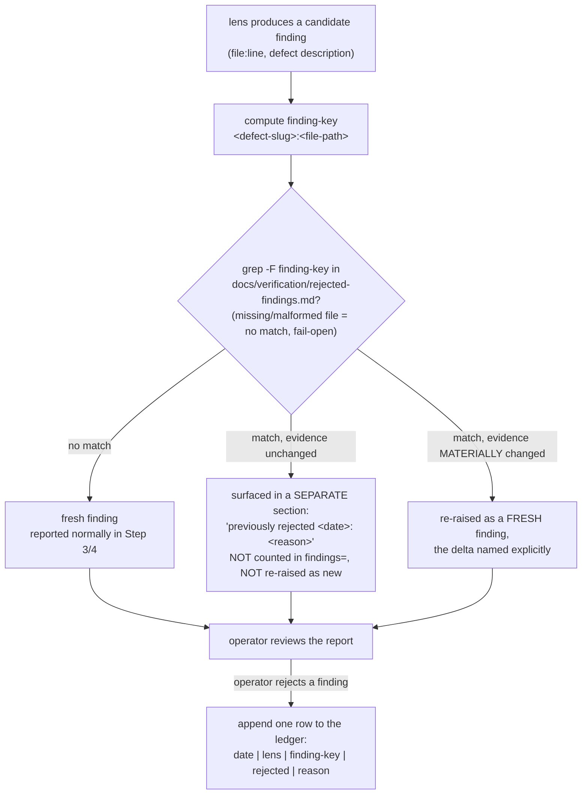

# Spec: Review findings memory (gate-review-absorptions sub-goal 02, ID-263 kit half)

Generated: 2026-07-04
Status: VALIDATED
Lane: normal (classified `normal` by `lib/lane-classify.sh`; touches `commands/review.md`,
`commands/review-team.md`, `agents/advisor.md` -- prose/prompt surfaces, not `lib/`/`hooks/`,
so the SPEC-069 review-escalation trigger does not fire).
Depends on: SPEC-143 (stale-adr-inversion, merged to `master`; the `stale-adr:` finding-key
prefix convention this spec's `<slug>` generalizes already lives in all three surfaces).

## Problem

The kit's review surfaces (`/kit:review`, `/kit:review-team`, `agents/advisor.md` critique
mode) have no memory across runs. Every review starts cold: a finding the operator already
looked at and explicitly rejected (a by-design pattern, a false positive, a won't-fix) gets
re-raised, verbatim, on the next review of the same code, because nothing records the
rejection. shadcn/improve's absorption source names the fix
(`research/2026-07-04-pxpipe-plannotator-improve-absorption.md` §3, A3, in `ops-toolkit`): a
"considered and rejected" vet-pass ledger that a later pass consults before reporting, so the
operator is not asked to re-litigate the same call every cycle. The risk of building this is
real and named up front (over-test flag on the sub-goal contract): a memory that can SUPPRESS
findings is a single bug away from silently muting a real defect on every future review, so
the mechanism must be conservative by construction -- surface, never silently drop -- and the
one load-bearing property (a novel finding on a previously-flagged file still fires) must be
proven, not asserted.

## Solution

### Approaches considered

1. **A per-repo markdown ledger (`docs/verification/rejected-findings.md`), consulted by
   prose + `grep` inside each review surface's own instructions; no new `lib/` script. CHOSEN.**
   Matches the existing convention every markdown-driven command in this kit already uses
   (BACKLOG.md is a hand-parseable kanban, gate-ledger's own log lines are hand-parseable
   pipe-delimited text): the ledger is a flat, git-diffable, human-readable table a reviewer
   (human or agent) can open and read directly, and the consult step is a literal `grep -F
   "<finding-key>" docs/verification/rejected-findings.md`, which any agent with a `Grep`/`Bash`
   tool can execute with zero new tooling. The sub-goal contract explicitly prefers this
   ("prefer prose + grep; add a lib helper ONLY if prose+grep genuinely cannot do it") and
   prose+grep is sufficient here: the operation is "does this literal string appear in this
   file," which needs no parser, no schema migration, no new dependency.
2. **A new `lib/rejected-findings.sh` helper (append/query verbs, like `gate-ledger.sh`).**
   Rejected: the contract's own quality bar forbids a new lib file unless prose+grep genuinely
   cannot do the job; a substring-match consult and a one-row markdown-table append are both
   inside what prose+grep already does, so a dedicated script would add a maintenance surface
   (tests, `tests/test-meta.sh` wiring, doc-impact-map rows) for no behavioral gain over the
   two-line grep the reviewer already has to run.
3. **Store rejected findings inside each spec's own `## Review` section (no separate ledger).**
   Rejected: `/kit:review` and `/kit:review-team` **replace, not stack**, the `## Review`
   section on every re-review (SPEC-005 rule, both commands' own text: "replacing any prior
   `## Review` section"), so a rejection recorded there is erased the moment the next review
   runs, exactly the memory-loss this sub-goal exists to fix. A ledger must outlive the spec
   it was raised against and survive across specs (a pattern rejected in one PR should stay
   rejected the next time it shows up anywhere in the repo, not just in that one spec's
   history).

### Chosen approach + why

Approach 1. It reuses the kit's existing "flat markdown ledger + prose consult" idiom instead
of inventing a new one, needs no new dependency or test-meta wiring, and keeps the ledger a
first-class git-diffable artifact the operator can read and hand-edit directly -- exactly the
posture the contract's quality bar calls for ("no severity scoring, no auto-rejection; the
ledger only remembers").

### finding-key format

`<defect-slug>:<file-path>` -- a short kebab-case slug naming the DEFECT SHAPE (not the
per-instance wording), a colon, then the file path the finding was raised against. Generalizes
SPEC-143's `stale-adr:` finding-key prefix convention (already live in all three review
surfaces) from one named lens type to any lens: `stale-adr:docs/foo.md` is a valid
finding-key under this scheme, as is `sql-injection:src/db.py` or
`bare-except:tools/notify.py`. **Match is on the WHOLE finding-key string** (slug AND path,
colon-joined); matching on the path alone is the exact failure mode the load-bearing NC
proves against (a novel defect at a previously-flagged file must still fire; see
Verification).

### Emit grammar

The review phase's existing gate-ledger record line (`commands/review.md` Step 4,
`commands/review-team.md` Step 3 tail: `bash lib/gate-ledger.sh record <rid> review ran
"<verdict> findings=<K> [suppressed=<S>]"`) gains two more space-separated `key=value` tokens,
appended to the existing reason string, never replacing it:

```
bash lib/gate-ledger.sh record <rid> review ran "<verdict> findings=<K> rejected=<M> actor=<name>"
```

- `rejected=<M>` -- count of findings this run recognized as a finding-key match and surfaced
  as "previously rejected" (NOT counted in `findings=<K>`, which stays "fresh findings only",
  unchanged meaning from before this spec).
- `actor=<name>` -- `git config user.name`, read at record time. Per the mega-goal's
  DECISIONS.md convention, a green-field emit grammar carries identity from birth rather than
  bolting it on later once a query already assumes its absence.

**Why this parses with the kit_gates reader unchanged.** `lib/gate-ledger.sh record` already
writes the whole reason string as ONE field (`printf '%s | GATE | %s | %s | %s\n' "$(now)"
"$phase" "$state" "$reason"`, line 177); `ledger-observatory`'s `adapters.read_kit_gates()`
parses a `| GATE |` line into `(rid, gate, outcome, reason, ...)` where `reason` is
`schemas.KIT_GATES_SCHEMA`'s `VARCHAR` column, i.e. the raw remainder string, never split into
sub-keys by the reader itself (confirmed by reading `adapters.py`'s `read_kit_gates()`
docstring and `tests/test-gate-yield.sh`'s row-fixture assertions in
`tools/ledger-observatory`, ops-toolkit, 2026-07-04). So `rejected=` and `actor=` need no
reader change: they ride inside the same opaque `reason` VARCHAR `findings=` already lives in.
The live cross-check in Verification below proves this on a real emitted line, not just by
reading the reader's source.

**Reconciling with sub-goal 03's gate-decision keying.** Sub-goal 03 (ops stack, not built
here) keys a SEPARATE vocabulary: gate-DECISION reasons (why a ship-gate override fired, why a
lane escalated). This spec's finding-key is a REVIEW-FINDING identity (a defect shape at a
file), never a decision reason. The two never collide because they answer different questions
("was this specific defect seen and rejected before?" vs. "why was this gate skipped or
overridden?") and live in different ledgers (`docs/verification/rejected-findings.md` here;
the gate-ledger's own `| GATE |` reason field there). Advisor P6 (cross-cutting seam check) at
convergence confirms no shared namespace: neither vocabulary borrows the other's prefix
convention (`stale-adr:`/defect-slugs vs. whatever sub-goal 03 mints for decision reasons).

## Design

New artifact: `docs/verification/rejected-findings.md`, a per-repo append-only markdown table.
New behavior: a "consult before report" step inserted into `commands/review.md` (between
Steps 2 and 3), `commands/review-team.md` (between the Step 3 merge and the Step 4 report),
and `agents/advisor.md`'s critique mode (before it emits its `ADVISORY:` line). No new agent,
no new `lib/` file, no new hook, no change to which findings a lens looks for -- only whether
an already-found finding gets reported as fresh or as "previously rejected."



## Acceptance criteria

1. `docs/verification/rejected-findings.md` exists with a header, the format doc (the table
   columns + the finding-key rule), and at least one seeded example row.
2. `commands/review.md`, `commands/review-team.md`, and `agents/advisor.md` (critique mode)
   each carry the pre-flag consult step, worded so a match is SURFACED (never silently
   dropped) and NEVER re-raised as a fresh finding, and so a finding-key match on file-path
   alone is explicitly ruled out (the load-bearing NC).
3. Both `commands/review.md` and `commands/review-team.md` name an append path: when the
   operator rejects a finding, the reviewer appends one row to the ledger.
4. The gate-ledger record line in both commands carries `findings=<K> rejected=<M>
   actor=<name>`, with `findings=<K>` counting fresh findings only (unchanged from before this
   spec) and `rejected=<M>` counting surfaced-as-previously-rejected findings.
5. A seeded previously-rejected finding (same finding-key: same slug AND same path) is
   surfaced as "previously rejected," not re-raised as fresh; a seeded NOVEL finding on the
   SAME FILE (different slug) still fires as fresh, proven by a real subagent dispatch with a
   deliberately-broken (file-path-only) match rule going RED (the novel finding wrongly
   suppressed) and the corrected (finding-key) match rule going GREEN.
6. A real emitted `findings=/rejected=/actor=` gate-ledger line parses through the
   `ledger-observatory` `kit_gates` reader (ops-toolkit `tools/ledger-observatory`), confirmed
   by an actual `ledger show kit_gates` / `ledger query` run against the real ledger, not by
   reading the reader's source alone.

## Verification

Fixture + NC-break + live-emit capture: `docs/verification/spec-144-review-findings-memory.md`.
Delta-from-contract notes: `docs/implementation-notes/spec-144-review-findings-memory.md`.

## Test plan

| # | Category | Case | Asserts |
|---|---|---|---|
| T1 | Happy path (fixture) | seeded rejected finding-key + a novel defect on the same file, correct (finding-key) match rule | rejected one surfaced as "previously rejected", novel one fires fresh (AC5) |
| T2 | NC break (load-bearing) | same fixture, match rule weakened to file-path-only | novel finding WRONGLY suppressed -- RED (AC5) |
| T3 | NC restore | same fixture, match rule restored to finding-key | novel finding fires again -- GREEN (AC5) |
| T4 | Fail-open: missing ledger | ledger file absent | no error, review proceeds as if no memory exists |
| T5 | Fail-open: empty ledger | ledger file present, header only, zero rows | no match for any finding-key, review proceeds normally |
| T6 | Fail-open: malformed row | a row missing pipe columns | `grep -F` still returns exact-substring matches for well-formed rows; a malformed row is inert, never crashes the consult step |
| T7 | Cross-lens collision | the same finding-key rejected under one lens, re-encountered under a different lens | still surfaced as previously-rejected (the ledger key has no lens partition; the `lens` column is descriptive metadata, not part of the match key) |
| T8 | Emit grammar | a live `gate-ledger.sh record ... review ran "... findings=N rejected=M actor=X"` line | parses via `ledger-observatory`'s `kit_gates` table, `reason` column carries the full string verbatim (AC6) |
| T9 | Append path | operator rejects a finding in a review session | one new row appended to `docs/verification/rejected-findings.md`, existing rows untouched |
| T10 | Coverage-delta advisory | `lib/coverage-delta.sh check` over this branch's diff | records, never blocks (informational; this is a prompt/doc-heavy change) |
| T11 | Substring-collision (found live, fixed) | `grep -F "except:notify.py"` (bare) vs `grep -F "\| except:notify.py \|"` (pipe-anchored) against the `bare-except:notify.py` row | bare form WRONGLY matches (RED); pipe-anchored form correctly does not (GREEN) |

## Coverage-delta row

```
$ bash lib/coverage-delta.sh check "$(git rev-parse --show-toplevel)" --rid review-findings-memory
[coverage-delta] exempt: no source change (docs/test/generated only)
```
Expected: this sub-goal is prose/prompt/doc surfaces, not application source; `exempt` is the
correct classification, never `WARNING under-tested`.

## Review
Date: 2026-07-04 | Reviewer: `kit:code-reviewer` (architecture lens), real dispatch

### Verdict: FIX THEN SHIP (at time of review) -> fixed, now SHIP

### Findings
1. **CRITICAL (FIXED): unanchored `grep -F "<finding-key>"` substring-matches, so a shorter
   slug that is a suffix of a longer rejected one (e.g. `except:notify.py` vs
   `bare-except:notify.py`) would wrongly match.** File: `commands/review.md`,
   `commands/review-team.md`, `agents/advisor.md`, `docs/verification/rejected-findings.md`.
   Fix applied: all four now specify `grep -F "| <finding-key> |"`, pipe-anchored to the whole
   table cell. Verified red (bare form wrongly matches) -> green (anchored form correctly does
   not); see `docs/verification/spec-144-review-findings-memory.md` "Run 3".
2. **MEDIUM (ADDRESSED): `docs/verification/rejected-findings.md` is a cross-cutting,
   ever-growing memory file living under a directory whose established convention is one
   proof-of-done record per work-item slug, undocumented as an exception.** Fix applied: a
   callout added to `docs/verification/README.md` naming this file as the one deliberate
   exception (path fixed by the sub-goal contract; not a precedent for a second one).
3. **LOW (ACCEPTED, consistent with existing convention): the consult-step prose is
   triplicated near-verbatim across the three review surfaces.** Same pattern SPEC-143's
   stale-adr rule already uses in the same three files; the contract explicitly weighed and
   rejected a shared `lib/` helper for these LLM-consumed prose instructions. Not changed.
4. **LOW (ACCEPTED, optional): `actor=$(git config user.name)` is computed caller-side in two
   command docs rather than centralized in `gate-ledger.sh`.** Matches the pre-existing
   convention (`findings=`/`suppressed=` were already caller-computed before this spec); worth
   revisiting only if a third `record` call site needs the same field.

### TODOs (open follow-ups)
None blocking. Findings 3 and 4 are accepted as consistent with the repo's existing
conventions; revisit only if a future review surface repeats the pattern a fourth time.

## Out of scope

- The observatory adapter + query changes (sub-goal 04, ops stack) -- this spec only proves
  the emit line PARSES with the reader as it exists today; it does not add a query.
- ops-toolkit's own `rejected-findings.md` file (created organically by first use in that
  repo, per the sub-goal contract's scope edges; not pre-seeded here).
- Auto-rejection, severity scoring, or any change to which findings a lens looks for. The
  human rejects; the ledger only remembers.
- A new `lib/` script (see Approaches considered #2).
