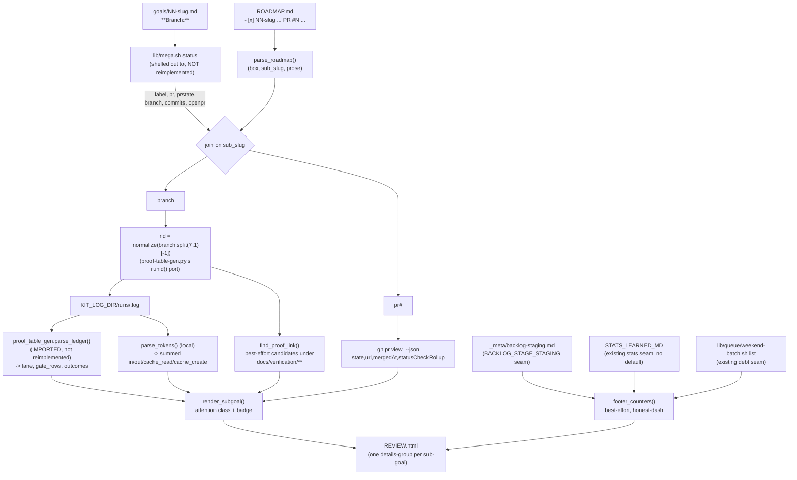

# Spec: mega review dashboard (harness-loop sub-goal 07)

Generated: 2026-07-12
Status: VALIDATED
Lane: full (`bash lib/classify/lane-classify.sh classify` on a description touching
`lib/mega.sh`, `lib/mega-review.py`, `lib/queue/orchestrate.sh`, `tests/`, `docs/specs/`; a
new composition surface touching an enforcement path (`orchestrate.sh`'s TIER-4 close),
SPEC-069's escalation applies regardless of lane depth).
Depends-on: 02 (OUTCOME emit sweep, merged 76fbafe -- this spec's gate-table Duration column
reads that data, though the real corpus has no post-sweep run yet, stated honestly below).

## Problem

The harness-loop mega's own Destination names a per-mega HTML dashboard as "the sign-off
surface" Han eyeballs before the gated-final click. Today that surface does not exist: the
loop's three read-only sources are already shipped SEPARATELY (`lib/mega.sh status`'s
git-truth reconciliation, the gate/run ledger, `gh pr view`) but nothing COMPOSES them into
one page. `RUN_REPORT.md` is hand-authored prose per mega (real, but not mechanically
verifiable against the ledger); there is no "what needs my eyes right now" projection that
survives a re-run.

A second, smaller gap the goal file names explicitly: the Learn leg's harness-wide starvation
signals (staged candidates, learned-ledger queued rows, unpaid debt) have no guaranteed
reader today -- they live in files nobody opens on a cadence. The dashboard is that reader.

## Solution

### Approaches considered

1. **A live/served dashboard (a small web server reading the ledger on request).** Rejected
   explicitly by the goal file's scope fence ("Not: a web server, auto-refresh"). Also
   contradicts PHILOSOPHY §3 (no unbounded outer loop / long-running kit-side process) and
   SPEC-182 (stats persists nothing, projections are recomputed on demand, not served).
2. **A second stats "lens" inside `lib/stats`'s DuckDB pipeline (a `mega-review` materialized
   view + `stats render --surface artifact`).** Rejected: `lib/stats` ingests from git-sourced
   and markdown-sourced adapters keyed by REPO or TIME WINDOW, not by "this one mega's
   sub-goal set reconciled against git truth" -- shoehorning `lib/mega.sh status`'s own
   git-truth classification (PR state + branch + commit count, already a working, tested
   verb) into a DuckDB adapter would duplicate that logic a second time inside a different
   subsystem, the exact drift the ADR-0034 taxonomy exists to prevent. Also out of scope per
   the goal file ("Not: ... new lenses").
3. **CHOSEN: a thin bash-launcher-to-python composer living beside `lib/mega.sh`**, reusing
   THREE already-shipped read paths without re-implementing any of them: `lib/mega.sh status`
   (git truth, shelled out to and parsed, not reimplemented), `lib/gate/proof-table-gen.py`'s
   `parse_ledger` (GATE/OUTCOME line parsing, imported directly), and `gh pr view` (fresh per
   render, never cached). This is the exact delegation shape `lib/gate/proof-table-gen.sh` ->
   `lib/gate/proof-table-gen.py` already established (bash 3.2 has no associative arrays,
   which the phase/token/PR joins need) and the exact cross-subsystem sourcing convention
   `gate-ledger.sh` itself uses for `lib/telemetry` + `lib/ledger` siblings.

### Chosen approach + why

Approach 3. It adds zero new persisted state (SPEC-182: "stats persists nothing" extended to
this surface -- a projection, always safe to re-run, never cached), zero new parsers for data
that already has one (GATE/OUTCOME lines, git-truth classification), and stays inside the
existing `mega` verb surface rather than growing a fourth subsystem. The composition itself
(joining three independently-shipped sources into one attention-colored page) is the only
genuinely new logic.

### Extensibility & boundaries

- `bin/mega` (the stable consumer entrypoint) and the `lib/mega.sh` -> `lib/mega/mega.sh`
  directory promotion are explicitly ADR-0034's SG-04 territory, not this sub-goal's. `mega
  review` is added as a second `case` arm in the existing orphan file; the promotion the
  file's own header comment documents ("if a second verb lands, promote to `lib/mega/mega.sh`
  + siblings") is a DEFERRED decision, recorded as a deviation below, not silently skipped.
- If `lib/stats` ever grows a per-mega adapter, this composer is unaffected: it never reads
  from `lib/stats`, so there is no coupling to break.
- Unit boundary: this sub-goal owns `mega review --html` + its TIER-4 wiring only. `learn
  propose`/`learn drain` (SG-05/06) are a DIFFERENT surface (cross-run distillation into a
  staging file); this dashboard reads the SAME staging file read-only for its footer count,
  never writes to it, and has no dependency on SG-05/06 landing first.

## Design

Three read-only sources join per sub-goal on the goal file's `**Branch:** <name>` line (the
same authoritative-branch convention `lib/mega.sh status` already documents: "no guessing a
naming convention"), keyed to a `rid` via `gate-ledger.sh`'s own `rid()` transform
(`${branch#*/}`, SPEC-070). A fourth, harness-wide, best-effort footer joins three MORE
existing consumer files by their own pre-existing env seams -- never a new path.



Chosen approach: Approach 3 above (thin composer over three shipped read paths + one
best-effort footer over three more, zero re-implementation of GATE/OUTCOME parsing or
git-truth classification).

## Technical Design

### Interfaces (I/O contract)

- Command: `bash lib/mega.sh review <slug> --html [--megagoals-root DIR] [--code-root DIR]
  [--base BRANCH] [--out PATH]`. `--html` is REQUIRED (the only surface, scope fence). Default
  `--out`: `<megagoals-root>/<slug>/REVIEW.html` (next to `RUN_REPORT.md`, per the goal file's
  "Handoff on completion" item 3 -- the output-location convention this spec records for
  DECISIONS.md).
- Inputs / consumes (read-only, zero writes to any of them): `<megagoals-root>/<slug>/
  ROADMAP.md` + `goals/*.md`; `KIT_LOG_DIR/runs/<rid>.log` (resolved via
  `lib/telemetry/kit-log-dir.sh`, the same resolver `gate-ledger.sh`/`proof-table-gen.sh` use);
  `gh pr view`; `docs/verification/**` (existence-check only); `_meta/backlog-staging.md`
  (`BACKLOG_STAGE_STAGING` env, default `<code-root>/_meta/backlog-staging.md`);
  `$STATS_LEARNED_MD` (no default, per `lib/stats/src/stats/config.py`'s "ops-toolkit-specific,
  no hardcoded fallback" contract); `lib/queue/weekend-batch.sh list --all-repos` (its own
  default 7-day window, labeled honestly in the footer text, not silently widened).
- Outputs / produces: one self-contained `REVIEW.html` file (inline `<style>` only, zero
  external requests, light/dark aware -- mirrors `lib/stats/src/stats/render.py`'s
  `_ARTIFACT_CSS` contract, extended with attention-state badges; every cell/title/prose value
  is `html.escape`d before interpolation, same discipline `render_artifact` already documents).
  Zero JS: `<details>`/`<summary>` (native HTML) does the collapse/expand, no script tag
  anywhere in the output.
- Invariants: a projection, never a stored source of truth (SPEC-182 discipline extended) --
  safe to re-run any time, nothing cached between runs, no partial-write (the file is written
  once, atomically via a single `open(...).write(...)`, not streamed incrementally). Every
  read path degrades to an honest-empty/honest-dash result on an absent source (missing
  ledger, missing goal file, missing `gh`, missing footer consumer file), NEVER a fabricated
  row -- the honest-empty NC (below) is the load-bearing proof of this invariant. Exit code 0
  on a successful render (including an honestly-empty one); nonzero only when the mega itself
  does not exist (no `ROADMAP.md` at the resolved path) or a flag/arg is missing.

### Data model changes

None (no new persisted table, no ledger marker change, no new file format). The
`_meta/backlog-staging.md` / `STATS_LEARNED_MD` / `weekend-batch.sh list` formats are read
via their OWN existing, unmodified contracts.

### API changes

New `lib/mega.sh` subcommand `review` (second verb; see Decision Log for the deferred
directory-promotion). New sibling `lib/mega-review.py` (bash-launcher-to-python, mirroring
`lib/gate/proof-table-gen.sh` -> `.py`). No change to `lib/mega.sh status`'s existing contract
or output (verified: `tests/test-mega.sh`'s 16 existing checks stay green, unmodified).

### Infrastructure changes

`lib/queue/orchestrate.sh`'s `_tier4_close` gains one new step (render the dashboard,
best-effort, non-fatal) between corpus resolution and the no-orphan sweep. Gated by the SAME
`TIER4_CLOSE` knob every other close step already uses -- no new env var.

## Scope

**In:** the `mega review --html <slug>` compose verb; the TIER-4 close wiring (best-effort,
non-fatal); 3 proof screenshots over real archived-mega ledger data; the wiring NC; the
honest-empty NC; a COVERAGE-DELTA row.

**Out:** a live/served variant (explicitly the Hermes-cards successor per the goal file);
historical backfill of any kind; new `lib/stats` lenses; the `bin/mega` stable entrypoint and
the `lib/mega.sh` -> `lib/mega/mega.sh` directory promotion (ADR-0034 SG-04); sign-off state
of any kind stored in the page (the gate click stays in the PR/merge flow, per the goal
file's scope fence).

**Not:** a web server; auto-refresh; a second ledger parser (GATE/OUTCOME parsing is imported
from `lib/gate/proof-table-gen.py`, never reimplemented); a second git-truth classifier
(shelled out to `lib/mega.sh status`, never reimplemented).

## Verification

```bash
bash tests/test-mega.sh              # unchanged, 16/16 (mega status's existing contract intact)
bash tests/test-mega-review.sh       # new, 22 checks: honest-empty NC, rid isolation, TOKENS
                                      # summation, proof-link best-effort, attention open/collapsed,
                                      # footer honest-dash-vs-real-zero, usage guards
bash tests/test-tier4-close.sh       # extended: wiring proof (REVIEW.html exists on a clean
                                      # TIER4_CLOSE=1 close) + wiring NC (TIER4_CLOSE=0 -> no
                                      # REVIEW.html, no render narration)
bash tests/test-meta.sh              # structural integrity, unaffected
bash tests/test-hooks.sh             # hook behavior, unaffected
```

Real-corpus render (proof rung 2, `docs/proof/loop-07-mega-dashboard/`):
```bash
bash lib/mega.sh review harness-ops --html \
  --megagoals-root _meta/megagoals/_archive --code-root . --base master --out /tmp/harness-ops-review.html
bash lib/mega.sh review kit-modularity --html \
  --megagoals-root _meta/megagoals/_archive --code-root . --base master --out /tmp/kit-modularity-review.html
```

## After state

- [x] `bash lib/mega.sh review <slug> --html` renders `<megagoals-root>/<slug>/REVIEW.html`
  from live ledger + gh + proof data for a real mega-goal (today: no such surface exists).
- [x] The page groups by sub-goal, attention-colors (green collapses, red/blue/gray stay open),
  shows gate rows (ran/skipped/override + reason, + Caught/Duration when OUTCOME data exists),
  summed TOKENS, PR/CI/merge state, and a best-effort proof-of-done link.
- [x] A harness-wide footer (staged candidates + oldest age, learned-ledger queued, unpaid
  debt) renders honest-dash when its source is absent/unset, never a fabricated number.
- [x] `lib/queue/orchestrate.sh`'s TIER-4 close renders the dashboard automatically
  (best-effort, non-fatal) when `TIER4_CLOSE=1` (default); `TIER4_CLOSE=0` renders nothing
  (proved by `tests/test-tier4-close.sh`'s wiring NC).
- [x] A mega with sub-goal lines but zero ledger rows anywhere renders a page that says so in
  a banner, with zero fabricated `<tr>` rows (the honest-empty NC).
- [x] `lib/mega.sh status`'s existing 16-check test suite is untouched and still green.

## Decision Log

- DEC-001: the directory promotion `lib/mega.sh` -> `lib/mega/mega.sh` + siblings, which the
  file's own header comment says should happen "if a second verb lands", is DEFERRED to
  ADR-0034 SG-04 (its own census names `bin/mega` + the promotion explicitly as SG-04's
  target state). This sub-goal adds `review` as a second `case` arm in the existing orphan
  file instead, with a header-comment note explaining the gap. Rationale: the goal file's own
  `## Touches` names `lib/mega.sh` singular, and SG-04 is the mega's dedicated consolidation
  wave for exactly this kind of structural move -- doing it here would touch files outside
  this sub-goal's Touches and risk a same-file collision with SG-04's own wave.
- DEC-002: GATE/OUTCOME ledger parsing is IMPORTED from `lib/gate/proof-table-gen.py`
  (`importlib.util.spec_from_file_location`, since the filename has a hyphen) rather than
  reimplemented. TOKENS-line parsing has no existing reader (proof-table-gen.py doesn't parse
  it) and is implemented locally (small, ~20 lines, ledger-local).
- DEC-003: git-truth classification is NOT reimplemented in Python. `mega-review.py` shells
  out to the already-shipped, already-tested `bash lib/mega.sh status <slug> ...` and parses
  its stable, documented per-line output format (`_STATUS_LINE_RE`). This keeps exactly ONE
  classifier for OK/CLAIM-UNVERIFIED/MERGED-UNCHECKED/STALLED/WIP/PENDING/INFO; a future
  change to the classification rules only has to change `lib/mega.sh`'s `_classify()`.
- DEC-004: the "attention-colored... one red thing unmissable" quality bar is implemented as
  native `<details open>`/`<details>` (no JS): OK/INFO collapse by default; WIP/PENDING/
  CLAIM-UNVERIFIED/MERGED-UNCHECKED/STALLED and an unresolvable (`None`) classification all
  open by default. This satisfies "zero JS dependencies beyond what the [stats] artifact
  formatter already ships" literally (that formatter ships zero JS too).
- DEC-005: the harness-wide footer's three counters read via THREE DIFFERENT semantics,
  stated plainly rather than unified for symmetry: staged candidates = count of `## [staged]`
  blocks (excludes `[promoted]`/`[rejected]`) + the oldest `Source: session <date>` age in
  LOCAL days (matching `hooks/backlog-stage.py`'s own `time.strftime` local-date convention,
  not UTC); learned-ledger queued = count of `## Ledger` table rows whose `status` column is
  exactly `queued` (no age computed -- out of scope for this sub-goal, a possible SG-10 doc
  follow-up, not invented here); unpaid debt = the row count of `weekend-batch.sh list
  --all-repos`'s own default 7-day window (labeled `(7d window)` in the footer text, never
  silently widened to "all time").
- DEC-006: the TIER-4 wiring point renders BEFORE the no-orphan sweep / verifier dispatch
  (not after), so the dashboard reflects a snapshot as of close-time regardless of how the
  rest of the close resolves (held-clean, orphan-blocked, or dissent-blocked). A render
  failure is a WARN, never a halt -- the dashboard is a projection for the human gate, not a
  gate itself.
- DEC-007: the real-corpus proof render surfaced a genuine data-quality finding, reported
  honestly rather than swept aside: `kitmod-03-subsystem-commands.log` in the real ledger
  corpus carries 4 `OUTCOME` lines and ZERO `GATE` lines, at a single identical timestamp --
  the shape of a scripted test-fixture write, not a real production run (kit-modularity SG-02
  predates the OUTCOME emitter entirely, per SPEC-193's own inventory). The render correctly
  shows "(no GATE rows recorded for this sub-goal -- OUTCOME markers exist with no paired GATE
  row)" for it rather than a fabricated table; the proof screenshots use a DIFFERENT, clean
  real example (harness-ops's `02-wire-ledger`) instead of this anomaly.
- DEC-008: no real archived-mega ledger row in the corpus today carries BOTH a `| GATE |
  ... ran ...` line AND its paired `| OUTCOME |` bracket (SPEC-193's sweep landed 2026-07-12,
  after every archived mega in this proof ran) -- so the Duration/Caught columns are proven
  functional against the fixture suite (`tests/test-mega-review.sh`) but not yet demonstrated
  on a real ledger row in the screenshots. Stated honestly rather than staged with synthetic
  data in the real-corpus proof.

## Amendments
(none)

## Review
Self-review (delegate build session, 2026-07-12): the design's one non-obvious risk (a second
git-truth classifier drifting from `lib/mega.sh status`'s own) is closed by DEC-003 (shell out,
never reimplement). Security: `gh`/`git`/`bash lib/mega.sh status`/`bash lib/queue/weekend-
batch.sh` are all invoked via `subprocess.run([...])` argv lists, never `shell=True`, never
string-interpolated into a shell command; every value written into the HTML output passes
through `html.escape`. `--code-root`/`--megagoals-root` are caller-supplied paths joined via
`os.path.join` and existence-checked before any read (`os.path.isfile`), never executed.
Failure-mode: every external read (ledger, `gh`, footer consumer files, `mega.sh status`
subprocess) degrades to `None`/empty on any error (missing binary, timeout, malformed JSON,
nonzero exit), never raises, matching the "never a fourth persisted store / never fabricate"
invariant. Escalated to `/kit:review-team` at build-review per SPEC-069 (this run touches
`lib/queue/orchestrate.sh`, an enforcement surface).
Status: VALIDATED.

## Open questions
- The learned-ledger footer's "oldest" age (mentioned as an example in the mega's own
  Destination text, `"140 queued, 1 flushed, oldest 28d"`) is intentionally NOT computed here
  (DEC-005); if Han wants it, it is a small follow-up (min-date over `status == queued` rows,
  the same pattern `_staging_counts` already uses).
