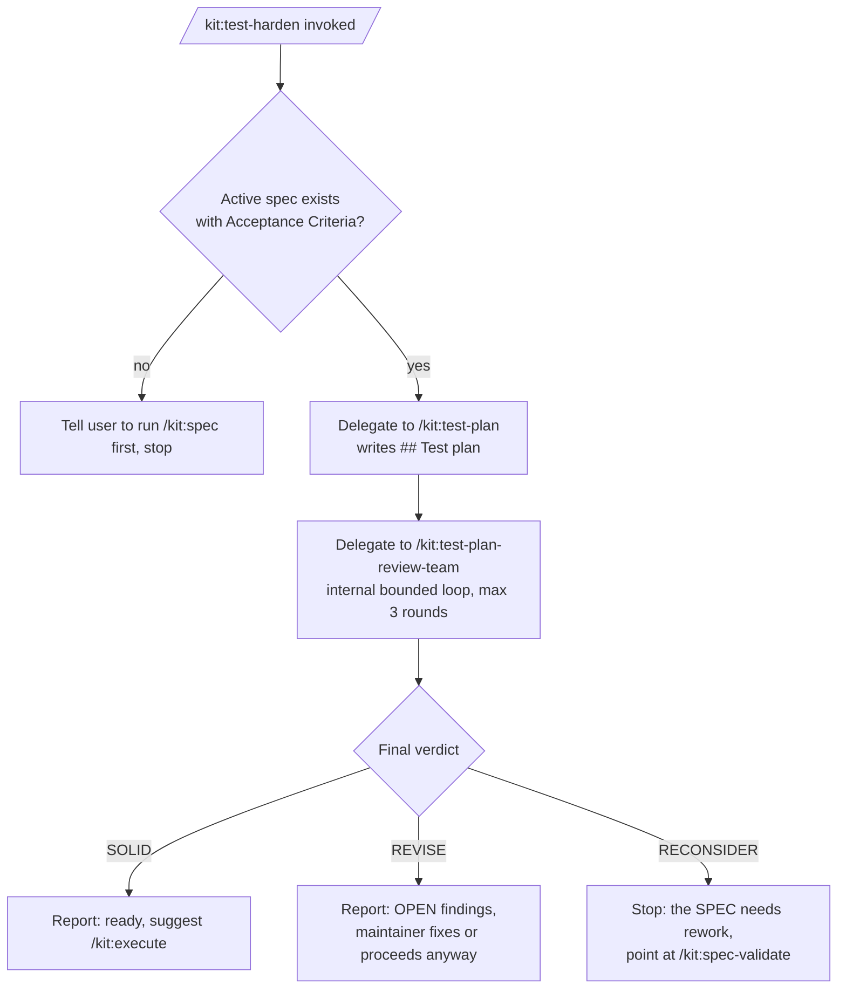

# Spec: /kit:test-harden, a spec-to-hardened-tests pipeline
Generated: 2026-07-30
Status: DRAFT
References: [commands/ui-design.md, imitate its exact shape: a thin coordinator that writes a brief, delegates generation to one existing lane, delegates critique to another existing lane, and reports a verdict, without reimplementing either lane's internals. commands/ship.md Step 1, imitate its "read a prior lane's verdict, branch on it, never silently skip" pattern for how this spec's Step 3 reads /kit:test-plan-review-team's verdict.]

## Problem
Getting from an idea to a hardened set of test cases today needs the maintainer to manually run three separate commands in the right order (`/kit:spec`, `/kit:test-plan`, `/kit:test-plan-review-team`), and to know that order exists. Nothing chains them. The operator described this as wanting "the input is the spec, the output is the test scenarios," run as one step, not three manual ones.

## Solution

### Approaches considered
1. **Build a new bounded auto-revise loop around `/kit:test-plan`.** Rejected: `/kit:test-plan-review-team` already IS a bounded auto-revise loop (max 3 rounds, distinct-reviser-not-lens-reviewer, strictly-falling-findings rule, `[[QL-VERDICT ...]]` markers). Duplicating that loop would be the exact anti-pattern `coding-hygiene.md`'s "rule of three" warns against, worse, two loops with slightly different cap/termination rules would drift apart over time.
2. **Fold the sequencing into `/kit:test-plan` itself** (add a flag that auto-invokes `test-plan-review-team` at the end). Rejected: `/kit:spec-validate` stays separate from `/kit:spec`, `/kit:review-team` stays separate from `/kit:review`, `/kit:visual-team` stays separate from generation in `/kit:ui-design`. The kit's own convention is author and critique as separate opt-in lanes; collapsing them here would be the one inconsistent exception.
3. **A thin new coordinator command that only sequences the three existing lanes by reference** (chosen). It does not reimplement spec-authoring, matrix generation, or the critique loop; it resolves the active spec, delegates to `/kit:test-plan`, delegates to `/kit:test-plan-review-team`, then reads the final verdict and reports.

### Chosen approach + why
Option 3. It is the smallest change that satisfies "one command, spec in, hardened tests out," and it reuses 100% of the existing critique/revise machinery instead of forking it. The rejected alternatives both either duplicate a loop that already exists (1) or break an established kit convention of separating authoring from critique (2).

### Extensibility & boundaries
- What changes when the load-bearing dimension grows: if a fourth test-related lane is ever added (e.g. a dedicated exploratory-testing lane), it slots in as a fourth delegated step after the critique loop terminates, the same way this spec adds a third step after `/kit:test-plan`. The dimension that grows is "number of lanes chained," not the shape of any one lane.
- Unit boundaries: this command has exactly one job, sequence three existing lanes and report the final verdict. It owns no test-design logic, no critique logic, and no revise logic; all three live in their existing homes.

### Architecture
See `## Design` below.

## Design

### Approaches considered + chosen
See `## Solution` above; same three options, same choice (a thin reference-only coordinator).

### Diagram

### ADR link(s)
None. This is a reversible, additive command; no lasting architectural commitment beyond the kit's existing lane-separation convention (already precedented by `/kit:ui-design`, `/kit:spec-validate`, `/kit:review-team`).

### Boundaries & failure modes
Out of bounds: this command never edits `## Test plan` or `## Test plan critique` content itself, both belong to the lanes it delegates to. See `## Failure modes` below.

## Technical Design

### Interfaces (I/O contract)
- Inputs / consumes: the active `docs/specs/SPEC-NNN-<slug>.md` (resolved the `/kit:next` branch-aware way, same as `/kit:test-plan` and `/kit:test-plan-review-team` already do), specifically its `## Acceptance Criteria` section.
- Outputs / produces: the same two spec sections `/kit:test-plan` and `/kit:test-plan-review-team` already produce (`## Test plan`, `## Test plan critique`), unmodified in shape, plus a short final report (verdict + next step) to the user. No new files, no new spec sections.
- Invariants: this command must never write directly into `## Test plan` or `## Test plan critique`; it only reads the final state those two lanes leave behind. A future change to either lane's output shape does not require a change here unless the verdict vocabulary (`SOLID`/`REVISE`/`RECONSIDER`) itself changes.

## Task Breakdown

### Phase 1: Foundation
- [ ] TASK-001: Create `commands/test-harden.md` with frontmatter `description` matching the kit's existing style (one line, states input/output/opt-in)., Acceptance: file exists, frontmatter parses, description under ~200 chars.
- [ ] TASK-002: Write Step 1 (resolve active spec the `/kit:next` way; if none or no Acceptance Criteria, point at `/kit:spec` and stop, mirroring `/kit:test-plan` Step 1's own fallback verbatim)., Acceptance: wording matches the existing fallback pattern in `commands/test-plan.md` Step 1.

### Phase 2: Core
- [ ] TASK-003: Write Step 2, delegate to `/kit:test-plan`'s process by reference (do not copy its steps), same delegation style `/kit:ui-design` Step 2 uses for `frontend-design`., Acceptance: no duplicated enumeration-category text from `test-plan.md` appears in the new file.
- [ ] TASK-004: Write Step 3, delegate to `/kit:test-plan-review-team`'s process by reference (its internal bounded loop runs to completion inside this delegation; this command does not re-implement rounds, caps, or the reviser step)., Acceptance: no duplicated lens/round/cap text from `test-plan-review-team.md` appears in the new file.
- [ ] TASK-005: Write Step 4, read the final `### Verdict:` line from `## Test plan critique` and branch the report (SOLID/REVISE/RECONSIDER), matching `commands/ship.md` Step 1's read-a-verdict-and-branch pattern., Acceptance: all three verdict branches produce a distinct, correct next-step message.

### Phase 3: Polish
- [ ] TASK-006: Add the `## Source` footer naming what this command reuses (test-plan.md, test-plan-review-team.md) and the two files it imitates the shape of (ui-design.md, ship.md), per the kit's own convention of every command citing its lineage., Acceptance: footer present, all four files named.
- [ ] TASK-007: Add gate-ledger timing brackets (`bash lib/gate/gate-ledger.sh outcome <rid> test-harden start/end`) per SPEC-129, matching every other command's own bracket convention., Acceptance: brackets present at the same points `test-plan.md` places its own (before Step 1, after the final report).

## After state
- [ ] A single `/kit:test-harden` command exists that takes an idea/active-spec as input and leaves a critique-hardened `## Test plan` as output, without the maintainer manually sequencing three commands. (Today: the maintainer must know to run `/kit:spec` -> `/kit:test-plan` -> `/kit:test-plan-review-team` in that order, unassisted.)
- [ ] Zero duplicated logic: `commands/test-harden.md` contains no copy of `test-plan.md`'s category taxonomy or `test-plan-review-team.md`'s lens/round logic, verifiable by `grep`. (Today: N/A, command does not exist.)

## Acceptance Criteria (global)
- [ ] All tasks pass their individual acceptance criteria
- [ ] Running `/kit:test-harden` against a spec with no `## Acceptance Criteria` stops and points at `/kit:spec`, does not proceed
- [ ] Running it against a valid spec produces the same `## Test plan` and `## Test plan critique` shapes the two existing lanes already produce
- [ ] No regressions to `/kit:test-plan` or `/kit:test-plan-review-team` when run standalone (this command is additive, not a replacement)

## Verification
`grep -c "happy-path\|boundary/edge\|failure-injection" commands/test-harden.md` returns `0` (no duplicated category taxonomy); `grep -c "Bracket the phase for timing" commands/test-harden.md` returns `1` (gate-ledger wired); a manual dry run against a real spec produces a final report naming one of SOLID / REVISE / RECONSIDER.

## Edge Cases
1. No active spec at all -> stop at Step 1, point at `/kit:spec`, do not fabricate a spec.
2. Active spec exists but has no `## Acceptance Criteria` -> same stop as case 1 (mirrors `/kit:test-plan`'s own existing behavior).
3. `## Test plan critique`'s bounded loop hits its 3-round cap still at REVISE (findings did not fully converge) -> report the OPEN findings plainly; do not claim SOLID, do not retry a 4th round (that retry logic belongs to `test-plan-review-team.md`, not here).
4. Multiple specs match the branch-aware resolution -> ask the user which one, exactly as `/kit:test-plan` Step 1 already does; do not auto-pick.

## Out of Scope
- Auto-running `/kit:execute` after a SOLID verdict. This pipeline stops at hardened test cases (the operator's stated input/output boundary); execution is a separate, explicit step.
- A new critique loop, lens set, or cap. All critique logic stays owned by `commands/test-plan-review-team.md`.
- Any change to `commands/spec.md`'s interactive intent-gathering. A missing spec is a stop-and-point, not an auto-invoke (spec authoring needs the user's own answers).

## Decision Log
- DEC-001: Command name is `/kit:test-harden` (working name). Rationale: distinct from `test-plan`/`test-plan-review-team` (no collision), "harden" names the generate-then-critique-then-revise outcome. Alternative rejected: `/kit:spec-tests` (read as "tests for a spec," ambiguous with "does this spec have tests" rather than the pipeline verb).
- DEC-002: Delegate by reference to the two existing lanes rather than inlining their steps. Rationale: avoids drift between two copies of the same category taxonomy / critique-loop logic; matches `/kit:ui-design`'s own delegation-by-reference style for `frontend-design` and `/kit:visual-team`.

## Open questions
(none; a /goal loop appends here if it hits a decision this spec does not cover, then stops)
