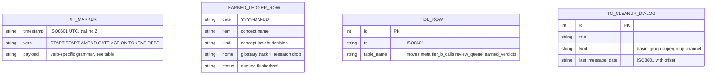

# Spec: ledger-event schema (the observatory's contract)
Generated: 2026-07-04
Status: VALIDATED

## Problem

The `ledger-observatory` mega-goal collapses ~10 scattered write-only ledgers (kit
gate/proof/telemetry, `learned-ledger.md`, tide's `state.sqlite`, tg-cleanup's `*.json`,
plus two planned ledgers not yet emitting) into one agent-callable, read-only observability
surface. Sub-goal 02 builds the DuckDB ETL that reads all of them, but nothing yet says,
precisely, what shape each store is in. Without a pinned schema, 02 would either
re-derive the grammar ad hoc per store (drift risk) or invent a fourth marker convention
where one (the kit's own) already exists and is already shared by two ledgers that don't
exist yet. This spec is that pin: the contract 02's ETL builds its views against.

## Solution

### Approaches considered

1. **Formalize the existing kit marker convention as canonical, adapt the 3 outliers.**
   The kit's `lib/gate-ledger.sh` already emits an append-only, pipe-delimited,
   timestamp-prefixed line format across ~10 stores (6 marker verbs in per-run ledgers +
   several standalone hook logs, see Design below). Two ledgers that don't exist yet
   (understanding-gate's debt ledger, kit-face's token ledger) already reuse this exact
   shape (`DEBT`/`TOKENS` verbs are implemented in `gate-ledger.sh` today, just not yet
   called by their producing features), so they conform on arrival, no extra work needed.
   Only 3 genuinely foreign stores (a markdown table, a SQLite db, JSON snapshots) need a
   documented field-map, not a rewrite.
2. **Invent one normalized schema all 10 stores get migrated to.** Rejected outright by the
   goal's Quality bar ("ONE schema, not a fourth convention") and the ROADMAP's binding
   assumption ("no sync, no second source of truth... the files stay canonical"). Migrating
   `tide`'s SQLite or tg-cleanup's JSON to a text marker format would mean rewriting two
   working tools' storage layers to serve an observability side-project, disproportionate
   and explicitly out of scope ("changing any producer ledger's format" is a **Not**).
3. **Skip formalization, let 02 read each store's ad hoc shape directly.** Rejected: this is
   exactly the failure mode the mega-goal exists to prevent (drift, no shared contract,
   02/03/04 each re-deriving parsing rules independently). A written contract is cheap here
   (a doc, no code) and every downstream sub-goal depends on it.

### Chosen approach + why

Approach 1. It costs nothing beyond documentation (the shape already exists in running
code), it satisfies the "name it, don't invent it" quality bar exactly, and it gives 02 a
single grammar for ~10 of ~13 total stores plus 3 pinned adapter contracts for the rest.

### Extensibility & boundaries

- **Growth dimension: new marker verbs.** `gate-ledger.sh` today emits 6 verbs
  (`START`/`START-AMEND`/`GATE`/`ACTION`/`TOKENS`/`DEBT`). A 7th verb (e.g. a future
  cost-alert marker) is additive: the schema doc's verb table gains a row, the
  conformance check's verb allowlist gains an entry. No structural change.
- **Growth dimension: new outlier stores.** A 4th non-conforming store (e.g. a future
  tool with its own state file) gets its own adapter-contract section, following the same
  three-part shape (field-map + sample record + parse note) as the 3 here. The schema
  doc's adapter section is designed to append, not restructure.
- **Unit boundaries:** the schema doc names the grammar (no code). The conformance check
  is a single-purpose grep/parse script with one job (accept/reject a line or record
  against the grammar), it does not read a live ledger file end-to-end or aggregate
  anything; that's 02's ETL.

### Architecture

See `## Design` below.

## Design

### Approaches considered + chosen

See `## Solution` above, same analysis, no design-specific tradeoff beyond it.

### Diagram (ER, the shape each store's records take)



This is intentionally shallow, an ER diagram of 4 record shapes, not a full relational
model. The point being pinned is "what does one record of each store look like," which
is what 02's ETL adapters key off; the actual multi-table SQLite schema is already fully
defined in `tools/tide/src/tide/state.py::ensure_schema()` and is not duplicated here.

### ADR link(s)

None. Nothing here is a new irreversible decision, it's a naming/formalization of
conventions already live in shipped code (`gate-ledger.sh`) and already-running tools
(`tide`, `tg-cleanup`). No ADR needed per ADR-0031 §1's own trigger list (no new
component, no schema change, the schemas described already exist).

### Boundaries & failure modes

See `## Failure modes` below. This design touches data (it describes existing data
shapes) but makes no external integration or migration; the conformance check is
read-only against static fixture strings, never a live ledger file.

## Technical Design

### Interfaces (I/O contract)

- **Inputs / consumes:** nothing at runtime, the schema doc and adapter contracts are
  static references. The conformance check's test harness (`test-schema-conform.sh`)
  consumes: one real line copied from a live `~/.local/state/dwarves-kit/logs/runs/*.log`
  file, synthetic `DEBT`/`TOKENS` lines generated via `gate-ledger.sh debt`/`tokens` in a
  scratch `DWARVES_KIT_LOG_DIR` (never the live log dir), one hand-crafted malformed line,
  and the 3 outlier sample records embedded in the adapter contracts doc.
- **Outputs / produces:** the conformance-check script exits 0 on a conforming line, exits
  non-zero (with a reason on stderr) on a malformed one. No files are written.
- **Invariants:** the checker never mutates `~/.local/state/dwarves-kit/logs/` or any
  tool's live store (read-only over ledgers is the mega-goal's Quality bar, binding here
  even though 01 does no querying, the checker sets the precedent 02 must follow).

### Data model changes

None, this spec describes existing data models; it changes none of them (Scope edge:
"changing any producer ledger's format" is explicitly Not in scope).

### API changes

None.

### UI changes

None.

### Infrastructure changes

None. Seeds the `tools/ledger-observatory/` folder (`docs/`, `tests/`) that 02 builds on.

## Task Breakdown

### Phase 1: Schema doc

- [ ] TASK-001: Write `tools/ledger-observatory/docs/ledger-event-schema.md` naming the
  kit marker grammar precisely: line shape, the 6 verbs, each verb's exact payload
  grammar (k=v tokens for `START`/`START-AMEND`/`TOKENS`/`DEBT`; pipe-delimited
  positional fields for `GATE`; freeform oneline text for `ACTION`), acceptance: doc
  states plainly that `GATE`/`ACTION` are NOT k=v, so the schema stays honest about what
  exists rather than rounding to a uniform convention that isn't real.
- [ ] TASK-002: In the same doc, list the ~10 conforming stores this schema covers today
  (the kit's per-run ledgers under `logs/runs/*.log`, keyed by verb; plus the ~8
  standalone hook logs under `logs/*.log` which share the same
  `timestamp | context | ...` line shape) and the 2 planned stores (understanding-gate's
  debt marker, kit-face's token marker) that conform on arrival because `gate-ledger.sh`
  already implements their verbs, acceptance: every store named is backed by a real
  grep/read shown in the doc's inventory table (file path + one real or synthetic sample
  line), not asserted from memory.

### Phase 2: Adapter contracts

- [ ] TASK-003: Write `tools/ledger-observatory/docs/adapter-contracts.md` with 3
  sections (learned-ledger.md, tide state.sqlite, tg-cleanup \*.json), each with: what the
  store is, its field-map (source field -> observatory-facing field name + type), and one
  sample record, acceptance: the tg-cleanup sample record uses synthetic placeholder
  values only (no real title/id/username copied from the live `*.json` files in this
  repo, per the repo privacy rule); the tide sample matches an actual `CREATE TABLE`
  column list in `tools/tide/src/tide/state.py`; the learned-ledger sample matches its
  own `## Schema` table in `_meta/learned-ledger.md`.

### Phase 3: Conformance check + tests

- [ ] TASK-004: Write `tools/ledger-observatory/tests/lib/conform.sh` (or similar), a
  grep/parse-only script exposing one function/mode: given a line on stdin (or as an
  arg), classify it as a conforming kit marker (name the verb) or reject it with a
  reason, acceptance: no engine, no DuckDB, no file I/O beyond reading its input.
- [ ] TASK-005: Write `tools/ledger-observatory/tests/test-schema-conform.sh` covering:
  (a) a real line copied from a live `~/.local/state/dwarves-kit/logs/runs/*.log` file
  passes; (b) a `DEBT` line and a `TOKENS` line (the planned-marker shapes, generated via
  `gate-ledger.sh debt`/`tokens` into a scratch log dir, never hand-typed) pass; (c) a
  malformed non-conforming line (missing the timestamp, or an unknown verb, or missing
  pipe delimiters) is REJECTED, the load-bearing negative control; (d) each of the 3
  outlier sample records (from TASK-003's doc) parses under its own adapter contract
  (a lightweight per-adapter shape check, not a real DuckDB read), acceptance: running
  the script prints a PASS/FAIL line per case and exits non-zero if any case fails.

## After state

- [ ] `tools/ledger-observatory/docs/ledger-event-schema.md` exists and names the kit's
  real marker grammar (verified: `grep -c '^##' tools/ledger-observatory/docs/ledger-event-schema.md`
  shows the verb sections). (Today: no `tools/ledger-observatory/` directory exists.)
- [ ] `tools/ledger-observatory/docs/adapter-contracts.md` exists with 3 adapter
  sections, each with a field-map and a sample record. (Today: the 3 outlier stores have
  no documented contract anywhere.)
- [ ] `tools/ledger-observatory/tests/test-schema-conform.sh` exists and is runnable via
  `bash tools/ledger-observatory/tests/test-schema-conform.sh`, exiting 0 with all cases
  PASS including the malformed-line negative control. (Today: no conformance check
  exists.)

## Acceptance Criteria (global)

- [ ] All 5 tasks pass their individual acceptance criteria.
- [ ] `bash tools/ledger-observatory/tests/test-schema-conform.sh` exits 0: conforming
  kit line passes, `DEBT`+`TOKENS` planned-marker shapes pass, malformed line rejected
  (NC), all 3 outlier samples parse.
- [ ] No regressions: nothing in `lib/gate-ledger.sh`, `lib/lane-telemetry.sh`, `tide`, or
  `tg-cleanup` is modified by this spec (read-only, doc-only change to those areas).

## Verification

```bash
bash tools/ledger-observatory/tests/test-schema-conform.sh
```

## Edge Cases

1. A `GATE` line whose reason field itself contains a literal `|` (possible since
   `oneline()` in `gate-ledger.sh` does not strip pipes), the schema doc must say the
   payload is parsed by splitting on the FIRST two `|` delimiters after the verb, then
   treating the remainder as opaque text, not by a fixed field count.
   `ACTION`/`GATE`-reason payloads are already free text (see the same `oneline()`
   contract) and the checker must not over-trust delimiter counts on them.
2. A `DEBT` line's `reason=` value has `=` neutered to `:` by `gate-ledger.sh` itself
   (see its own comment on this), the adapter/checker must not assume a raw `=` never
   appears in a payload's free-text tail.
3. tg-cleanup's `keep-auto.json`/`kill-auto.json` are JSON **objects** keyed by category
   (`keep_personal`, etc.) mapping to arrays, while `review.json` is a flat JSON
   **array**, the adapter contract must document both shapes, not just one.
4. tide's `state.sqlite` may not exist yet on a fresh machine (`tide` creates it
   lazily), the adapter contract notes this is a 02-time concern (missing-file
   handling), not something 01's conformance check needs to handle since it never opens
   the real file.

## Failure modes

| Failure class | Detection signal | Mitigation / recovery |
|---|---|---|
| A future kit change alters `gate-ledger.sh`'s line shape (e.g. adds a 7th field) without updating this schema doc | `test-schema-conform.sh`'s real-line case (TASK-005a) starts failing against a freshly-copied live line | Doc + checker are versioned in this repo, not the kit; a spec-drift-guard style diff-check is a candidate for 02, out of scope here, for now, re-run the conformance test whenever the kit updates and fix the doc by hand |
| The tg-cleanup sample record accidentally includes real personal data | Grep the committed doc for the live JSON files' real title/id strings before commit | This spec's TASK-003 acceptance criterion requires synthetic values only; verified manually before commit (see Verification) |
| Conformance check silently accepts a malformed line because a regex is too loose | The malformed-line negative control (TASK-005c) is the load-bearing check; if it ever passes when the checker is broken, the whole conformance claim is void | The NC is a required, named part of Verification, a broken checker fails the spec's own acceptance, not silently |

## Out of Scope

- The DuckDB views / the `ledger` CLI (02's job).
- The render skill (03's job).
- The feedback loop into `work-intake` (04's job).
- Implementing the 3 adapters in code (02's job, this spec only writes the contract).
- Inventing any new marker convention (explicitly rejected, see Solution).
- Changing any producer ledger's format, in the kit or in `tide`/`tg-cleanup` (read-only).

## Decision Log

- DEC-001: Formalize the kit's existing marker grammar as canonical rather than
  inventing a normalized schema. Rationale: the goal's Quality bar demands naming, not
  inventing; the two planned ledgers already implement the reused shape. Alternatives
  rejected: a normalized cross-store schema (would require rewriting tide/tg-cleanup's
  storage), skipping formalization (defeats the mega-goal's point).
- DEC-002: Co-locate the schema doc + adapter contracts + conformance test under
  `tools/ledger-observatory/` rather than a central `docs/specs/` location. Rationale:
  this repo's co-location rule (`CLAUDE.md` "docs" section) puts a single-tool's docs at
  `tools/<x>/docs/...`; `tools/ledger-observatory/` is the mega-goal's declared Work repo
  target and 02-05 build directly on this folder.
- DEC-003: Synthesize `DEBT`/`TOKENS` sample lines by actually invoking
  `gate-ledger.sh debt`/`tokens` into a scratch log dir rather than hand-typing them.
  Rationale: a hand-typed sample risks silently drifting from the real `printf` format in
  `gate-ledger.sh`; a generated sample is provably real.

## Review

See `SPEC-126-validation.md` (spec-validate report, 2026-07-04): APPROVED, no
critical/blocking findings, one non-blocking scope note.

## Open questions

(none)
