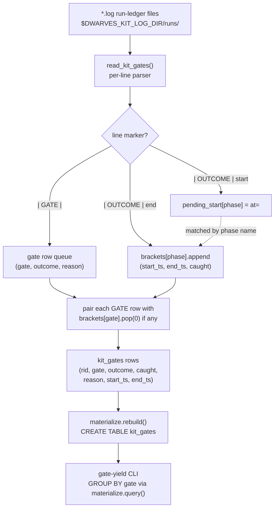

# Spec: kit_gates per-gate table + `gate-yield` (ledger-observatory mega-goal harness-observatory, SG-01)
Generated: 2026-07-04
Status: VALIDATED
Lane: normal (lane-classify.sh returned `normal`; treated as bearing design per goal file: /spec then
/spec-validate before code)
Depends-on: none (chain head). Builds on the shipped `tools/ledger-observatory/` package (PRs
#672-#680, SPEC-126..130, all merged on `main`).

## Problem

`tools/ledger-observatory/docs/benchmark-followup.md` change 1 names the load-bearing miss: kit
#158's `gate-ledger.sh` grammar (`TS | GATE | <phase> | ran|skipped|override | <reason>`) has no
per-line reader. `schemas.KIT_SCHEMA` / `adapters.read_kit` (via lane-telemetry's `_rows()`) store
only per-RUN aggregates (`gates_ran`, `gates_skip`, `gates_ovr`), never which named gate ran, was
skipped, or was overridden, and never its reason. The "ceremony" signal (a gate that is high-`ran`
with zero real catch, i.e. it structurally cannot fail) is today a hand probe over raw log text, not
a query. This sub-goal is the read-side half of the harness-observatory mega-goal's flagship
benchmark query: `ledger gate-yield`.

A companion emitter (`gate-ledger.sh outcome <rid> <phase> <start|end> [caught=<bool>]`, SPEC-129 in
the KIT's own numbering) already exists in `~/.claude/dwarves-kit/lib/gate-ledger.sh` and writes an
ADDITIVE `| OUTCOME |` start/end bracket carrying `caught=<bool>` + epoch timestamps, keyed on the
same phase name as the `GATE` line. Verified 2026-07-04 by scanning all 83 files under
`~/.local/state/dwarves-kit/logs/runs/*.log`: **zero** contain a real `| OUTCOME |` marker line today
(the verb/reader exist per `kri-01-gate-outcome.log`'s own build note, but nothing calls `outcome
start`/`outcome end` at an actual phase boundary yet). The kit-absorptions mega-goal wires that call
site later. So `kit_gates` must be correct and useful on a corpus where `caught`/`start_ts`/`end_ts`
are 100% NULL today, without dropping or mislabeling a single `GATE` row on that account, this is the
FP-negative-control this sub-goal's proof is built around.

## Solution

### Approaches considered

1. **New table, single-sourced schema, NEW per-line parser reading the run-ledger files directly
   (CHOSEN).** `kit_runs` is a per-RUN aggregate table sourced by reusing lane-telemetry's private
   `_rows()` awk helper (mandated no-re-parse rule, `adapters.py` docstring). `_rows()` has no
   per-line output mode, it aggregates counts inside one awk pass and returns one row per file. There
   is no existing per-line reader to reuse for a per-GATE-line table, so `adapters.read_kit_gates()`
   is a small, new, purpose-built parser over the SAME files (`config.kit_log_dir() / "runs" /
   *.log`), matching the same env-driven, skip-safe-on-missing-source contract every other adapter in
   the file already follows.
2. **Extend `_rows()` (kit's own lane-telemetry.sh) to also emit per-gate lines, and read those.**
   Rejected: out of scope (that file is dwarves-kit's, not ledger-observatory's; the goal file's
   scope edges name `adapters.py`, not the kit's own lib), and it would coordinate a cross-repo change
   for a read that direct-file-parsing solves without touching the kit at all.
3. **Wait for the kit-absorptions mega's emitter to land before building the reader.** Rejected:
   inverts the "shipped read-only lens with no reader for an existing emit" bug this table exists to
   fix, matching the bug the etl-cli's own schema-drift fix already models: a write with no reader is
   worthless. The FP-NC below proves the reader is correct *now*, over the corpus that exists *now*
   (100% NULL caught), and remains correct once the emitter starts producing real brackets (the golden
   fixture covers both states).

### Chosen approach + why

Approach 1. Matches the existing single-source-of-truth schema discipline (`schemas.py`) exactly,
adds no new write path, and needs no coordination with the kit repo to ship a correct, useful reader
today.

### Extensibility & boundaries

- If the kit-absorptions mega's emitter starts calling `outcome start`/`outcome end` at real phase
  boundaries, `kit_gates.caught`/`start_ts`/`end_ts` populate automatically on the next `rebuild()`,
  no schema or parser change needed (the pairing logic already handles a present-or-absent bracket).
- `defect-correlation` (SG-02, next) reads `kit_gates` (and the new `git_fixes` adapter it introduces)
  independently; nothing here couples to git history.
- Unit boundary: this sub-goal owns `kit_gates` + `gate-yield` only. `anomalies.py`'s ceremony
  detector (a later sub-goal) will read `gate-yield`'s aggregation logic but is not built here.

## Design

New table (`kit_gates`), new adapter function (`adapters.read_kit_gates`), new CLI command
(`gate-yield`), zero new write paths, zero changes to `kit_runs`/`tide_moves`/`tg_dialogs`/`learned`.
No new dependency (uses the same `duckdb`/`typer` already in `pyproject.toml`). The non-obvious part
is the two-marker join: `GATE` rows (gate/outcome/reason) and `OUTCOME` brackets (caught/start_ts/
end_ts) are written by two different `gate-ledger.sh` subcommands and must be paired by phase name,
FIFO, per rid, without assuming both exist.



Chosen approach: Approach 1 above (new per-line parser; no reuse of `_rows()`, which aggregates and
has no per-line mode).

## Technical Design

### Interfaces (I/O contract)

- Inputs / consumes: `$DWARVES_KIT_LOG_DIR/runs/*.log` (default
  `~/.local/state/dwarves-kit/logs/runs`, via `config.kit_log_dir()`), reading `| GATE |` and
  `| OUTCOME |` lines directly (no re-use of `lane-telemetry.sh`'s `_rows()`, per Approach 1).
- Outputs / produces: a `kit_gates` DuckDB table (columns: `rid, gate, outcome, caught, reason,
  start_ts, end_ts`); a `ledger gate-yield [--json|--table]` CLI command producing one row per gate
  name (`gate, ran, override, skipped, caught, override_pct`).
- Invariants: read-only (uses the SAME `materialize.query()` read path every other command uses, no
  new duckdb connection, no new write path); `kit_gates` is rebuilt from scratch on every
  `rebuild()` (delete-and-rematerialize, unchanged contract); a `GATE` line with a missing reason
  field, a malformed `at=`/`caught=` token, or a repeated gate name within one rid never raises and
  never silently drops a row.

### Data model changes

New table `kit_gates`, single-sourced via a new `schemas.KIT_GATES_SCHEMA` entry (the same
`(name, type)` list pattern `KIT_SCHEMA`/`TG_SCHEMA`/`LEARNED_SCHEMA` already use, DDL + column names
both derived from it, `schemas.assert_parity` guards the load).

```
KIT_GATES_SCHEMA = [
    ("rid", "VARCHAR"), ("gate", "VARCHAR"), ("outcome", "VARCHAR"),
    ("caught", "BOOLEAN"), ("reason", "VARCHAR"),
    ("start_ts", "VARCHAR"), ("end_ts", "VARCHAR"),
]
```

### API changes

New CLI command `gate-yield` (`cli.py`), `--json` (default) / `--table`, same `_emit()` formatter
every other command uses. No change to `rebuild`/`tables`/`show`/`query`/`render`/`anomalies`.

### Infrastructure changes

None.

## Task Breakdown

### Phase 1: Foundation
- [x] TASK-001: `schemas.KIT_GATES_SCHEMA` (7-column spec) + `column_names`/`ddl` reuse (already
  generic over any schema list). Acceptance: `schemas.column_names(schemas.KIT_GATES_SCHEMA) ==
  ["rid","gate","outcome","caught","reason","start_ts","end_ts"]`.
- [x] TASK-002: `adapters.read_kit_gates(runs_dir=None)`: parses `| GATE |` lines into rows (rid from
  filename stem, gate/outcome/reason from fields 3/4/5), parses `| OUTCOME |` start/end brackets into
  a per-(rid,gate) FIFO queue, pairs each `GATE` row against the next available completed bracket for
  that gate (or leaves `caught`/`start_ts`/`end_ts` NULL if none). Tolerant of: <4 pipe-fields (skip
  line, no crash), missing reason (4-field GATE line, reason=None), a malformed `at=`/`caught=` token
  (kept raw or ignored, no cast failure), and a duplicated gate name in one rid (each `GATE` line
  becomes its own row, never deduped). Acceptance: unit-level (via the golden fixture, TASK-004).

### Phase 2: Core
- [x] TASK-003: `materialize.py`: `_KIT_GATES_DDL = schemas.ddl(schemas.KIT_GATES_SCHEMA)`; wire
  `kit_gates` into `rebuild()`'s load loop + the row-count return; `SHOW_ORDER["kit_gates"] = "rid,
  gate"`. Acceptance: `uv run ledger rebuild` output JSON includes a `"kit_gates"` key with a `>= 0`
  int; `uv run ledger tables` lists `kit_gates`.
- [x] TASK-004: `tests/test-gate-yield.sh`: a COMMITTED golden fixture ledger dir (known rids, known
  gate outcomes, a legitimate no-caught-signal skip gate, at least one `| OUTCOME |` bracket, at least
  one malformed line, one missing-reason line, one duplicate gate name) asserting EXACT `gate-yield`
  numbers per gate. Includes the FP negative control (load-bearing): a gate with legitimate skips and
  zero `caught` signal is reported WITH its skip count, never dropped, never mislabeled as 100%
  ceremony when its `caught` column is simply unpopulated. Acceptance: `bash
  tests/test-gate-yield.sh` exits 0; the FP-NC assertion is present and passes.
- [x] TASK-005: `cli.py`: `gate-yield` command via `materialize.query()` (no new duckdb import), one
  row per gate: `ran/override/skipped/caught/override_pct`. Acceptance: `uv run ledger gate-yield
  --json` returns the golden-fixture's exact numbers (covered by TASK-004's suite).

### Phase 3: Polish
- [x] TASK-006: Over-test pass (`/kit:test-plan`-shaped) over parser edge cases beyond the golden
  fixture's happy-path coverage: missing fields, malformed timestamps, duplicate rids/gates. Record a
  COVERAGE-DELTA line in the canonical proof stating what this pass added vs. a baseline happy-path
  test. Acceptance: COVERAGE-DELTA line present in `docs/proof-of-done.md`'s `kit-gates-lens` feature
  row detail.
- [x] TASK-007: Materialize the 2026-07-04 hand-computed cut against the REAL corpus
  (`~/.local/state/dwarves-kit/logs/runs/`, 83 files) as the first real `gate-yield` run-table row;
  note any drift vs. the hand probe (grill ~82% skip, ui-design ~100% skip, core gates 2-4%
  override). Acceptance: a captured real-corpus `gate-yield --table` run in the proof, with a
  one-line drift note.
- [x] TASK-008: `docs/proof-of-done.md` new feature row (`kit-gates-lens`, SG-01, this spec) +
  `docs/verification/kit-gates-lens.md` detail file (per-feature, does not touch 01-05's existing
  rows/files). Commit, push, open PR against `main`, flip the mega-goal ROADMAP box, overwrite
  HANDOFF.md, append DECISIONS.md. Acceptance: PR open, ROADMAP/HANDOFF/DECISIONS updated + committed
  on the branch, CI green.

## After state

- [x] `kit_gates` exists as a materialized table, one row per `| GATE |` ledger line across every
  run-ledger file lane-telemetry.sh already reads. (Today: no such table.)
- [x] `ledger gate-yield [--json|--table]` returns per-gate `ran/override/skipped/caught/
  override_pct`. (Today: no such command; the ceremony signal is a hand probe.)
- [x] The FP negative control (a gate with legitimate skips and no caught signal is reported WITH its
  skip counts, never dropped) is asserted in a committed test, proven load-bearing.
- [x] The real 83-run corpus is materialized once and its `gate-yield` numbers captured against the
  2026-07-04 hand probe.
- [x] A COVERAGE-DELTA row is committed in the canonical proof.

## Acceptance Criteria (global)
- [x] All tasks pass their individual acceptance criteria.
- [x] `bash tests/test-schema-parity.sh && bash tests/test-ledger-cli.sh && bash
  tests/test-gate-yield.sh` all exit 0 (no regression to the 2 existing suites + the new one green).
- [x] No existing `verification/*`/`docs/specs/*` file for SG-01..05 is modified.

## Verification

```bash
cd tools/ledger-observatory
uv sync
uv run ledger rebuild
uv run ledger tables
bash tests/test-schema-parity.sh
bash tests/test-ledger-cli.sh
bash tests/test-gate-yield.sh
```

## Edge Cases
1. A `GATE` line with fewer than 4 pipe-delimited fields (severely malformed): skipped, never raises,
   never fabricates a gate/outcome from partial data.
2. A `GATE` line with exactly 4 fields (no reason): `reason` is NULL/None, row still emitted.
3. An `OUTCOME` end bracket with a malformed `at=`/`caught=` token (non-numeric epoch, non-bool
   caught value): the malformed token is kept as its raw string (`start_ts`/`end_ts`) or treated as
   absent (`caught` stays NULL), never a cast exception.
4. A gate name recorded twice within one rid (retried phase): each `GATE` line is its own row (never
   deduped); OUTCOME brackets pair FIFO in file order, so a gate re-run's two rows correctly get two
   different brackets when two exist, or the first gets a bracket and the second gets NULL when only
   one exists.
5. A `runs/` directory that does not exist (fresh install, no kit activity yet): `read_kit_gates`
   returns its known columns + an empty row list, matching every other adapter's missing-source
   contract, never an exception.

## Failure modes

| Failure class | Detection signal | Mitigation / recovery |
|---|---|---|
| FP-NC written vacuously (a legitimate skip silently reported as 100% ceremony, or dropped) | golden-fixture assertion checks the EXACT skip count for that gate, not just "gate-yield ran without error" | required as TASK-004 acceptance; a deliberate-break run (drop the skip row) documented in the run log |
| Parser crashes on a malformed real-world line instead of tolerating it | TASK-006 over-test pass feeds fixtures with missing fields / malformed ts / duplicate rids directly at `read_kit_gates` | acceptance requires all 3 classes to return rows (or an empty list), never raise |
| `kit_gates` schema drifts from its DDL the same way the original `KIT_SCHEMA` bug did | `schemas.assert_parity` runs at load time (same guard `test-schema-parity.sh` already proves is wired) | belt-and-suspenders; TASK-003 wires the SAME call site pattern `_load_python_table` already uses for the other 3 Python-sourced tables |

## Out of Scope
- `anomalies.py`'s ceremony detector (reads `gate-yield`'s aggregation logic, built in a later
  sub-goal per the mega-goal ROADMAP).
- `defect-correlation` / the `git_fixes` adapter (SG-02, next; explicitly out per the goal file's
  scope edges).
- Any change to `kit_runs`, `tide_moves`, `tg_dialogs`, `learned`, or the kit's own
  `gate-ledger.sh`/`lane-telemetry.sh` (kit-side emitter work belongs to the kit-absorptions mega).
- A second schema-definition mechanism; `kit_gates` uses the exact same `schemas.py` pattern as every
  other table.

## Touches
tools/ledger-observatory/**

## Decision Log
- DEC-001: `read_kit_gates` is a NEW parser, not a reuse of lane-telemetry's `_rows()`, because
  `_rows()` aggregates per-file and has no per-line output mode; there is no existing per-line reader
  to reuse. This is a deliberate, documented exception to the "reuse `_rows()`, no re-parse" rule the
  `kit_runs` adapter follows, scoped narrowly to the one grammar line (`| GATE |`) `_rows()` does not
  expose per-line.
- DEC-002: `caught`/`start_ts`/`end_ts` come from a SEPARATE `| OUTCOME |` marker (SPEC-129 in the
  kit's own numbering), paired to the `GATE` row by matching phase name, FIFO per (rid, gate), because
  the two marker types are written by two different `gate-ledger.sh` subcommands (`record` vs.
  `outcome`) and are not guaranteed to appear adjacent or even both present.
- DEC-003: on the real corpus (2026-07-04), 100% of `kit_gates` rows have NULL
  `caught`/`start_ts`/`end_ts` because zero run ledgers emit a real `| OUTCOME |` line yet (verified
  by scanning all 83 files); this is treated as the expected, correct state, not a bug, and is the
  basis for the FP-NC (a legitimate skip must still show its skip count with a NULL caught column, not
  be dropped or mislabeled).

- DEC-004: spec-validate self-review (2026-07-04): Reviewer 6 (Design Record Auditor, blocking)
  found this spec IS design-bearing (new table + new parser + non-obvious two-marker join logic) and
  the original `### Architecture` prose sat under `## Solution` instead of a top-level `## Design`
  section with a diagram. Fixed: added a `## Design` section with a mermaid flowchart of the
  parse-and-join pipeline before flipping Status to VALIDATED. Reviewers 1-5 (security, failure-mode,
  assumption, scope, solution-design) found no blocking issues: no auth/secret/injection surface (pure
  local read of `.log` files + a static SQL aggregation, no untrusted-input SQL interpolation); failure
  modes table already covers malformed input and empty-source; tasks are each single-file/narrow-scope
  and atomic; the FIFO-pairing assumption (DEC-002) is stated explicitly, not hidden.

## Amendments
(none)

## Review
Self-review via `/kit:spec-validate` (6-reviewer pass), 2026-07-04. Verdict: APPROVED after the
Reviewer-6 Design-section fix (DEC-004). Status flipped DRAFT -> VALIDATED.

## Open questions
(none)
