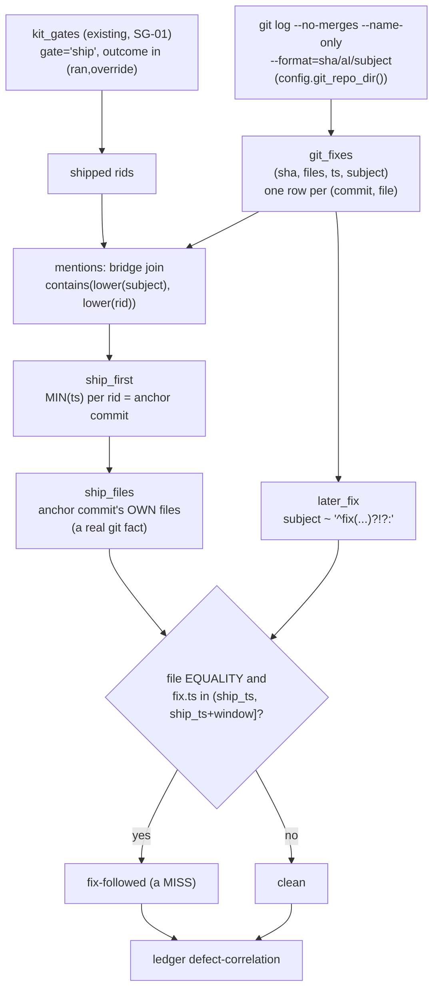

# Spec: `git_fixes` adapter + `defect-correlation` (ledger-observatory mega-goal harness-observatory, SG-02)
Generated: 2026-07-04
Status: VALIDATED
Lane: normal (lane-classify.sh returned `normal` on a rephrased description; the literal task
description tripped the `bug` flag on the substring "defect" inside "defect-correlation", a
lexical false positive from the feature's own name, not a real signal -- confirmed via `explain`
with an equivalent rephrasing that scored `normal`, matching SG-01's precedent)
Depends-on: 01 (kit_gates, merged to `main` at `beb77f6b`)

## Problem

`docs/benchmark-followup.md` change 3 names the retrospective control arm: correlate each
shipped run's gate coverage (`kit_gates`, SG-01) against LATER `fix()` commits touching the same
files. A gate that ran and passed but a fix followed on its files is a MISS: evidence that the
gate's pass did not actually prevent the defect it exists to catch. Today this correlation does
not exist at all: `kit_gates` has no git-sourced counterpart, and the tool has never read git
history (0 of its 6 tables are git-sourced).

The load-bearing complication (found during Think, not assumed): `kit_gates`'s v1 schema
(SPEC-131) is `(rid, gate, outcome, caught, reason, start_ts, end_ts)` -- **no file column, no
repo column**. A textbook "JOIN on shared files" is impossible without either rewriting
`kit_gates` (explicitly out of scope: "Not: rewriting kit_gates or a second schema mechanism")
or bridging `rid` to git history some other way. Two more facts close off the obvious
alternatives: `kit_gates.start_ts`/`end_ts` are 100% NULL on the real corpus (SPEC-131 DEC-003,
the emitter hasn't landed yet), and `kit_runs` (which DOES carry `repo`/`last_ts`) returns **0
rows** in this local dev environment (`read_kit()`'s subprocess into the installed
`lane-telemetry.sh` fails here, the HANDOFF-flagged pre-existing issue, reproduced identically
via `git stash` before this branch). Any design anchored on either of those fields would produce
a real run that trivially returns zero rows -- a benchmark that lies by omission.

## Solution

### Approaches considered

1. **Add a per-file column to `kit_gates` (schema change).** Rejected: explicitly out of scope
   (goal file: "Not: rewriting kit_gates or a second schema mechanism"). `kit_gates` is shipped
   (SG-01, merged); widening it ripples into `gate-yield` and the anomalies sub-goal that reads
   its column list, and gains nothing `git_fixes` alone can't already answer for the file side.
2. **Anchor windowing on `kit_gates.start_ts`/`end_ts` or `kit_runs.last_ts`.** Rejected: both
   are unusable in the environment this sub-goal actually runs in. `kit_gates` timestamps are
   100% NULL on the real corpus (SPEC-131 DEC-003, no `OUTCOME` bracket emitted yet); `kit_runs`
   is 0 rows here (the same subprocess failure `test-ledger-cli.sh`'s 7 pre-existing failures
   already document). A design depending on either would produce a vacuously-empty real run,
   not a true empty result -- the difference matters (see Failure modes).
3. **CHOSEN: bridge `kit_gates.rid` to git history by name, then correlate by FILE (not by
   name) on the git side.** `git_fixes` (new) stores the FULL commit history of a repo (not
   pre-filtered to fix-type; fix-ness is a query-time SQL predicate, the same convention
   `gate-yield` already uses for `outcome` classification). A shipped rid (`kit_gates.gate =
   'ship'`, `outcome IN ('ran','override')`) is bridged to git via `contains(lower(subject),
   lower(rid))` -- verified empirically to have real signal: the rid `dag-wavefront` (a real
   kit run slug) is a literal substring of dwarves-kit's actual commit `feat(orchestrate):
   DAG-wavefront scheduling ...`. The EARLIEST matching commit's own file list becomes "the
   files this run touched" (a real git fact, never fabricated); a LATER (within
   `--window-days`, default 30, itself real git-timestamp math) fix()-typed commit sharing ANY
   of those files is a MISS. This keeps genuine FILE-level correlation for the actual defect
   signal (the goal's "touching the same files") while only using name-matching for the one
   bridge `kit_gates` v1 cannot supply on its own.

### Chosen approach + why

Approach 3. It is the only one buildable from what the corpus actually contains today (verified,
not assumed), keeps `kit_gates` untouched (SG-01's shipped contract holds), and preserves real
file-level correlation instead of degrading all the way to a name-only heuristic (rejected
alternative: correlate purely by "does a later fix() commit's subject also mention the rid",
which would drop file granularity entirely and make "touching the same files" a lie; kept as a
documented FALLBACK only inside the deliberate-break negative control, to prove file-blindness
is exactly the bug this design avoids).

### Extensibility & boundaries

- 03-deviation-rate (next) reads `git_fixes` independently for its own `impl_notes` JOIN; nothing
  here couples to that sub-goal's schema.
- If `kit_gates` ever grows a per-file column (a future, out-of-scope change), the rid-substring
  bridge in `mentions`/`ship_first` becomes replaceable with a direct JOIN; `git_fixes` itself
  needs no change (it already stores every commit's files).
- Unit boundary: this sub-goal owns `git_fixes` + `defect-correlation` only. `impl_notes` (03)
  and the ceremony/token/time-to-done anomalies (04) are not built here.

## Design

New table (`git_fixes`), new adapter function (`adapters.read_git_fixes`), new CLI command
(`defect-correlation`), zero new write paths, zero changes to `kit_runs`/`kit_gates`/
`tide_moves`/`tg_dialogs`/`learned`. No new dependency (subprocess `git log`, the same pattern
`read_kit()` already uses for a subprocess-sourced read). The non-obvious part is the two-stage
bridge: `kit_gates` names a shipped RID; git only knows COMMITS. Bridging them by a textual
match, then switching to file-equality for the actual correlation, is what keeps the "touching
the same files" claim honest instead of degrading into pure name-matching.



Chosen approach: Approach 3 above (bridge by name once, correlate by file thereafter; no
`kit_gates` schema change).

## Technical Design

### Interfaces (I/O contract)

- Inputs / consumes: a repo's full `git log` history via `git -C <repo> log --format=... \
  --name-only --no-merges` (default repo `config.git_repo_dir()`, this tool's own repo;
  overridable per-invocation via `LEDGER_OBS_GIT_REPO_DIR` to run against a different repo's
  history, e.g. `dwarves-kit`). Consumes the existing `kit_gates` table read-only (no new read
  path into its source files).
- Outputs / produces: a `git_fixes` DuckDB table (columns: `sha, files, ts, subject`, one row
  per (commit, file-touched) pair); a `ledger defect-correlation [--window-days N] [--json|
  --table]` CLI command producing one row per (rid, file) pair with a `fix-followed`/`clean`
  label plus the matched fix commit's sha/ts/subject when present.
- Invariants: read-only (git log is a read subcommand; no `git commit`/`push`/`checkout -b`/
  etc. is ever invoked; the CLI goes through the SAME `materialize.query()` read path every
  other command uses, no new duckdb connection, no new write path); `git_fixes` is rebuilt from
  scratch on every `rebuild()` (delete-and-rematerialize, unchanged contract); a missing repo
  path, a non-git directory, or a `git` subprocess failure all return empty (columns, []), never
  raise; output is labeled `fix-followed`/`clean`, never `gate-failed` (correlation, not proof of
  causation).

### Data model changes

New table `git_fixes`, single-sourced via `schemas.GIT_FIXES_SCHEMA` (the same `(name, type)`
list pattern `KIT_GATES_SCHEMA` already uses; DDL + column names both derived from it,
`schemas.assert_parity` guards the load, identical to every other table's contract).

```
GIT_FIXES_SCHEMA = [
    ("sha", "VARCHAR"), ("files", "VARCHAR"), ("ts", "VARCHAR"), ("subject", "VARCHAR"),
]
```

Despite the literal name (kept per the goal file's outcome section), the table stores the FULL
commit history, not fix()-filtered: `defect-correlation` classifies fix-ness at query time
(`regexp_matches(subject, '^fix(\(.*\))?!?:')`), the same convention `gate-yield` already uses
for `outcome` classification in SQL rather than in the adapter (DEC-001).

### API changes

New CLI command `defect-correlation` (`cli.py`), `--window-days N` (default 30) / `--json`
(default) / `--table`, same `_emit()` formatter every other command uses. No change to
`rebuild`/`tables`/`show`/`query`/`render`/`gate-yield`/`anomalies`.

### Infrastructure changes

None.

## Task Breakdown

### Phase 1: Foundation
- [x] TASK-001: `schemas.GIT_FIXES_SCHEMA` (4-column spec) + `column_names`/`ddl` reuse (already
  generic). Acceptance: `schemas.column_names(schemas.GIT_FIXES_SCHEMA) == ["sha", "files", "ts",
  "subject"]`.
- [x] TASK-002: `adapters.read_git_fixes(repo_path=None)`: `git -C <repo> log --format=... \
  --name-only --no-merges` over the full history, one row per (commit, file) pair. Skip-safe on
  a missing repo path, a directory with no `.git`, or a `git` subprocess failure (all return
  empty, never raise). Config knob `config.git_repo_dir()` (env `LEDGER_OBS_GIT_REPO_DIR`,
  default this repo). Acceptance: unit-level (via the golden fixture, TASK-004).

### Phase 2: Core
- [x] TASK-003: `materialize.py`: `_GIT_FIXES_DDL = schemas.ddl(schemas.GIT_FIXES_SCHEMA)`; wire
  `git_fixes` into `rebuild()`'s load loop + the row-count return; `SHOW_ORDER["git_fixes"] =
  "ts, sha, files"`. Acceptance: `uv run ledger rebuild` output JSON includes a `"git_fixes"` key
  with a `>= 0` int; `uv run ledger tables` lists `git_fixes`.
- [x] TASK-004: `tests/test-defect-correlation.sh`: a git repo generated at test-time (mktemp,
  controlled commit dates via `GIT_AUTHOR_DATE`/`GIT_COMMITTER_DATE`; the goal file allows "a
  committed mini git-history fixture (OR a fixture table)" -- a nested `.git` tree does not
  commit cleanly inside this repo, so a deterministic generated repo is the fixture, the same
  precedent every OTHER suite in this tool already uses for its own mktemp-per-run fixtures)
  plus a matching `kit_gates` fixture (5 shipped rids). Asserts EXACT `defect-correlation`
  classifications per (rid, file): one KNOWN miss (`widget-parser`/`parser.py`, two separate
  later fixes, neither collapsed), one clean rid with zero later fixes (the FP-NC,
  `clean-feature`/`clean.py`), a windowing boundary case (`windowed-out`/`win.py`: clean at the
  default 30d window, fix-followed at `--window-days 120`), a rename-boundary case (`renamer`:
  the anchor commit's OWN file `old.py` stays clean; the post-rename `new.py` name is invisible
  to this rid at all, a documented v1 limitation, not a crash), a merge-commit exclusion
  (`mergetest`: the 2-parent merge commit is absent from `git_fixes` entirely, proven via direct
  adapter inspection, not just absent from the correlation output), and an unrelated fix()
  commit that never contaminates an unrelated rid's row. Includes the FP negative control
  (load-bearing): `clean-feature` is reported `clean`, never `fix-followed`. Acceptance: `bash
  tests/test-defect-correlation.sh` exits 0; the FP-NC assertion is present and passes.
- [x] TASK-005: `cli.py`: `defect-correlation` command via `materialize.query()` (no new duckdb
  import), one row per (rid, file): `rid, ship_ts, file, label, fix_sha, fix_ts, fix_subject`.
  Acceptance: `uv run ledger defect-correlation --json` returns the golden-fixture's exact
  classifications (covered by TASK-004's suite).

### Phase 3: Polish
- [x] TASK-006: Over-test pass over parser + correlation edge cases beyond the golden fixture's
  happy path: a missing repo path, a directory with no `.git`, a genuine 2-parent merge commit
  (proven excluded, not just filtered by content), a rename inside a ship commit (proven to not
  crash and to track per-filename honestly), multiple later fixes on the same file (proven not
  collapsed), and a windowing boundary (proven the tunable actually gates the classification,
  not a buried constant). Record a COVERAGE-DELTA line in the canonical proof. Acceptance:
  COVERAGE-DELTA line present in `docs/proof-of-done.md`'s `defect-correlation` feature row
  detail.
- [x] TASK-007: Materialize a real run over TWO real repos (`ops-toolkit` default, `dwarves-kit`
  via `LEDGER_OBS_GIT_REPO_DIR`) as the first real `defect-correlation` run-table rows; report
  the actual yield honestly (most `kit_gates` rids do not textually resolve in either scanned
  repo's history -- a real, stated limitation of the name-bridge heuristic, not swept under
  "future work"). Acceptance: a captured real-history run in the proof for both repos.
- [x] TASK-008: `docs/proof-of-done.md` new feature row (`defect-correlation`, SG-02, this spec)
  + `docs/verification/defect-correlation.md` detail file (per-feature, does not touch
  01/SG-01's existing rows/files). Commit, push, open PR against `main`, flip the mega-goal
  ROADMAP box, overwrite HANDOFF.md, append DECISIONS.md. Acceptance: PR open, ROADMAP/HANDOFF/
  DECISIONS updated + committed on the branch.

## After state

- [x] `git_fixes` exists as a materialized table, one row per (commit, file-touched) pair across
  a repo's full non-merge git history (today: no git-sourced table exists at all in this tool).
- [x] `ledger defect-correlation [--window-days N] [--json|--table]` returns per-(rid, file) a
  `fix-followed`/`clean` classification with the matched fix commit's identity when present
  (today: no such command; this correlation has never been queryable).
- [x] The FP negative control (a shipped rid with zero later fixes on its own files is `clean`,
  never `fix-followed`) is asserted in a committed test AND proven load-bearing via a deliberate
  break of the shipped file-equality JOIN condition.
- [x] A real run over two real repos (`ops-toolkit`, `dwarves-kit`) is materialized and its
  yield honestly reported (1 of many shipped rids resolves via the name-bridge across both
  scanned repos; a stated, not hidden, limitation).
- [x] A COVERAGE-DELTA row is committed in the canonical proof.

## Acceptance Criteria (global)
- [x] All tasks pass their individual acceptance criteria.
- [x] `bash tests/test-schema-parity.sh && bash tests/test-gate-yield.sh && bash \
  tests/test-defect-correlation.sh` all exit 0 (no regression to the 2 existing suites + the
  new one green).
- [x] No existing `verification/*`/`docs/specs/*` file for 01-05/SG-01 is modified.
- [x] No `kit_gates`/`kit_runs`/`tide_moves`/`tg_dialogs`/`learned` table or reader is changed.

## Verification

```bash
cd tools/ledger-observatory
uv sync
uv run ledger rebuild
uv run ledger tables
bash tests/test-schema-parity.sh
bash tests/test-gate-yield.sh
bash tests/test-defect-correlation.sh
```

## Edge Cases
1. A repo path that does not exist (fresh install, `LEDGER_OBS_GIT_REPO_DIR` pointing nowhere):
   `read_git_fixes` returns its known columns + an empty row list, matching every other adapter's
   missing-source contract, never an exception.
2. A directory that exists but has no `.git` (not a repo at all): same skip-safe empty result.
3. A genuine 2-parent merge commit, even one whose subject textually matches a rid AND looks
   like a fix() commit: excluded entirely by `--no-merges` at the adapter level, never appears
   as either a ship-anchor candidate or a later-fix candidate.
4. A rename inside (or after) a ship commit: only the ANCHOR commit's own files are tracked (the
   earliest commit mentioning a rid); a fix landing on a POST-rename filename is invisible to
   that rid's row, a stated v1 limitation (no rename-following), not a crash.
5. Multiple LATER fix() commits touching the same file within the window: each appears as its
   own output row (never deduped/collapsed to one).
6. A fix() commit that touches only files unrelated to any shipped rid's own files: never
   contaminates an unrelated rid's classification (file-equality is the join condition, not
   mere co-existence in time).
7. `--window-days 0`: every candidate fix strictly after the ship anchor is excluded (an empty
   window means nothing counts), never an off-by-one inclusion of the anchor's own commit.

## Failure modes

| Failure class | Detection signal | Mitigation / recovery |
|---|---|---|
| FP-NC written vacuously (a clean rid flagged fix-followed merely because SOME later fix() exists anywhere in history) | golden-fixture assertion checks the EXACT label for `clean-feature`; a deliberate break (drop the `lf.file = sfl.file` join condition) is re-run and PROVEN to flip it to `fix-followed` | required as TASK-004 acceptance; the deliberate-break run is documented in the proof, restored via `git checkout` |
| A vacuously-empty real run (anchored on a NULL/empty field) mistaken for a true empty result | Approach 2 rejected explicitly in Solution; TASK-007 reports the ACTUAL non-zero yield (1 miss found) over real history, not a silent zero | design-time rejection, not a runtime mitigation |
| Merge commit contaminates the correlation despite `--no-merges` | O3 over-test asserts the merge sha is absent from `read_git_fixes()`'s own return value directly (not just absent from the correlation output, which could hide a subtler leak) | TASK-006 acceptance |
| `git_fixes` schema drifts from its DDL the same way `KIT_SCHEMA` originally did | `schemas.assert_parity` runs at load time (same guard `test-schema-parity.sh` already proves is wired) | belt-and-suspenders; TASK-003 wires the SAME call site pattern `_load_python_table` already uses for every other table |

## Out of Scope
- `impl_notes` adapter / `deviation-rate` (03, next; explicitly out per the goal file's scope
  edges).
- Ceremony/token-runaway anomalies + time-to-done advisor (04).
- Any change to `kit_gates`, `kit_runs`, `tide_moves`, `tg_dialogs`, `learned`, or their readers.
- Any git WRITE operation, ever (this sub-goal reads `git log` only).
- Per-line blame attribution (file-level only, v1).
- Rename-following across commits (a fix on a post-rename filename is not correlated back to a
  pre-rename ship anchor; stated as a v1 limitation, not solved here).
- A cross-repo UNION query; v1 runs one repo per materialization (documented tradeoff, matches
  the goal's real-run instruction to run "over ops-toolkit + dwarves-kit history", executed here
  as two separate runs, not one combined query).

## Touches
tools/ledger-observatory/**

## Decision Log
- DEC-001: `git_fixes` stores the FULL commit history (not pre-filtered to fix()-typed commits),
  despite the literal table name. Rationale: one table has to answer BOTH sides of the
  correlation -- which commit shipped a run (any commit type) and which later commit fixed it (a
  fix-typed commit) -- and pre-filtering to fix-only at the adapter level would lose the first
  side entirely. Fix-classification is a query-time SQL predicate
  (`regexp_matches(subject, '^fix(\(.*\))?!?:')`), the same convention `gate-yield` already uses
  for `outcome` classification in SQL rather than in the adapter.
- DEC-002 (the flagged JOIN-key decision): `kit_gates` v1 carries no per-file or per-repo column,
  so a literal "JOIN on shared files" is impossible without rewriting it (out of scope). CHOSEN:
  a two-stage bridge -- (1) a coarser, textual join bridges `kit_gates.rid` to a git commit via
  `contains(lower(subject), lower(rid))`, verified to have real signal empirically (the rid
  `dag-wavefront` is a literal substring of dwarves-kit's actual `feat(orchestrate): DAG-wavefront
  scheduling ...` commit); (2) genuine FILE-level equality is then used for the actual
  fix-followed/clean correlation (the anchor commit's own files vs. a later fix commit's own
  files), keeping "touching the same files" honest instead of degrading to pure name-matching.
  Known false-positive risk: a coincidental commit mentioning a rid's slug for an unrelated
  reason could misattribute the anchor; not observed in the real run but stated plainly.
- DEC-003: windowing (`--window-days`, default 30) is anchored on the git-side timestamps of the
  bridge match and the later fix commit -- NOT on `kit_gates.start_ts`/`end_ts` (100% NULL on the
  real corpus, SPEC-131 DEC-003) or `kit_runs.last_ts` (0 rows in this local dev environment, the
  HANDOFF-flagged pre-existing `read_kit()` subprocess issue). This sidesteps both known-broken
  timestamp sources entirely; the real run's non-zero yield (TASK-007) is direct evidence the
  chosen anchor works where the alternatives would have produced a silently-empty result.
- DEC-004: a rename occurring in or after the ship anchor commit is NOT followed (v1 limitation,
  proven via the `renamer` fixture case): `ship_files` only ever contains the EARLIEST matching
  commit's own file list; a later rename or a fix on the post-rename name is invisible to that
  rid. Real per-line/per-rename history-following (`git log --follow`-equivalent) is out of scope
  for v1; stated honestly rather than silently assumed correct.
- DEC-005: the golden-fixture git history is GENERATED at test time (`git init` + controlled
  `GIT_AUTHOR_DATE`/`GIT_COMMITTER_DATE` commits in `mktemp -d`), not a COMMITTED nested repo. A
  nested `.git` tree does not commit cleanly as tracked files inside this repo (git does not
  version a repo-within-a-repo without submodule machinery, which is unwarranted ceremony for a
  disposable test fixture); the goal file explicitly allows "a committed mini git-history fixture
  (OR a fixture table)", and every OTHER suite in this tool (`test-ledger-cli.sh`,
  `test-feedback.sh`, `test-render-skill.sh`) already uses this same mktemp-per-run fixture
  precedent for their own sources.
- DEC-006: `--template=` is passed to `git init` when constructing the fixture repo, disabling
  this machine's global `init.templatedir` (a Conventional-Commit-enforcing `commit-msg` hook
  wired for real repos via `~/.git_template`). Without it, the throwaway fixture repo inherits
  that hook and refuses non-conforming test subjects; `--template=` keeps the fixture fully
  disposable and independent of the host's global git config.
- DEC-007: spec-validate self-review (2026-07-04): Reviewer 6 (Design Record Auditor, blocking)
  confirmed this spec is design-bearing (new table + new git-sourced adapter + a non-obvious
  two-stage bridge/correlation join) and requires the top-level `## Design` section with a
  diagram, present above. Reviewers 1-5 (security, failure-mode, assumption, scope,
  solution-design): no blocking findings. Security: the adapter shells out to `git -C <repo>
  log ...` with the repo path passed as an ARGV element (`subprocess.run([...])`, no shell=True,
  no string interpolation into a shell command), so a path containing shell metacharacters cannot
  inject; no untrusted-input SQL interpolation (the `--window-days` int is Typer-validated and
  interpolated as a plain integer into a fixed `INTERVAL (...) DAY` position, not a user string).
  Failure-mode: the table above covers vacuous-NC, empty-anchor, merge-leak, and schema-drift
  classes. Assumption: the rid-substring bridge's false-positive risk (DEC-002) is stated
  explicitly, not hidden. Scope: tasks are each single-file/narrow-scope and atomic, matching
  SG-01's task granularity.

## Amendments
(none)

## Review
Self-review via the `/kit:spec-validate` 6-reviewer pass, 2026-07-04. Verdict: APPROVED (DEC-007).
Status: VALIDATED.

## Open questions
(none)
