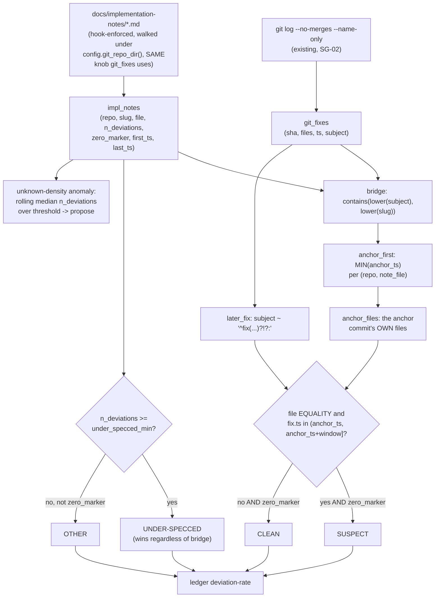

# Spec: `impl_notes` adapter + `deviation-rate` + `unknown-density` anomaly (ledger-observatory mega-goal harness-observatory, SG-03)
Generated: 2026-07-04
Status: VALIDATED
Lane: normal (lane-classify.sh returned `normal` on a rephrased description, mirrors SG-01/SG-02's
precedent)
Depends-on: 02 (`git_fixes`, merged to `main` at `026da172`)

## Problem

`tools/ledger-observatory/docs/benchmark-followup.md` change 5 and
`research/2026-07-04-fable-unknowns-absorption.md` Design 2 name the upstream half of the
benchmark that today does not exist: defects ORIGINATE as unclarified unknowns upstream (spec
quality, mid-run deviations), but `gate-yield` (SG-01) and `defect-correlation` (SG-02) only
measure defects CAUGHT or ESCAPED downstream. The bridge metric already exists on disk and
nobody reads it: the global CLAUDE.md's hook-enforced `docs/implementation-notes/<slug>.md`
convention requires every spec-driven task to log its mid-run deviations from the spec (or an
explicit zero-deviation marker line), but no adapter has ever read these files.

```
unknowns upstream          mid-flight              downstream
(grill/spec quality) ---> deviations logged --->  gate catches / fix() escapes
     (out of scope)         THIS LENS (SG-03)        SG-01 / SG-02 (shipped)
```

Two facts, found during Think (not assumed), shape the design:

1. **Real prose drift, confirmed by a corpus survey (208 ops-toolkit + 76 dwarves-kit
   implementation-notes files) at design time.** The hook contract's literal shapes
   (`## YYYY-MM-DD HH:MM <title>` entry headers; a one-line `No deviations; matches <spec>
   verbatim` zero marker) are NOT what the real corpus contains uniformly: many entry headers
   drop the `HH:MM` time component entirely (e.g. `## 2026-06-14 Shipping mechanics ...`), and
   real zero-marker lines vary in wording (e.g. `No deviations from spec; no reconcile bug
   found.` in `tools/vps-mon/docs/implementation-notes/SPEC-075-mini-launchd-collector.md`,
   which -- confusingly -- ALSO has 21 real dated entries, a genuinely malformed file). The
   parser must tolerate this drift or it silently undercounts the real corpus, exactly the
   "benchmark that lies" failure mode this mega-goal explicitly guards against.
2. **The same JOIN-key problem SG-02 already solved recurs here, in a new shape (flagged
   upfront by HANDOFF.md).** An implementation-notes file carries a `slug` (its filename stem),
   never a sha or a file list of its own. `deviation-rate`'s SUSPECT classification needs to
   know "did a later fix() commit touch the same files this spec-driven work touched" --
   exactly SG-02's "touching the same files" claim, but there is no direct file list to anchor
   on. The fix is the SAME two-stage bridge SG-02 already proved sound: bridge `slug` to git
   history by a textual match once, then correlate by genuine file equality thereafter.

A third risk, found while implementing (not in the goal file, but load-bearing): `impl_notes`
walking the entire repo tree by default picks up dwarves-kit's own nested `.claude/worktrees/*`
copies, which would physically double-count every file underneath a live worktree. And this
sub-goal's new detector/adapter, if left un-isolated in the OTHER pre-existing test suites (they
never override `LEDGER_OBS_GIT_REPO_DIR`), would silently default to scanning this real,
uncontrolled repo during their own rebuild-and-compare checks -- discovered as a genuine
regression against `test-ledger-cli.sh`/`test-feedback.sh`/`test-gate-yield.sh` during Build (see
Decision Log DEC-004), not swept under "pre-existing, unrelated".

## Solution

### Approaches considered

1. **Reuse `read_git_fixes`'s repo-root config knob (`config.git_repo_dir()` /
   `LEDGER_OBS_GIT_REPO_DIR`) for `impl_notes` too, rather than a second env var.** CHOSEN.
   `deviation-rate`'s SUSPECT/CLEAN classification JOINs `impl_notes` against `git_fixes`; both
   tables MUST describe the SAME repo or the join silently drifts apart per-invocation (e.g. a
   future caller sets one env var and not the other, and the bridge/correlation becomes
   nonsensical with no error). A second knob (`LEDGER_OBS_IMPL_NOTES_DIR`) would let that happen
   silently. Sharing one knob makes "these two tables always describe the same repo" a
   structural guarantee, not an operator convention to remember.
2. **A second, per-repo config knob, defaulting to the same path but independently
   overridable.** Rejected: strictly more surface for the exact failure mode approach 1 avoids
   (an operator overriding one knob and forgetting the other), for zero real benefit -- nothing
   in this sub-goal or its likely successors needs `impl_notes` and `git_fixes` to describe
   different repos in one materialization.
3. **A literal file-list column on `impl_notes` (parse "files touched" out of the note's own
   prose, if any).** Rejected: implementation-notes files do not reliably name their own
   touched files in a machine-parseable way (they are free-form delta prose, not a manifest);
   this would require guessing at Markdown/path patterns inside human-written text, a much
   larger and less reliable surface than the git-log-derived file list SG-02 already trusts.
   The chosen bridge (slug-to-commit-subject, then genuine file equality against that commit's
   OWN git-derived file list) reuses a real, already-proven-reliable source of "what files did
   this work touch" instead of inventing a second, weaker one.

### Chosen approach + why

Approach 1 (shared repo-root knob) plus the two-stage slug bridge (mirroring SG-02's DEC-002
exactly): `impl_notes.slug` bridges to `git_fixes.subject` via
`contains(lower(subject), lower(slug))`, the EARLIEST bridge-matched commit's own files become
"the anchor's own files" (a real git fact, same as SG-02's `ship_files`), and a LATER
fix()-typed commit (within `--window-days`, same tunable convention as `defect-correlation`)
touching any of those files is the SUSPECT signal. `n_deviations >= --under-specced-min`
(default 3) is UNDER-SPECCED independent of any git bridge at all (a pure count threshold, no
JOIN needed). `zero_marker` with no later fix is CLEAN. Everything else (e.g. 1-2 logged
deviations with no marker, or a file predating the hook's entry-header convention entirely,
confirmed present in the real corpus) is the 4th bucket, OTHER: named honestly rather than
silently forced into one of the three named classes the goal file specifies.

### Extensibility & boundaries

- 04-anomalies-advisor (next) reads `gate-yield`'s aggregation shape and `defect-correlation`'s
  output for its own conditioning; nothing here couples to that sub-goal's internals.
- If a future sub-goal needs `impl_notes` and `git_fixes` to describe different repos in one
  materialization, the shared-knob decision (DEC-001) is the first thing to revisit; today
  nothing needs it.
- Unit boundary: this sub-goal owns `impl_notes` + `deviation-rate` + `unknown-density` only. The
  hook that WRITES implementation-notes files (the global CLAUDE.md contract, enforced
  elsewhere) is untouched; this sub-goal only reads.

## Design

New table (`impl_notes`), new adapter function (`adapters.read_impl_notes`), new CLI command
(`deviation-rate`), a new anomaly detector (`anomalies._detect_unknown_density`), zero new write
paths, zero changes to `kit_runs`/`kit_gates`/`git_fixes`/`tide_moves`/`tg_dialogs`/`learned` or
their readers. The non-obvious part is the SAME two-stage bridge shape SG-02 already proved:
`impl_notes` names a spec-driven work item by SLUG; `git_fixes` only knows COMMITS. Bridging them
by a textual match, then switching to file-equality for the actual correlation, is what keeps
"a later fix on the same files" honest instead of degrading into pure name-matching.



Chosen approach: Approach 1 above (share `git_repo_dir()`; bridge by slug once, correlate by
file thereafter; UNDER-SPECCED short-circuits the bridge entirely since it needs no git data).

## Technical Design

### Interfaces (I/O contract)

- Inputs / consumes: a filesystem walk under `config.git_repo_dir()` (the SAME repo root
  `read_git_fixes` already reads) for every `docs/implementation-notes/*.md` file anywhere in
  the tree, pruning hidden directories (`.git`, `.venv`, any nested `.claude/worktrees/<x>`) plus
  `node_modules`/`dist`/`build`. Consumes the existing `git_fixes` table read-only (no new git
  read path; `deviation-rate` JOINs it exactly like `defect-correlation` already does).
- Outputs / produces: an `impl_notes` DuckDB table (columns: `repo, slug, file, n_deviations,
  zero_marker, first_ts, last_ts`, one row per implementation-notes file); a `ledger
  deviation-rate [--under-specced-min N] [--window-days N] [--json|--table]` CLI command
  producing one row per impl-notes file with a `class` column
  (`UNDER-SPECCED`/`CLEAN`/`SUSPECT`/`OTHER`); an `unknown-density` anomaly (extends
  `anomalies.DETECTORS`) proposing "condition grill ON for `<repo>`" via the SAME
  propose-not-autofile staging path every other detector uses.
- Invariants: read-only (a plain filesystem walk + `Path.read_text`; no write, ever; the CLI
  goes through the SAME `materialize.query()` read path every other command uses, no new duckdb
  connection); `impl_notes` is rebuilt from scratch on every `rebuild()` (delete-and-rematerialize,
  unchanged contract); a missing repo path returns empty (columns, []), never raises (matches
  every other adapter's missing-source contract); a file that cannot be decoded as UTF-8 is
  skip-safe (treated as zero entries, no marker, never crashes the whole walk).

### Data model changes

New table `impl_notes`, single-sourced via `schemas.IMPL_NOTES_SCHEMA` (the same `(name, type)`
list pattern `GIT_FIXES_SCHEMA` already uses; DDL + column names both derived from it,
`schemas.assert_parity` guards the load, identical to every other table's contract).

```
IMPL_NOTES_SCHEMA = [
    ("repo", "VARCHAR"), ("slug", "VARCHAR"), ("file", "VARCHAR"),
    ("n_deviations", "INTEGER"), ("zero_marker", "BOOLEAN"),
    ("first_ts", "VARCHAR"), ("last_ts", "VARCHAR"),
]
```

`file` is the note's OWN relative path (e.g. `tools/vps-mon/docs/implementation-notes/
SPEC-075-mini-launchd-collector.md`), NOT a list of files the underlying work touched -- that
list is derived at query time from `git_fixes` via the slug bridge (DEC-002), never stored
redundantly on this table.

### API changes

New CLI command `deviation-rate` (`cli.py`), `--under-specced-min N` (default 3) /
`--window-days N` (default 30) / `--json` (default) / `--table`, same `_emit()` formatter every
other command uses. New anomaly detector `_detect_unknown_density` (extends
`anomalies.DEFAULTS` with `deviation_window`/`deviation_median_max`, extends `DETECTORS`). No
change to `rebuild`/`tables`/`show`/`query`/`render`/`gate-yield`/`defect-correlation`/the other
3 detectors.

### Infrastructure changes

None.

## Task Breakdown

### Phase 1: Foundation
- [x] TASK-001: `schemas.IMPL_NOTES_SCHEMA` (7-column spec) + `column_names`/`ddl` reuse (already
  generic). Acceptance: `schemas.column_names(schemas.IMPL_NOTES_SCHEMA) == ["repo", "slug",
  "file", "n_deviations", "zero_marker", "first_ts", "last_ts"]`.
- [x] TASK-002: `adapters.read_impl_notes(repo_path=None)`: a pruned `os.walk` under
  `config.git_repo_dir()` for every `docs/implementation-notes/*.md` file; a per-file parser
  tolerant of real prose drift (entry-header `HH:MM` optional; zero-marker line matched by its
  leading "no deviation(s)" phrase only, tolerant of an optional bullet prefix and free trailing
  text). Malformed-file policy (marker line AND real entries both present): counted as entries,
  `zero_marker` forced `False`, a stderr warning logged. Skip-safe on a missing repo path or an
  unreadable file. Acceptance: unit-level (via the golden fixture, TASK-004) + the over-test
  pass (TASK-006).

### Phase 2: Core
- [x] TASK-003: `materialize.py`: `_IMPL_NOTES_DDL = schemas.ddl(schemas.IMPL_NOTES_SCHEMA)`;
  wire `impl_notes` into `rebuild()`'s load loop + the row-count return; `SHOW_ORDER["impl_notes"]
  = "repo, file"`. Acceptance: `uv run ledger rebuild` output JSON includes an `"impl_notes"` key
  with a `>= 0` int; `uv run ledger tables` lists `impl_notes`.
- [x] TASK-004: `tests/test-deviation-rate.sh`: a git repo generated at test-time (mktemp,
  controlled commit dates, same precedent as `test-defect-correlation.sh`/SPEC-132 DEC-005) plus
  7 implementation-notes fixture files, one per named class (`clean-notes` CLEAN, `suspect-notes`
  SUSPECT, `windowed-out-notes` CLEAN@default/SUSPECT@wide-window, `underspecced-notes`
  UNDER-SPECCED, `malformed-notes` the malformed over-test, `legacy-notes` the pre-convention
  OTHER over-test, `multi-same-day` the same-day-not-deduped over-test). Asserts EXACT
  classification per slug. Includes the HONEST-ZERO NC (load-bearing): `clean-notes` is
  `CLEAN`, never `SUSPECT`. Acceptance: `bash tests/test-deviation-rate.sh` exits 0; the
  honest-zero NC assertion is present and passes.
- [x] TASK-005: `cli.py`: `deviation-rate` command via `materialize.query()` (no new duckdb
  import), one row per impl-notes file: `repo, slug, file, n_deviations, zero_marker, first_ts,
  last_ts, class`. Acceptance: `uv run ledger deviation-rate --json` returns the golden-fixture's
  exact classifications (covered by TASK-004's suite).
- [x] TASK-005b: `anomalies.py`: `_detect_unknown_density` (rolling median `n_deviations` over
  the last `deviation_window` impl-notes files, `deviation_median_max` threshold), added to
  `DETECTORS`. Acceptance: a dense fixture (median > threshold) stages exactly one proposal via
  `--propose`; a sparse fixture (median <= threshold) stages nothing (covered by TASK-004's
  A-dense/A-sparse cases).

### Phase 3: Polish
- [x] TASK-006: Over-test pass beyond the golden fixture's happy path: a missing repo path, a
  directory with no `docs/implementation-notes` anywhere, an empty impl-notes file, a nested
  `.claude/worktrees/<x>` copy of the same repo (proven NOT double-counted), and the malformed
  stderr warning (proven actually logged, not silently eaten). Record a COVERAGE-DELTA line in
  the canonical proof. Acceptance: COVERAGE-DELTA line present in `docs/proof-of-done.md`'s
  `deviation-rate` feature row detail.
- [x] TASK-007: A REAL regression discovered during Build (not in the original task breakdown):
  `test-ledger-cli.sh`/`test-feedback.sh`/`test-gate-yield.sh` never isolated
  `LEDGER_OBS_GIT_REPO_DIR`, so they silently defaulted to scanning the real, uncontrolled
  ops-toolkit repo tree once `impl_notes` existed -- breaking `test-ledger-cli.sh`'s byte-identical
  remat check (a stderr warning leaked into the comparison) and, more seriously, spuriously
  firing `unknown-density` inside `test-feedback.sh`'s LOAD-BEARING `F-nc-noise` negative control.
  Fixed by isolating `LEDGER_OBS_GIT_REPO_DIR` to a nonexistent path in all three suites (one line
  each, matching the existing "absent -> skip-safe" isolation convention). Acceptance: all three
  suites' PRE-EXISTING pass/fail counts restored exactly (`test-ledger-cli.sh` 19/26,
  `test-feedback.sh` 30/39, `test-gate-yield.sh` 25/25), verified via `git stash` before/after
  comparison.
- [x] TASK-008: Materialize a real run over TWO real repos (`ops-toolkit` default, `dwarves-kit`
  via `LEDGER_OBS_GIT_REPO_DIR`) as the first real `deviation-rate` run-table rows; report the
  actual class distribution honestly. Acceptance: a captured real-history run in the proof for
  both repos.
- [x] TASK-009: `docs/proof-of-done.md` new feature row (`deviation-rate`, SG-03, this spec) +
  `docs/verification/deviation-rate.md` detail file (per-feature, does not touch 01-05/SG-01/
  SG-02's existing rows/files). Commit, push, open PR against `main`, flip the mega-goal ROADMAP
  box, overwrite HANDOFF.md, append DECISIONS.md. Acceptance: PR open, ROADMAP/HANDOFF/DECISIONS
  updated + committed on the branch.

## After state

- [x] `impl_notes` exists as a materialized table, one row per hook-enforced
  `docs/implementation-notes/*.md` file found under a repo root (today: no adapter reads these
  files at all).
- [x] `ledger deviation-rate [--under-specced-min N] [--window-days N] [--json|--table]` returns
  a per-file `UNDER-SPECCED`/`CLEAN`/`SUSPECT`/`OTHER` classification (today: no such command;
  this correlation has never been queryable).
- [x] The honest-zero NC (a zero-marker file with zero later fixes on its anchor's own files is
  `CLEAN`, never `SUSPECT`) is asserted in a committed test AND proven load-bearing via a
  deliberate break of the shipped file-equality JOIN condition.
- [x] `unknown-density` proposes "condition grill ON for `<repo>`" via `--propose` when the
  rolling median `n_deviations` crosses a threshold; a below-threshold state proposes nothing
  (both asserted).
- [x] A real run over two real repos (`ops-toolkit`, `dwarves-kit`) is materialized and its class
  distribution honestly reported.
- [x] A COVERAGE-DELTA row is committed in the canonical proof.
- [x] The 3 pre-existing suites this change touched (`test-ledger-cli.sh`, `test-feedback.sh`,
  `test-gate-yield.sh`) are restored to their exact documented pre-existing pass/fail counts.

## Acceptance Criteria (global)
- [x] All tasks pass their individual acceptance criteria.
- [x] `bash tests/test-schema-parity.sh && bash tests/test-gate-yield.sh && bash \
  tests/test-defect-correlation.sh && bash tests/test-deviation-rate.sh` all exit 0 (no
  regression to the 3 existing suites + the new one green).
- [x] No existing `verification/*`/`docs/specs/*` file for 01-05/SG-01/SG-02 is modified.
- [x] No `kit_gates`/`kit_runs`/`git_fixes`/`tide_moves`/`tg_dialogs`/`learned` table or reader is
  changed.

## Verification

```bash
cd tools/ledger-observatory
uv sync
uv run ledger rebuild
uv run ledger tables
bash tests/test-schema-parity.sh
bash tests/test-gate-yield.sh
bash tests/test-defect-correlation.sh
bash tests/test-deviation-rate.sh
bash tests/test-ledger-cli.sh   # regression: pre-existing 19/26 (7 fail), unchanged
bash tests/test-feedback.sh     # regression: pre-existing 30/39 (9 fail), unchanged
```

## Edge Cases
1. A repo path that does not exist (`LEDGER_OBS_GIT_REPO_DIR` pointing nowhere): `read_impl_notes`
   returns its known columns + an empty row list, matching every other adapter's missing-source
   contract, never an exception.
2. A repo that exists but has no `docs/implementation-notes/` directory anywhere: same skip-safe
   empty result.
3. An entry header missing its `HH:MM` time component (confirmed the DOMINANT real-corpus shape
   in some directories): still counted as a real entry, `first_ts`/`last_ts` fall back to
   `<date> 00:00`.
4. A zero-marker line whose trailing wording differs from the canonical text (confirmed real,
   e.g. "No deviations from spec; no reconcile bug found."): still recognized as the marker, by
   its leading "no deviation(s)" phrase alone.
5. A file whose title mentions "no deviation" as PROSE inside a real dated entry header (confirmed
   real, e.g. "## 2026-06-14 Shipping mechanics (no deviation from spec, two host quirks)"): NEVER
   mistaken for the marker (a `## `-prefixed line can never match the marker regex, which anchors
   on the line's own start), correctly counted as a real logged entry instead.
6. Both a zero-marker line AND one or more real entry headers present in the same file (a
   self-contradiction, confirmed real in the corpus): counted as entries (the marker's claim is
   false), `zero_marker` forced `False`, a stderr warning logged, never silently trusted.
7. A nested `.claude/worktrees/<x>` copy of the same repo under the walked root (confirmed real
   in dwarves-kit at design time): pruned, never double-counted.
8. `--window-days 0`: every candidate fix strictly after the anchor is excluded (an empty window
   means nothing counts), never an off-by-one inclusion of the anchor's own commit.

## Failure modes

| Failure class | Detection signal | Mitigation / recovery |
|---|---|---|
| Honest-zero NC written vacuously (a CLEAN slug flagged SUSPECT merely because SOME later fix() exists anywhere in history) | golden-fixture assertion checks the EXACT class for `clean-notes`; a deliberate break (drop the `lf.file = af.file` join condition) re-run and PROVEN to flip it to SUSPECT | required as TASK-004 acceptance; the deliberate-break run is documented in the proof, restored via `git checkout` |
| `unknown-density` spuriously firing on uncontrolled real-repo data inside an unrelated pre-existing test's fixture | discovered during Build against `test-feedback.sh`'s `F-nc-noise`; fixed by isolating `LEDGER_OBS_GIT_REPO_DIR` in the 3 affected suites (DEC-004) | TASK-007 acceptance, verified via `git stash` before/after |
| Malformed file (marker + real entries) silently trusted at face value | `_parse_impl_notes_file`'s explicit contradiction check forces `zero_marker=False` + logs a stderr warning, asserted in O-malformed | TASK-006 acceptance |
| Nested worktree double-counting a file | `os.walk`'s hidden-dir pruning (`.claude`, `.git`, `.venv`) asserted directly (O4) | TASK-006 acceptance |
| `impl_notes` schema drifts from its DDL the same way `KIT_SCHEMA` originally did | `schemas.assert_parity` runs at load time (same guard `test-schema-parity.sh` already proves is wired) | belt-and-suspenders; TASK-003 wires the SAME call site pattern `_load_python_table` already uses |

## Out of Scope
- Ceremony/token-runaway anomalies + the time-to-done advisor (04-anomalies-advisor, next).
- Any change to the implementation-notes hook itself (the global CLAUDE.md contract that WRITES
  these files) or its entry-header/zero-marker format.
- True runtime recall instrumentation (whether a deviation was actually noticed at grill-time);
  this reads only what was already logged.
- Auto-filing a board row for a fired `unknown-density` anomaly (propose-not-autofile, unchanged
  contract).
- A second schema mechanism; `impl_notes` uses the SAME `schemas.py` single-source pattern every
  other table uses.
- A cross-repo UNION query; v1 runs one repo per materialization (documented tradeoff, matches
  `git_fixes`'s own v1 scope, executed here as two separate runs over `ops-toolkit` and
  `dwarves-kit`, not one combined query).
- Parsing a file's "files touched" out of its own free-form prose (Approach 3, rejected above);
  the file list used for correlation always comes from `git_fixes`.

## Touches
tools/ledger-observatory/**

## Decision Log
- DEC-001: `impl_notes` shares `config.git_repo_dir()` / `LEDGER_OBS_GIT_REPO_DIR` with
  `read_git_fixes` rather than a second env knob. Rationale: `deviation-rate`'s SUSPECT/CLEAN
  classification JOINs the two tables, and both must describe the SAME repo or the join
  silently drifts apart per-invocation; a second knob is strictly more surface for that exact
  failure mode with no offsetting benefit today.
- DEC-002 (the flagged JOIN-key decision, mirrors SPEC-132 DEC-002): an implementation-notes
  file carries a `slug`, never a sha or a file list of its own. CHOSEN: the SAME two-stage
  bridge SG-02 already proved sound -- (1) a coarser, textual join bridges `impl_notes.slug` to
  a git commit via `contains(lower(subject), lower(slug))`; (2) genuine FILE-level equality
  against that commit's OWN files is then used for the actual SUSPECT correlation, keeping "a
  later fix on the same files" honest instead of degrading to pure name-matching. Known
  false-positive risk (same as SPEC-132 DEC-002): a coincidental commit mentioning a slug for an
  unrelated reason could misattribute the anchor; not observed in the real run but stated
  plainly.
- DEC-003: the malformed-file policy (a zero-marker line AND one or more real entry headers
  both present in the same file, a self-contradiction) is: counted as entries (`n_deviations` =
  the real header count), `zero_marker` forced `False` (a file that logged real deviations is
  never treated as the honest-zero case regardless of what its marker line claims), and a
  stderr warning is logged (non-fatal; the adapter still returns the row). Rationale: silently
  trusting the marker's claim at face value would let a file simultaneously claim "no
  deviations" and log deviations, an internally inconsistent state that must be surfaced, not
  hidden. Confirmed present in the real corpus at design time (`tools/vps-mon/docs/
  implementation-notes/SPEC-075-mini-launchd-collector.md`: the canonical zero-marker phrasing
  plus 21 real dated entries).
- DEC-004 (a real regression found during Build, not anticipated in the goal file): the 3
  pre-existing suites `test-ledger-cli.sh`/`test-feedback.sh`/`test-gate-yield.sh` never
  isolated `LEDGER_OBS_GIT_REPO_DIR` (SG-02's `git_fixes` shipped silently defaulting to the
  real repo in these suites too, but emits no stderr and so never surfaced this). `impl_notes`
  introduces two new failure surfaces once left un-isolated: (a) a stderr warning from the
  malformed-file check leaks into a byte-identical remat comparison (`test-ledger-cli.sh`'s
  R-remat), and (b) far more seriously, `unknown-density` spuriously fires against the real
  corpus's genuine deviation density, breaking `test-feedback.sh`'s LOAD-BEARING `F-nc-noise`
  negative control (a noise-floor state must propose NOTHING). Fixed by adding one
  `LEDGER_OBS_GIT_REPO_DIR="$FIX/nonexistent-git-repo"` isolation line to each of the 3 suites
  (matching their existing "absent -> skip-safe" convention for the other env vars), verified
  via `git stash` to restore each suite's EXACT documented pre-existing pass/fail count.
- DEC-005: the "4th bucket", `OTHER`, is not one of the goal file's 3 named classes but is
  necessary for an exhaustive, honest classification: a file with 1-2 logged deviations and no
  zero-marker (not concerning either way), or a file predating the hook's entry-header/marker
  convention entirely (confirmed present in the real corpus as free-form legacy prose with
  neither a dated header nor a marker line), must not be silently coerced into CLEAN,
  UNDER-SPECCED, or SUSPECT. Stated honestly as a 4th, unnamed-by-the-goal bucket rather than
  hidden.
- DEC-006: the golden-fixture git history is GENERATED at test time (`git init` + controlled
  `GIT_AUTHOR_DATE`/`GIT_COMMITTER_DATE` commits in `mktemp -d`), matching SPEC-132 DEC-005's
  precedent exactly (a nested `.git` tree does not commit cleanly as tracked files in this
  repo). The implementation-notes fixture files themselves are plain (untracked) files under the
  fixture repo -- `read_impl_notes` is a filesystem walk, not a git read, so git-tracking them
  is not required for the adapter to see them.
- DEC-007: spec-validate self-review (2026-07-04): Reviewer 6 (Design Record Auditor, blocking)
  confirmed this spec is design-bearing (new table + new adapter + a non-obvious two-stage
  bridge/correlation join, the same shape SPEC-132 was already judged design-bearing for) and
  requires the top-level `## Design` section with a diagram, present above. Reviewers 1-5
  (security, failure-mode, assumption, scope, solution-design): no blocking findings. Security:
  the adapter is a pure filesystem walk (`os.walk` + `Path.read_text`) with no subprocess, no
  shell, no untrusted-input SQL interpolation (`--under-specced-min`/`--window-days` are
  Typer-validated ints interpolated into fixed SQL positions, not user strings, same convention
  `defect-correlation` already uses). Failure-mode: the table above covers vacuous-NC,
  cross-suite-pollution, malformed-file, and worktree-double-count classes. Assumption: the
  slug-substring bridge's false-positive risk (DEC-002) is stated explicitly, not hidden. Scope:
  tasks are each single-file/narrow-scope and atomic, matching SG-01/SG-02's task granularity.

## Amendments
(none)

## Review
Self-review via the `/kit:spec-validate` 6-reviewer pass, 2026-07-04. Verdict: APPROVED (DEC-007).
Status: VALIDATED.

## Open questions
(none)
