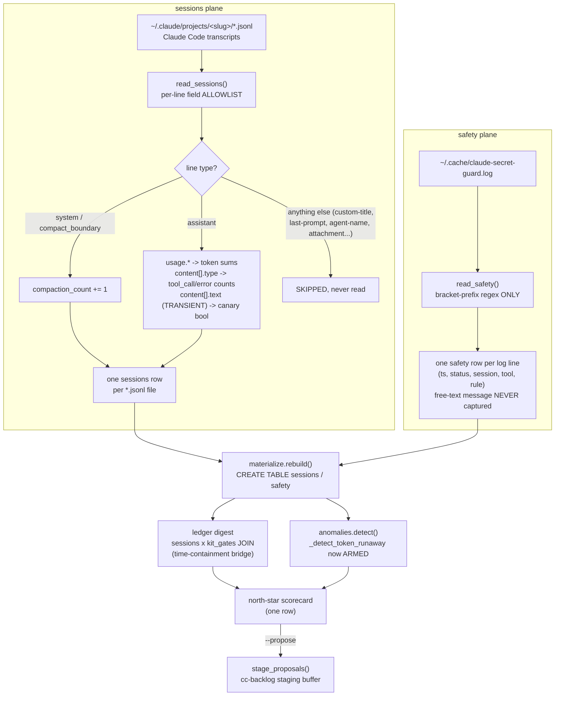

# Spec: numeric-only sessions + safety planes + `ledger digest` north-star scorecard (ledger-observatory mega-goal harness-observatory, SG-05)

Generated: 2026-07-04
Status: VALIDATED
Lane: full (lane-classify.sh returned `full`; goal file marks Design: bearing -- new adapters +
a privacy boundary + a JOIN-based scorecard, all full-lane design-bearing triggers)
Depends-on: SG-01 (kit_gates/gate-yield), SG-02 (git_fixes/defect-correlation), SG-04
(anomalies.py's `DETECTORS` shape + `_detect_token_runaway` stub). Builds on the shipped
`tools/ledger-observatory/` package (PRs #672-#688, SPEC-126..134, all merged on `main`).

## Problem

Every lens this tool has shipped so far (kit_gates, git_fixes, impl_notes) reads work-process
metadata: what ran, what shipped, what deviated. None of them reads the one place the actual
COST of that work is recorded: Claude Code's own session transcripts
(`~/.claude/projects/*/*.jsonl`) and the secret-guard audit log
(`~/.cache/claude-secret-guard.log`). Two concrete gaps:

1. **No token/cost telemetry exists anywhere in the lens.** `anomalies.py`'s
   `_detect_token_runaway` (SPEC-134 DEC-003) is wired into `DETECTORS` but hard-coded to
   always return `None` -- there is no materialized table carrying a per-session token figure
   to threshold against. Every "north-star" question this mega-goal was framed around
   (`_meta/megagoals/harness-observatory/ROADMAP.md`: token efficiency, cost-per-verified-outcome,
   time-to-done) is unanswerable without it.
2. **No safety-posture counter exists.** The secret-guard hook has been auditing every Bash/
   Edit/Write/Read call for 5300+ lines (confirmed: `wc -l ~/.cache/claude-secret-guard.log` ->
   5339, `BLOCK`=4127/`BYPASS`=295/`WARN`=587 today) but nothing in this tool surfaces trend
   (is the bypass rate climbing or falling week over week).

Both sources are uniquely dangerous to read naively: a Claude Code transcript line's
`tool_result.content` field was CONFIRMED during design-time probing to carry raw file text
verbatim (a `String to replace not found` Edit error literally quotes surrounding file prose);
`custom-title`/`agent-name`/`last-prompt` transcript-metadata lines carry a short but real
conversation-derived title string; and the secret-guard log's free-text message sometimes
carries a real file path (e.g. `/tmp/pt.json`, a `dotfiles/tests/secret-guard.sh` path). A lens
that reads either source the way every prior adapter reads its own (whole-object read, store
what's useful) would be a **privacy regression**, not a benchmark improvement -- the goal file's
own quality bar says the lens must "stay safe to query casually." This is why the goal file
grades the whole sub-goal's Proof on ONE load-bearing negative control (a fixture fake-secret
string, provably absent from the materialized db) rather than the usual feature-correctness
negative control every prior sub-goal has used.

## Solution

### Approaches considered

1. **Whole-line/whole-object read, store everything that looks numeric (REJECTED).** Read each
   jsonl line as-is, keep every key that happens to hold a number today, drop the rest at
   materialize time. Rejected: "drop the rest at materialize time" means the ADAPTER still reads
   and holds `tool_result.content`/`message.content[].text`/`custom-title` etc. in memory,
   inviting a future edit (a well-meaning "let's also surface the title" PR) to widen the return
   tuple and leak content with zero adapter-level guard. The goal file's privacy quality bar
   ("no message text, no tool inputs/outputs, no file paths from inside conversations") demands
   the boundary live at the PARSE step, not the materialize step.
2. **A per-line field ALLOWLIST enforced at parse time, one row per session/log-line, numeric
   schema (CHOSEN).** `read_sessions`/`read_safety` each parse ONLY a fixed, named set of
   fields (see "Field whitelist" below) out of each line; every other key on the line (including
   `tool_result.content`, `cwd`, `sessionId`, `custom-title`, `last-prompt`, `agent-name`, the
   safety log's free-text message) is never even assigned to a local variable, let alone
   returned. One `text` field IS read, but ONLY transiently (to test whether it ends with the
   adherence-canary marker), producing a derived BOOLEAN that is the only thing that survives
   the function; the string itself is discarded before the next line is parsed (never appended
   to a list, never logged, never returned). This mirrors every existing adapter's skip-safe/
   tolerant contract (adapters.py docstring) with one addition: a schema that is numbers/booleans/
   short-slugs ONLY, no free-text column exists to leak into even if a future bug tried.
3. **A separate, gated "raw session dump" tool outside this lens, with `ledger` only reading its
   pre-sanitized output (REJECTED).** Rejected: doubles the maintenance surface (a second parser
   that must ALSO get the allowlist right, now duplicated) for no benefit over parsing the
   allowlist directly in `adapters.py`, the same single-file-per-source-shape every existing
   adapter already follows. The mega-goal's own scope fence ("this tool, no daemons") also rules
   out a second always-on process.

### Chosen approach + why

Approach 2. The privacy boundary is enforced at the earliest possible point (the per-line
parse), matches every existing adapter's shape (a `read_*` function returning `(columns, rows)`,
skip-safe on a missing source, tolerant of malformed lines), and needs no new module or process.

### Extensibility & boundaries

- If a future sub-goal wants richer session telemetry (e.g. per-tool-name breakdown, per-model
  cost), it extends `SESSIONS_SCHEMA` + `_parse_session_file`'s allowlist explicitly -- the
  allowlist is the boundary a reviewer checks, not an afterthought.
- `_detect_token_runaway` (SPEC-134) arms against `sessions` in THIS spec (a flat per-session
  budget threshold, no rid bridge -- `sessions` carries no rid column in v1, see DEC-002 below).
  A future sub-goal wanting cost attributed to a specific rid would need a session-to-rid bridge
  column or a new bridge query; not built here.
- 06-memory-lens is independent of this sub-goal's internals (ROADMAP.md).

## Design

Two new adapters (`read_sessions`, `read_safety`), two new tables (`sessions`, `safety`), one
new CLI command (`ledger digest`) that JOINs `sessions` against the existing `kit_gates`/
`git_fixes` bridge (the SAME two-stage name-then-fact bridge technique proven in SG-02/03/04,
here bridged by TIME containment instead of file equality, since `sessions` carries no file
list) and folds in the existing `anomalies.detect()`/`stage_proposals()` path (SG-04, zero new
detection logic duplicated). `_detect_token_runaway` (SPEC-134, previously an always-`None`
stub) is armed against the new `sessions` table.



## Technical Design

### Interfaces (I/O contract)

- Inputs / consumes: `~/.claude/projects/<project-slug>/*.jsonl` (default, overridable via
  `LEDGER_OBS_SESSIONS_DIR`), read line-by-line (streaming, bounded memory regardless of file
  size); `~/.cache/claude-secret-guard.log` (default, overridable via
  `LEDGER_OBS_SECRET_GUARD_LOG`), read whole-file (a few thousand lines today, no streaming
  needed at this scale). Both read-only, no subprocess, no shell-out.
- Outputs / produces: a `sessions` DuckDB table (13 columns, one row per `*.jsonl` file with
  >= 1 timestamped line) and a `safety` DuckDB table (5 columns, one row per matching
  secret-guard log line); `ledger digest [--threshold KEY=VALUE]... [--propose] [--json|--table]`
  producing one scorecard row + the fired-anomalies list + (optionally) staged proposals.
- Invariants: read-only (same `materialize.query()` path every other command uses, no new
  duckdb connection); a session/log source is skip-safe on missing (empty table, never raises);
  a malformed/truncated line is skipped, never crashes the whole file's parse; the field
  whitelist above is the ONLY thing either parser ever reads -- no code path in `_parse_
  session_file`/`read_safety` assigns a non-whitelisted field to a variable.

### Field whitelist (the privacy boundary; verbatim copy lives in
`_meta/megagoals/harness-observatory/DECISIONS.md` for Han's review)

`read_sessions` reads ONLY, per jsonl line: `type`, `subtype` (system lines only), `timestamp`,
`message.usage.{input_tokens,output_tokens,cache_read_input_tokens,cache_creation_input_tokens}`
(assistant lines only), `message.stop_reason` (assistant lines only), `message.content[].type`,
`message.content[].is_error` (tool_result items; confirmed live in `type == "user"` lines, the
tool-result turn Claude Code synthesizes back to the model, NEVER in the `type == "assistant"`
line that emitted the matching `tool_use`), `message.content[].text` (text items, ASSISTANT
lines only, read TRANSIENTLY to derive one boolean, never retained -- this transient-read
discipline applies to EVERY assistant text block encountered, not only the ones checked for the
canary marker, so even a real secret pasted into an assistant reply would never be extracted or
stored, only ever glanced at in memory and discarded). A `type == "user"` line's own `text`
content (Han's own raw prompt) is a STRICTER case: it is never read at all, not even
transiently -- only that line's `content[].type`/`.is_error` (the tool_result shape) is ever
inspected. `project_slug`/`session_id` come from the FILESYSTEM path (parent-dir name / filename
stem), never a per-line field. Every other key on every line (`cwd`, `sessionId`, `gitBranch`,
`model`, `uuid`, `parentUuid`, `tool_result.content`, `tool_use.input`, `custom-title`,
`last-prompt`, `agent-name`, `attachment`, `hookAdditionalContext`, `toolUseResult`, `prUrl`,
...) is never read.

`read_safety` reads ONLY the leading 4-5 bracketed groups of each secret-guard log line via a
fixed regex (`ts`, `status`, `session`, `tool`, an optional `rule` code) -- the free-text
remainder of the line (confirmed to sometimes carry a real file path) is never captured into a
group, never stored.

### Data model changes

```
SESSIONS_SCHEMA = [
    ("session_id", "VARCHAR"), ("project_slug", "VARCHAR"),
    ("first_ts", "VARCHAR"), ("last_ts", "VARCHAR"), ("duration_s", "INTEGER"),
    ("input_tokens", "BIGINT"), ("output_tokens", "BIGINT"),
    ("cache_read_tokens", "BIGINT"), ("cache_creation_tokens", "BIGINT"),
    ("tool_call_count", "INTEGER"), ("error_count", "INTEGER"),
    ("compaction_count", "INTEGER"), ("canary_drop_count", "INTEGER"),
]
SAFETY_SCHEMA = [
    ("ts", "VARCHAR"), ("status", "VARCHAR"), ("session", "VARCHAR"),
    ("tool", "VARCHAR"), ("rule", "VARCHAR"),
]
```

Both single-sourced via the existing `schemas.py` `(name, type)` pattern (`column_names()`/
`ddl()`/`assert_parity()` reused as-is, no changes to `schemas.py`'s own machinery).

### API changes

- `ledger digest [--threshold KEY=VALUE]... [--propose] [--json|--table]`: prints the north-star
  scorecard (one row: total sessions/tokens/tool-calls/errors/compactions/canary-drops, shipped
  vs. bridged rid counts, coverage_pct, cost_per_verified_outcome_tokens,
  avg_time_to_done_min), then the fired anomalies (SAME `anomalies_mod.detect()` call SG-04's
  `anomalies` command uses), then (with `--propose`) the staged/duplicate rows (SAME
  `anomalies_mod.stage_proposals()` call).
- `anomalies.py`: `_detect_token_runaway` rewritten (armed): flags the single `sessions` row
  whose total token footprint exceeds `token_budget_max` (new DEFAULTS key). No signature
  change, no `DETECTORS` tuple reorder.
- `cli.py`'s existing `anomalies` command is otherwise unchanged.

### Infrastructure changes

None. No daemon, no cron, no new dependency.

## Task Breakdown

### Phase 1: Foundation
- [ ] TASK-001: `schemas.SESSIONS_SCHEMA` / `schemas.SAFETY_SCHEMA`. Acceptance:
  `schemas.column_names(...)` returns the exact 13/5-column lists above.
- [ ] TASK-002: `config.sessions_dir()` (`LEDGER_OBS_SESSIONS_DIR`, default
  `~/.claude/projects`), `config.secret_guard_log_path()` (`LEDGER_OBS_SECRET_GUARD_LOG`,
  default `~/.cache/claude-secret-guard.log`). Acceptance: both overridable, both skip-safe on a
  missing path.
- [ ] TASK-003: `adapters.read_sessions(root=None)` + `adapters._parse_session_file(path)`: the
  allowlisted per-line parser above, one row per `*.jsonl` file, skip-safe on a missing root dir,
  tolerant of a malformed/truncated JSON line (skip, never raise), never returns a row for a file
  with zero timestamped lines (an empty/junk file is not a session). Acceptance: golden fixture
  (TASK-006).
- [ ] TASK-004: `adapters.read_safety(log_path=None)`: the bracket-regex parser above, one row
  per matching log line, skip-safe on a missing log, tolerant of a non-matching line (skip,
  never raise). Acceptance: golden fixture (TASK-006).

### Phase 2: Core
- [ ] TASK-005: `materialize.py`: `_SESSIONS_DDL`/`_SAFETY_DDL` via `schemas.ddl(...)`, wired into
  `rebuild()`'s load loop + row-count return; `SHOW_ORDER["sessions"] = "first_ts, session_id"`,
  `SHOW_ORDER["safety"] = "ts, status"`. Acceptance: `uv run ledger rebuild` JSON includes
  `"sessions"`/`"safety"` keys with `>= 0` ints; `uv run ledger tables` lists both.
- [ ] TASK-006: `tests/test-sessions-digest.sh`: golden fixture (a small committed set of
  `*.jsonl` session files with KNOWN token/tool-call/error/compaction/canary counts) asserting
  EXACT `sessions` row values; a fixture `secret-guard.log` asserting EXACT `safety` row counts
  per status/rule. Includes the PRIVACY negative control (load-bearing, see "Test plan" below).
- [ ] TASK-007: `anomalies._detect_token_runaway` armed: new `token_budget_max` DEFAULTS key,
  flags the single highest-total `sessions` row over budget, `None` when under or when
  `sessions` is empty. Acceptance: a fixture session over/under the budget flips the fire/no-fire
  outcome; `ledger anomalies --help` lists `token_budget_max`.
- [ ] TASK-008: `cli.py`: `digest` command (the JOIN scorecard SQL below + the folded-in
  `anomalies_mod.detect()`/`stage_proposals()` call). Acceptance: golden-fixture exact values
  (TASK-006).

### Phase 3: Polish
- [ ] TASK-009: Over-test pass (malformed jsonl lines, a truncated file cut mid-line, an empty
  session file, a multi-compaction session, a safety-log line with no rule code, a safety-log
  line with a path-bearing message). Record a COVERAGE-DELTA line.
- [ ] TASK-010: Real-corpus run: `uv run ledger rebuild` + `uv run ledger digest --table` against
  the live `~/.claude/projects/` corpus + the live secret-guard log; capture the first real
  north-star scorecard honestly (including an honest-empty JOIN if the real corpus's `kit_gates`
  rid-to-git bridge yields nothing, consistent with SG-02/03/04's own honest-empty findings on
  this same bridge).
- [ ] TASK-011: `docs/proof-of-done.md` new feature row (`sessions-digest`) +
  `docs/verification/sessions-digest.md` detail file. `_meta/megagoals/harness-observatory/`
  ROADMAP/HANDOFF/DECISIONS updated (field whitelist verbatim in DECISIONS.md). Commit, push,
  open PR **against `main`, HELD (merge policy: gate)** -- do not merge.

## After state

- [ ] `sessions`/`safety` tables exist, numeric/short-slug ONLY (no free-text column in either
  schema). (Today: no session or safety telemetry anywhere in the lens.)
- [ ] `ledger digest [--json|--table] [--propose]` prints the north-star scorecard + anomalies +
  (optionally) staged proposals, via the SAME `materialize.query()`/`anomalies.detect()`/
  `stage_proposals()` paths every other command uses. (Today: no such command.)
- [ ] `_detect_token_runaway` is armed (no longer a permanent `None` stub).
- [ ] The PRIVACY negative control (load-bearing, absolute) is asserted AND falsifiable (a
  deliberate break -- e.g. adding a raw-text column -- turns it red).
- [ ] A real `ledger digest --table` capture against the live corpus is committed in the proof.

## Acceptance Criteria

1. `schemas.SESSIONS_SCHEMA`/`SAFETY_SCHEMA` produce the exact column lists in "Data model
   changes"; `assert_parity` guards both loads (reuses existing machinery, no new guard code).
2. `read_sessions` on a golden fixture (known token sums, known tool-call/error/compaction/
   canary counts) returns EXACT row values.
3. `read_safety` on a fixture log returns EXACT per-status/per-rule row counts.
4. **PRIVACY negative control (load-bearing, absolute):** a committed fixture transcript
   containing the literal string `FAKE-SECRET-a1b2c3` (embedded inside a `tool_result.content`
   field AND inside a `custom-title` line, the two confirmed-real leak surfaces from the Problem
   section) is adapted; `uv run ledger rebuild` + a `ledger query` full-text scan across EVERY
   materialized table/column returns ZERO hits for that string, WHILE the fixture file's numeric
   `sessions` row DOES exist (the session was counted, not silently dropped). A deliberate break
   (temporarily widening `SESSIONS_SCHEMA`/`_parse_session_file` to also capture and return
   `tool_result.content` or `custom-title`) turns this assertion RED, proving it is falsifiable,
   not vacuous.
5. A malformed/truncated jsonl line does not crash `read_sessions`; the rest of the file's valid
   lines still contribute to that session's row.
6. An empty session file (zero timestamped lines) produces NO row (never a fabricated
   zero-duration row).
7. A session with 2+ `compact_boundary` system lines counts `compaction_count` correctly (not
   just 0-or-1).
8. `_detect_token_runaway` fires on a fixture `sessions` row over `token_budget_max`; does NOT
   fire on one at/under it, and does NOT fire when `sessions` is empty.
9. `ledger digest` on a golden fixture (a shipped `kit_gates` rid bridged to a git commit whose
   timestamp falls inside a known `sessions` row's `[first_ts, last_ts]` window) reports the
   EXACT expected `coverage_pct`/`cost_per_verified_outcome_tokens`/`avg_time_to_done_min`.
10. `ledger digest` on a shipped rid with NO time-containing session (honest-empty case) reports
    `coverage_pct = 0`/a null cost figure, never a crash, never a fabricated number.
11. `ledger digest --propose` stages fired anomalies via the SAME `stage_proposals()` path
    `anomalies --propose` uses (duplicate-safe, idempotent re-run) -- proven by a byte-identical
    staging-buffer comparison against calling `anomalies --propose` directly on the same lens
    state.
12. A real `uv run ledger rebuild` + `uv run ledger digest --table` capture against the live
    corpus is committed to the verification doc, honestly reporting what the JOIN found (or did
    not).
13. `ledger anomalies --help` lists `token_budget_max`.
14. `read_sessions`/`read_safety` are skip-safe on a missing source directory/file (return known
    columns + empty rows, never raise).

## Test plan

- **PRIVACY NC (load-bearing, absolute, AC4):** the hardest requirement in the whole run. Two
  independent embed points (a `tool_result.content` value and a `custom-title` line) both carry
  the fake-secret string in the fixture, so the NC exercises BOTH confirmed leak surfaces from
  the Problem section, not just one. Falsifiability is REQUIRED, not optional: the test file
  itself documents the exact one-line deliberate break (widen the schema/parser to also return
  the forbidden field) and its expected RED result, mirroring the `git_fixes`/`impl_notes`
  precedent's own deliberate-break convention.
- **Golden fixture (AC2/AC3):** small, hand-computed, committed fixture files (a session with
  known usage/tool-call/error/compaction/canary values; a safety log with known status/rule
  counts).
- **Over-test (AC5-AC7, AC10, AC14):** malformed jsonl, truncated file, empty session, multi-
  compaction session, missing source dirs, a safety-log line with no rule code, a path-bearing
  safety message (confirms the free-text is never captured even when it looks informative).
- **Real run (AC12):** `uv run ledger rebuild` + `uv run ledger digest --table` against the live
  `~/.claude/projects/` corpus and the live secret-guard log, captured verbatim in
  `docs/verification/sessions-digest.md`, honest about an empty JOIN if the rid-to-git bridge
  (SG-02/03/04's own documented real-corpus finding) again yields nothing.
- **Coverage-delta:** recorded in the proof per the tool's existing convention.

## Verification

```bash
cd tools/ledger-observatory
bash tests/test-sessions-digest.sh
uv run ledger rebuild
uv run ledger digest --table
uv run ledger anomalies --help
```

All test lines print `PASS`; the final line is `== N passed, 0 failed ==`.

## Edge Cases

- A jsonl line whose `message.content` is missing/not a list: skipped for tool/error/canary
  purposes, usage still counted if present.
- A `tool_result` item with `is_error` absent or falsy: not counted as an error (only an
  explicit truthy `is_error` counts).
- A terminal assistant turn (`stop_reason != "tool_use"`) with NO text block at all (e.g. a
  pure-tool-use-only turn that still ends the assistant's turn): no canary check possible,
  not counted as a drop (absence of a check is not evidence of a drop).
- A safety-log line with a bracket-shaped session/tool field but NO trailing rule code (e.g. a
  `BYPASS` line): `rule` is NULL, row still emitted (not dropped).
- Two session files with overlapping `[first_ts, last_ts]` windows (parallel worktrees) both
  bridging to the same commit timestamp: `digest`'s time-containment JOIN may attribute cost
  from BOTH sessions to that one rid (a documented, accepted coarser-join tradeoff, same
  "coarser join" precedent SPEC-132 DEC-001 already established for the rid-to-git bridge).
- A `sessions` row with `duration_s = 0` (a single-line/instant session): included, never
  divided-by-zero in `digest` (the JOIN uses containment, not a rate).

## Failure modes

- A very large individual session file (a heavy tool-output-quoting session can run into the
  hundreds of MB) could slow `rebuild()` noticeably; no per-file size cap or read timeout exists
  in v1 (mitigated only by line-by-line streaming, which bounds memory, not wall-clock time).
  Detection signal: a `rebuild()` that takes materially longer after this sub-goal lands.
  Mitigation: none automatic today; a future `LEDGER_OBS_SESSIONS_MAX_FILE_BYTES` skip-and-warn
  cap would be the natural fix if this becomes a real problem (found by `/kit:spec-validate`
  Reviewer 2; not built here, named honestly rather than silently accepted).
- A future Claude Code transcript format change that adds a NEW field carrying real content
  under a key not covered by SPEC-134's whitelist would not be caught structurally (the allowlist
  is a fixed set of keys, not a schema-inference system); this is a known, accepted limitation of
  an allowlist approach, mitigated by the PRIVACY NC re-running on every fixture change and by the
  fact that any new *documented* field would need a corresponding schema-column PR to ever reach
  the lens at all (an allowlist cannot silently widen).

## Out of Scope

- `06-memory-lens` (a separate sub-goal, independent per ROADMAP.md).
- Any transcript WRITE or cleanup (this tool remains read-only end to end).
- Dollar-cost figures (no pricing table exists in this tool; `digest` reports TOKENS, never a
  fabricated `$` figure).
- Content extraction of any kind: titles, prompts, file paths from inside conversations.
- OTel, daemons, or cron.
- Per-tool-name or per-model token breakdowns (a future extension, see "Extensibility" above).

## Touches

- `tools/ledger-observatory/src/ledger_observatory/{schemas,config,adapters,materialize,cli,anomalies}.py`
- `tools/ledger-observatory/tests/test-sessions-digest.sh` (new) + committed fixtures
- `tools/ledger-observatory/docs/proof-of-done.md`
- `tools/ledger-observatory/docs/verification/sessions-digest.md` (new)
- `_meta/megagoals/harness-observatory/{ROADMAP,HANDOFF,DECISIONS}.md`

## Decision Log

- **DEC-001 (allowlist-at-parse, not filter-at-materialize):** the privacy boundary is enforced
  in `_parse_session_file`/`read_safety` themselves (only named fields are ever assigned to a
  local variable), not as a later filtering step, so a future change to `materialize.py` cannot
  accidentally widen what's stored without ALSO touching the adapter's own allowlist.
- **DEC-002 (`sessions` carries no rid/repo column in v1):** a session transcript has no
  structural link to a kit rid; `digest`'s cost-per-verified-outcome JOIN bridges by TIME
  containment (a shipped rid's git-bridge commit timestamp falling inside a session's
  `[first_ts, last_ts]` window) rather than a clean key, the SAME two-stage
  name-then-genuine-fact bridge technique SG-02/03/04 already proved (HANDOFF: "proven FIVE
  times running"), here substituting time-containment for file-equality since `sessions` has no
  file list to compare.
- **DEC-003 (canary-drop is a derived boolean, never persisted text):** the adherence-canary
  check (global `~/.claude/CLAUDE.md`) requires testing a text string's trailing content, an
  apparent tension with "no message text ever lands in the lens." Resolved: the text IS read
  transiently in `_parse_session_file` (never in `materialize.py`, never in any adapter's return
  value) to compute ONE boolean per terminal assistant turn; the string itself is reassigned to
  `None` before the next line's parse and never appended to any accumulator, logged, or returned.
  The lens (the materialized db) never receives the text, only the count of drops -- satisfying
  the goal file's literal wording ("no message text... lands in the lens").
- **DEC-004 (`token_runaway` armed as a flat per-session threshold, not per-rid):** since
  `sessions` carries no rid column (DEC-002), arming the detector against a "per-sub-goal budget"
  (the HANDOFF's suggested phrasing) would require the SAME time-containment bridge `digest`
  uses, duplicating that logic inside a detector for marginal benefit. Chosen instead: flag the
  single highest-total `sessions` row over a flat `token_budget_max`, matching every other
  detector's single-shot, first/worst-match shape (`_detect_cost_spike`'s own rolling-window
  precedent) without a new bridge dependency inside `anomalies.py`.
- **DEC-005 (`project_slug`/`session_id` sourced from the filesystem path, not a per-line
  field):** avoids ever reading the per-line `cwd`/`sessionId` fields at all (not just avoiding
  storing them) -- one fewer field on the whitelist, and the directory/file name IS the
  project-dir slug the goal file explicitly allows ("timestamps, and the project-dir slug
  ONLY").
- **DEC-006 (sidechain/subagent lines count toward the parent session, deliberate, not an
  unstated assumption):** confirmed during design-time probing that `Agent`-dispatched subagent
  turns (`isSidechain: true`) are interleaved inline in the SAME `*.jsonl` file as the parent
  session, sharing its `type`/`message.usage`/`message.content` shape. `read_sessions` does not
  filter on `isSidechain` (a field outside the whitelist in any case) -- every assistant-typed
  line in a file, sidechain or not, contributes to that file's one `sessions` row. This is
  consistent with "one file = one row" (DEC-005) and avoids a second, unwhitelisted field read
  just to exclude data that belongs to the same billed session either way (spawning a subagent
  is part of the parent session's own token/tool-call footprint, not a  separate session).
  Found by `/kit:spec-validate` (Reviewer 3); fixed by stating the decision explicitly rather
  than leaving it an implicit, unstated behavior of the parser.

- **DEC-007 (a real Build-time bug: `tool_result`/`is_error` lives on a `type=="user"` line,
  not the `type=="assistant"` line that emitted the matching `tool_use`):** the first Build pass
  only scanned `content[]` on assistant-typed lines, so `error_count` silently stayed 0 across
  the entire real corpus (confirmed via a real smoke run: `total_errors: 0` over 6706 sessions,
  despite an earlier design-time probe of one file alone finding 37 `is_error: true` blocks).
  Root-caused by checking where those blocks actually live in the real jsonl shape: Claude Code
  synthesizes the tool result back to the model as the NEXT turn, `type=="user"`, not a
  continuation of the assistant turn. Fixed: `_parse_session_file` now also scans `type=="user"`
  lines, but ONLY for `content[].type=="tool_result"`/`.is_error` -- a user line's own `text`
  (Han's raw prompt) is never read, a stricter rule than the assistant-text case (which is at
  least read transiently for the canary check). No new field joins the whitelist; the same two
  already-whitelisted fields (`content[].type`, `content[].is_error`) are simply read from one
  more line-type than originally planned.
- **DEC-008 (a CRITICAL from `kit:code-reviewer` on the finished diff): bare `int()` on a
  whitelisted usage field is a content-leak vector.** A transcript line's
  `message.usage.input_tokens` (etc.) that is valid JSON but NOT numeric (a string) made
  `int(x)` raise `ValueError` with the value embedded verbatim in the message; that exception was
  NOT caught by the surrounding `except OSError` and propagated out to a CLI traceback, printing
  transcript-sourced content in the clear (reproduced live by the reviewer). Fixed two ways: a
  `_safe_int` helper coerces each usage field, returning 0 on anything non-numeric (mirroring
  `_duration_seconds`'s own never-raise contract, and the sibling `read_kit_gates` adapter's
  defensive-lookup convention); AND the WHOLE per-line body is wrapped in a broad
  `except Exception: continue`, so no raise inside the parse loop can ever surface a line's
  content in an exception string. Proven by the `O-badtype` fixture (a `input_tokens` value
  containing a planted secret-shaped string): `rebuild` exits 0, the string appears in zero
  materialized columns AND nowhere in the rebuild output, and the row is still counted with the
  bad field coerced to 0.
- **DEC-009 (a MINOR from the same review, defense-in-depth): the one accepted-verbatim field
  (`timestamp`) now gets a light ISO8601 shape-gate.** `timestamp` is harness-synthesized (not
  conversation-derived), so it is not a real leak surface, but the adapter's stated principle is
  a strict allowlist that never trusts a transcript field's shape. A non-`^\d{4}-\d{2}-\d{2}T`
  string is now dropped (that line's ts contribution only, never the whole line), never persisted
  raw into `first_ts`/`last_ts`. Proven by the `O-badts` fixture.
- **DEC-010 (a MAJOR from the same review): the digest cost-JOIN double-counted when >1 session
  overlapped a ship timestamp.** `bridge` was a 1:N join (a shipped rid can fall inside multiple
  concurrent sessions' `[first_ts, last_ts]` windows -- the NORM in this repo, where parallel
  worktrees/subagents run concurrent sessions), and `per_rid` summed tokens across ALL of them,
  inflating `cost_per_verified_outcome_tokens` (reproduced live: two 1000-token sessions
  overlapping one ship produced cost=2000 for one outcome). Worse, `avg_time_to_done_min` used
  `min(sess_first)` while cost summed everything, so the two headline aggregates used DIFFERENT
  attribution models. Fixed: a `QUALIFY row_number() OVER (PARTITION BY rid ORDER BY first_ts
  DESC)` picks exactly ONE session per rid -- the closest-preceding one (greatest `first_ts <=
  ship_ts`) -- so cost AND time-to-done are attributed to the SAME single session, one
  consistent model. Proven by the `D-overlap` fixture.

## Review

Self-review via `/kit:spec-validate` (6-reviewer pass), 2026-07-04, executed by the
sub-goal-05 agent itself (no separate reviewer session available in this run). Findings:
Reviewer 1 (Security): no critical/blocking findings; one hygiene note applied (DEC-003's
transient-text discipline stated to cover ALL text, not just the canary check -- fixed inline
above). Reviewer 2 (Failure modes): one real gap found -- no failure-mode row addressed a very
large individual session file slowing `rebuild()` (the real corpus is 2.1GB across 8179 files,
confirmed by probe); fixed, see the new "Failure modes" row below. Reviewer 3 (Assumptions): one
real gap found -- sidechain/subagent lines interleaved in the same jsonl file were an unstated
assumption about whether they count toward the parent session; fixed via DEC-006. Reviewer 4
(Scope): no blocking findings; task-to-AC mapping is complete, atomicity matches precedent
(SPEC-131/132's own task sizes). Reviewer 5 (Design/extensibility): one structural gap vs. this
tool's own "bearing"-tier precedent (SPEC-132/133 both carry a `### Interfaces (I/O contract)`
subsection; this draft omitted it) -- fixed, subsection added under Technical Design. Reviewer 6
(Design Record, BLOCKING): design-bearing confirmed (2 new tables, a non-obvious privacy
boundary, a JOIN-based scorecard, 2+ viable approaches); the `## Design` section is present,
non-empty, contains a mermaid flowchart and a stated chosen approach -- PASS, no block. Verdict:
APPROVED after the 3 fixes above (Interfaces subsection, DEC-006, DEC-003 clarification) and one
new Failure-modes row. Status flipped DRAFT -> VALIDATED.

**Round 2 (`kit:code-reviewer` on the FINISHED diff).** A fresh-context reviewer ran against the
actual committed code (not the draft), adversarially hunting the privacy boundary. It confirmed
the core allowlist design sound and the load-bearing PRIV-nc airtight, and found THREE real
issues the draft-stage pass could not have caught (they live in the actual code, not the design):
1 CRITICAL (bare `int()` leaking a non-numeric usage field's content via an uncaught-exception
traceback -- DEC-008), 1 MAJOR (the digest cost-JOIN double-counting across overlapping sessions
-- DEC-010), 1 MINOR (the unvalidated `timestamp` field -- DEC-009). All three fixed with new
falsifiable fixtures (`O-badtype`, `D-overlap`, `O-badts`); the suite went 49 -> 59 assertions,
still 0 failed. This is the two-review-rounds lesson (HANDOFF): a draft-stage `/kit:spec-validate`
and a finished-diff `kit:code-reviewer` catch DIFFERENT bug classes -- the former the design's
logical shape, the latter where the actual code diverges from it, and here the latter caught the
single highest-stakes bug in the whole sub-goal (a real content-leak path).

## Open questions

None blocking.
