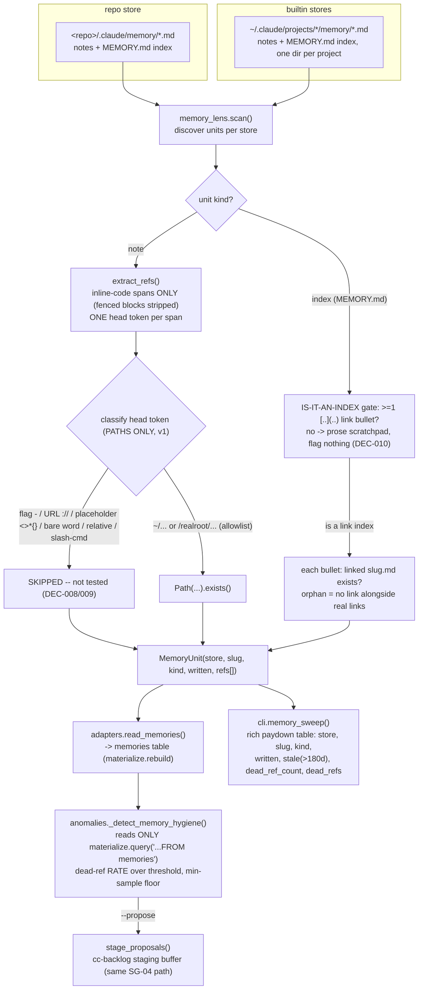

# Spec: memory-verify sweep + `memories` hygiene lens (ledger-observatory mega-goal harness-observatory, SG-06)

Generated: 2026-07-04
Status: VALIDATED
Lane: full (lane-classify.sh floor is `normal`; the goal file marks Design: bearing and this
sub-goal adds a new data-model table -- a full-lane trigger -- so the heavier lane is taken per
"when in doubt, take the heavier one")
Depends-on: SG-01 (`schemas.py`/`materialize.py` single-source-of-truth pattern), SG-04
(`anomalies.py`'s `DETECTORS`/propose-not-autofile shape). Logically independent of SG-05
(ROADMAP.md: "06 logically needs only 01's schema pattern"); stacked on SG-05's branch only
because SG-05 is HELD (gate), not for any internal dependency.

## Problem

Every lens this tool has shipped so far reads a ledger that is either machine-generated
(kit_gates, git_fixes, sessions) or append-only human authored with a fixed schema
(learned-ledger.md). None of them reads the one store where Han's own accumulated
operating-knowledge lives: the memory notes (`<repo>/.claude/memory/*.md` and the built-in
Claude Code auto-memory at `~/.claude/projects/*/memory/*.md`). These notes are durable,
confidently-stated facts ("run X via Y", "the fix is Z") written once and then trusted
indefinitely -- but nothing ever re-checks whether the path/command a note points at still
exists. A note can go **stale-but-confident**: still phrased as present-tense fact, silently
wrong, and nobody finds out until it fails a real task. Two concrete gaps:

1. **No dead-reference detector exists.** A memory note that says "run `tools/foo/bar.sh`"
   after `bar.sh` is renamed or deleted reads exactly as confident as one that is still
   correct. Nothing distinguishes them.
2. **No index-integrity check exists.** Each memory store's `MEMORY.md` is a hand-maintained
   index of `[Title](slug.md)` links; a broken or orphaned entry (a bullet claiming a memory
   exists with no backing file, e.g. the two "MIGRATED to repo memory" tombstone lines in the
   real `~/.claude/projects/-Users-tieubao-workspace-tieubao-ops-toolkit/memory/MEMORY.md`)
   never surfaces on its own.

Both gaps compound the same way SG-03's `impl_notes`/deviation-rate gap did: confidence with
no verification is worse than an honest "I don't know," because it actively misleads.

## Solution

### Approaches considered

1. **A standalone `memory-sweep` CLI command only, no lens table, no anomaly (REJECTED).** The
   sweep scans and prints a report; nothing else in the tool can see the result.
   `anomalies.py`'s existing detectors all read ONLY via `materialize.query()` (the one-data-
   path contract every detector in the module already follows -- see its own module docstring);
   a hygiene anomaly with no materialized table to query would have to re-run the whole
   filesystem scan itself, duplicating the sweep's logic inside `anomalies.py` and breaking
   that contract. Rejected: the goal file explicitly asks for a `memories` lens table too, and
   this approach cannot produce one.
2. **A `memories` adapter/table only, no dedicated sweep CLI command (REJECTED for the human-
   facing report).** The `memories` table's own schema (`store, slug, written, last_verified,
   dead_ref_count`, matching every OTHER lens table's compact one-row-per-unit shape) carries
   only an aggregate count per note, by design -- the same convention `kit_gates`/`impl_notes`
   already use (classification is a query-time predicate over a compact table, never a second
   free-form schema). A human asking "which refs, specifically, are dead" would have no path to
   the actual per-reference detail (which token, path vs command, live/dead) if `ledger show
   memories`/`ledger query` were the only surface. Rejected on its own, though the table itself
   is still built (see Approach 3).
3. **Both: a `memories` adapter/table (the compact lens row) + a dedicated `memory-sweep` CLI
   command (the rich human-facing paydown report) + a new `_detect_memory_hygiene` anomaly
   reading the table via `materialize.query()` -- all three backed by ONE scan function
   (CHOSEN).** `memory_lens.scan()` is the single source of truth: `adapters.read_memories()`
   calls it and shapes the compact row; `cli.memory_sweep()` calls the SAME function and prints
   the rich per-reference paydown table; `anomalies._detect_memory_hygiene()` never calls
   `memory_lens` at all, it reads the already-materialized `memories` table exactly like every
   sibling detector reads `kit_gates`/`impl_notes`. One data path in, two consumers out (compact
   lens row + rich CLI report), zero duplicated scan logic.

### Chosen approach + why

Approach 3. It is the only one that satisfies all three goal-file deliverables (sweep command +
lens table + anomaly) while preserving the tool's two standing contracts: single-source-of-truth
schemas (SG-01) and one-data-path anomaly detection (SG-04's `anomalies.py` module docstring).

### Extensibility & boundaries

- Global `~/.claude/CLAUDE.md` reference sweeping is explicitly deferred to v2 (see Out of
  Scope + the coverage-delta row in the proof); this sub-goal covers repo `.claude/memory/`
  and the built-in auto-memory project dirs only, both named in the goal file.
- A future sub-goal wanting per-reference-kind anomalies (e.g. "commands only") would need
  either a widened `MEMORY_SCHEMA` (e.g. per-kind counts) or a new ref-level table -- the v1
  `dead_ref_count` is a single kind-agnostic aggregate, so it genuinely CANNOT answer a
  per-kind question without a schema change. Not built here since v1 has no such requirement
  (found + corrected during `/kit:spec-validate`: the draft understated this, see Review).
- **The sweep NEVER writes.** No function in `memory_lens.py` opens a memory file in a write
  mode; `memory_lens.scan()`/`adapters.read_memories()`/`cli.memory_sweep()` are all read-only,
  same shape as every other adapter in the tool. This is Han's absolute NEVER-delete rule
  applied to the one store it is riskiest to get wrong (his own accumulated knowledge).

## Design



No arrow ever points back into either store: `memory_lens.py` opens every memory file in
read-only mode (`Path.read_text()`), never write/append. The NEVER-DELETE negative control
(Acceptance Criteria + proof) asserts this with a before/after shasum over a fixture store.

## Technical Design

### Interfaces (I/O contract)

- Inputs / consumes: `<memory_repo_dir>/.claude/memory/*.md` (default `config.memory_repo_dir()`,
  a real git repo) and `<memory_projects_root>/*/memory/*.md` (default
  `config.memory_projects_root()`, plain directories, not version controlled). Both read-only,
  `Path.read_text()` only; the repo store additionally shells out to `git log` (list-form
  `subprocess.run`, no `shell=True`, no string interpolation of user data into the command).
- Outputs / produces: a `memories` DuckDB table (5 columns, one row per memory FILE) and
  `ledger memory-sweep [--json|--table]` (one row per file, richer: `store, slug, kind,
  written, stale, dead_ref_count, dead_refs`).
- Invariants: read-only, always (no function in `memory_lens.py` opens a memory file in a
  write mode -- the NEVER-DELETE NC asserts this); skip-safe on a missing repo/projects root
  (`[]`, never raises); a single malformed file (unreadable OR undecodable) never drops a
  sibling file's unit from the scan.

### New module: `memory_lens.py`

- `MemoryRef` (dataclass): `kind` (`"path"` | `"command"` | `"index-link"`), `token` (raw
  extracted string), `live` (bool).
- `MemoryUnit` (dataclass): `store`, `slug`, `kind` (`"note"` | `"index"`), `written` (ISO8601
  string), `refs` (`list[MemoryRef]`); `dead_ref_count` property = count of `not live`.
- `scan(repo_dir=None, projects_root=None) -> list[MemoryUnit]`: discovers the repo store
  (`<repo_dir>/.claude/memory/`, default `config.memory_repo_dir()`) and every builtin store
  (`<projects_root>/*/memory/`, default `config.memory_projects_root()`), scans each `*.md`
  file (`MEMORY.md` as an index unit, everything else as a note unit).

### Conservative reference extraction (the "a false dead-ref costs trust" quality bar)

> **v1 shipped rule (below) is NARROWER than the draft's original design, per the real-corpus
> Build findings DEC-008/DEC-009: command-testing was removed entirely and leading-`/` paths
> were gated to a real-root allowlist. The table reflects what the code does, not the draft.**

`extract_refs(text)` restricts extraction to **inline code spans only** (`` `...` ``), after
stripping fenced ` ```...``` ` blocks first. Within each span, only the FIRST whitespace-
delimited token (the "head") is classified -- one candidate token per span, never every word in
a sentence. v1 tests **PATHS ONLY**; there is no command or flag test.

Head-token classification (`_classify_and_test`), in order:

| Shape | Kind | Test | Rationale |
|---|---|---|---|
| contains any of `<>*{}` | (none, skipped) | not tested | a template placeholder / glob / brace-expansion (`<name>`, `*.ts`, `{a,b}`), never a literal path |
| starts with `-` | (none, skipped) | not tested | a flag (`--dry-run`); flag validity needs invoking `--help`, too fragile for a hygiene sweep |
| contains `://` | (none, skipped) | not tested | a URL or `op://...` credential ref, not a local reference |
| starts with `~` | path | `Path(token).expanduser().exists()` (RuntimeError on an unresolvable `~user` caught -> dead) | home-relative, unambiguous on any host |
| starts with `/` AND under a real root (`_REAL_PATH_PREFIXES`: `/Users/`, `/etc/`, `/opt/`, ...) | path | `Path(token).exists()` | a genuine absolute path |
| starts with `/` but NOT under a real root | (none, skipped) | not tested | a Claude Code slash-command (`/goal`, `/kit:spec`) or REST path fragment (`/v1/chat/completions`) -- syntactically a path, never one (DEC-009, the dominant leading-`/` false positive on the real corpus) |
| a bare word or a relative path (contains `/` but no leading `/` or `~`, or no `/` at all) | (none, skipped) | not tested | command-testing removed (DEC-008: bare prose words / shell builtins flooded the sweep); relative paths cannot be safely attributed to the note's own repo (DEC-009: even repo-store notes reference other trees) |

`MEMORY.md` index parsing is a separate, deliberately different rule (`_extract_index_refs`),
gated by the **IS-IT-AN-INDEX** check (DEC-010): a MEMORY.md with ZERO `[title](slug.md)` link
bullets is a free-prose scratchpad, not a broken index, and contributes NO refs. Once a file
has >= 1 real link bullet, each `- ...` bullet is matched against `\[([^\]]+)\]\(([^)]+)\)`; a
match resolves the target against the SAME directory the MEMORY.md lives in; a sibling bullet
with no link (a bare prose tombstone, e.g. Han's own "MIGRATED to repo memory: ..." lines) is
flagged dead (`kind="index-link"`, `token="(no linked file)"`) -- an index entry claiming a
memory exists with nothing backing it is exactly the signal this sweep exists to surface, even
when (as with the MIGRATED tombstones) it turns out to be an intentional, already-known state; the
sweep PROPOSES, a human confirms or dismisses.

### `written` (the staleness signal)

`written_ts(path, git_repo_dir)`: for the repo store (a real git repo), the file's most recent
commit timestamp (`git log -1 --format=%aI -- <relpath>`) -- "written" tracks the last time the
note's CONTENT changed, not its creation date, matching "notes unverified > 180 days" (has
anyone touched/reconfirmed this since). For the builtin store (not version controlled), falls
back to `path.stat().st_mtime`. `is_stale(written)` (180-day threshold, a module constant) is a
QUERY-TIME predicate over the string, never a stored column -- the same convention
`defect-correlation`'s fix() classification and `deviation-rate`'s UNDER-SPECCED/CLEAN/SUSPECT
classification already use (classify at read time, store only the raw fact).

### `schemas.MEMORY_SCHEMA` (single source of truth, SG-01 pattern)

```python
MEMORY_SCHEMA = [
    ("store", "VARCHAR"),           # "repo:<name>" | "builtin:<project-slug>"
    ("slug", "VARCHAR"),            # filename stem
    ("written", "VARCHAR"),         # ISO8601, git commit ts or mtime fallback
    ("last_verified", "VARCHAR"),   # this rebuild()'s own timestamp (no cross-run state)
    ("dead_ref_count", "INTEGER"),
]
```

### `config.py` additions

`memory_repo_dir()` (env `LEDGER_OBS_MEMORY_REPO_DIR`, default this tool's own repo -- same
convention as `git_repo_dir()`, but a SEPARATE env knob so isolating one in a test never
silently isolates the other, the HANDOFF cross-suite-pollution lesson) and
`memory_projects_root()` (env `LEDGER_OBS_MEMORY_PROJECTS_ROOT`, default `~/.claude/projects` --
the same real root `sessions_dir()` already points at, but again a dedicated knob).

### `adapters.read_memories()`

Calls `memory_lens.scan()`, maps each `MemoryUnit` to `[store, slug, written, now_iso,
dead_ref_count]` (`last_verified` is this call's own timestamp -- the lens has no persisted
cross-run state, matching every table's delete-and-rematerialize contract).

### `materialize.py`

`_MEMORY_DDL = schemas.ddl(schemas.MEMORY_SCHEMA)`; `rebuild()` loads it into a `memories`
table via the existing `_load_python_table` helper (the SAME `assert_parity` guard every other
Python-sourced table gets); `SHOW_ORDER["memories"] = "store, slug"`.

### `anomalies.py`: `_detect_memory_hygiene`

Two new `DEFAULTS` keys: `memory_min_notes` (5.0, the min-sample floor) and
`memory_dead_ref_rate_max` (0.15). Reads ONLY
`SELECT count(*), count(*) FILTER (WHERE dead_ref_count > 0) FROM memories` via
`materialize.query()`; fires when the fraction of units carrying >= 1 dead ref exceeds
`memory_dead_ref_rate_max`, gated by the `memory_min_notes` floor (thin data proposes nothing,
same convention as `misfire`/`unknown_density`). Dead-ref rate is the v1 retrieval-precision
proxy named in the goal file.

### `cli.py`: `memory-sweep`

```
uv run ledger memory-sweep [--json|--table]
```

Calls `memory_lens.scan()` directly (not through `materialize`, since it needs the rich
per-reference detail) and emits one row per `MemoryUnit`: `store, slug, kind, written, stale,
dead_ref_count, dead_refs` (a `;`-joined `kind:token` string for every dead ref). Read-only,
same as every command in this CLI; NEVER touches the `memories` DuckDB table (that's
`rebuild`'s job) and NEVER edits a memory file.

## After state

- [ ] `memory_lens.py` exists: `MemoryRef`, `MemoryUnit`, `scan()`, `extract_refs()`,
  `written_ts()`, `is_stale()`. (Today: no memory-store reader exists anywhere in the tool.)
- [ ] `memories` table materializes on `ledger rebuild` (5 columns, schema above).
- [ ] `uv run ledger memory-sweep [--json|--table]` prints the paydown table.
- [ ] `_detect_memory_hygiene` is wired into `anomalies.DETECTORS` and fires on a fixture
  over threshold, stages via `--propose` (same path every other detector uses).
- [ ] The NEVER-DELETE negative control (load-bearing, absolute) is asserted AND falsifiable.
- [ ] A real `ledger memory-sweep`/`ledger show memories` capture against this repo's actual
  stores (repo `.claude/memory/` + every builtin `~/.claude/projects/*/memory/`) is committed
  to the proof, including whatever it finds re: the known MEMORY.md tombstone entries.

## Acceptance Criteria

1. `schemas.MEMORY_SCHEMA` produces the exact 5-column list above; `assert_parity` guards the
   load (reuses existing machinery, no new guard code).
2. A memory note referencing a DEAD path (a backticked absolute path that does not exist) is
   flagged: `dead_ref_count >= 1` for that unit.
3. A memory note referencing a LIVE path (a backticked path that does exist, resolved per the
   store's own rule) is NOT flagged: `dead_ref_count == 0`.
4. A memory note with NO path/command references, committed/mtime'd more than 180 days before
   "now," is reported `stale=true` by `memory-sweep` (independent of `dead_ref_count`, which
   stays 0).
5. **NEVER-DELETE negative control (load-bearing, absolute):** every file's sha256 across a
   fixture memory store, taken before running `memory-sweep` + `rebuild` + `show memories` +
   `anomalies`, is IDENTICAL after. A deliberate mutation of one fixture file (proving the
   comparison mechanism itself is falsifiable, not vacuous) is shown to flip the same
   comparison to a mismatch, then the file is restored via `git checkout`.
6. A plain-prose path-like string with NO surrounding backticks is NOT extracted at all (proves
   extraction is restricted to inline code spans, not a general path-shaped-substring scan).
7. A flag-only inline code span (e.g. `` `--dry-run` ``) does not crash and is NOT flagged dead
   (proves flags are skipped, not mis-tested as paths).
8. A bare relative-path token (no leading `/` or `~`) inside a BUILTIN-store note is NOT
   flagged dead (proves the builtin store's relative-path scope-narrowing decision: no
   repo-root guess, extracted-but-unverified).
9. A `MEMORY.md` bullet with a valid `[title](slug.md)` link to an EXISTING sibling file is NOT
   flagged; one linking to a MISSING sibling file IS flagged; one with NO link at all (an
   orphan/tombstone bullet) IS flagged.
10. `_detect_memory_hygiene` fires when the dead-ref rate exceeds `memory_dead_ref_rate_max`
    AND total units >= `memory_min_notes`; does NOT fire below either floor.
11. `--propose` stages the fired hygiene anomaly into the cc-backlog staging buffer, duplicate-
    safe (idempotent re-run), same as every other detector.
12. A real `ledger memory-sweep` + `ledger rebuild` + `ledger show memories` capture against
    this repo's actual stores is committed to the verification doc.
13. `ledger anomalies --help` lists `memory_min_notes` and `memory_dead_ref_rate_max`.
14. `memory_lens.scan()` is skip-safe on a missing repo/projects root (returns `[]`, never
    raises), matching every other adapter's missing-source contract.

## Test plan

- **Golden fixture (AC2/AC3/AC6/AC7/AC8/AC9):** a committed-shape, test-time-generated fixture
  (a real git repo for the repo store, mirroring the `test-defect-correlation.sh` precedent, so
  `written_ts`'s git path is exercised with controlled commit dates; a plain non-git directory
  for the builtin store) with one small `.md` file per case above.
- **NEVER-DELETE NC (AC5, load-bearing):** shasum-before/after over every fixture file across
  `memory-sweep` + `rebuild` + `show memories` + `anomalies`; a separate deliberate-mutation +
  `git checkout` restore step proves the shasum comparison itself is falsifiable.
- **Staleness (AC4):** one fixture note committed with `GIT_AUTHOR_DATE`/`GIT_COMMITTER_DATE`
  backdated > 180 days before "now" (repo store, git path); one fixture note with `touch -t`
  backdated mtime (builtin store, mtime-fallback path).
- **Anomaly (AC10/AC11/AC13):** the same fixture's aggregate dead-ref rate is engineered to
  clear `memory_dead_ref_rate_max` at >= `memory_min_notes` total units; `--propose` staging
  checked the same way SG-04's own test suite checks it.
- **Real run (AC12):** `uv run ledger memory-sweep --table` + `uv run ledger rebuild` +
  `uv run ledger show memories --table` against this repo's OWN stores (no env overrides),
  captured verbatim in `docs/verification/memory-lens.md`, honest about what it finds (the
  known MEMORY.md tombstone entries are the expected positive hit).
- **Coverage-delta:** global `~/.claude/CLAUDE.md` sweeping (explicit v2) recorded as a row in
  the proof per the tool's existing convention.

## Verification

```bash
cd tools/ledger-observatory
bash tests/test-memory-lens.sh
uv run ledger rebuild
uv run ledger show memories --table
uv run ledger memory-sweep --table
uv run ledger anomalies --table
```

All test lines print `PASS`; the final line is `== N passed, 0 failed ==`.

## Edge Cases

- A memory file that fails to read (`OSError`, e.g. a broken symlink) OR fails to DECODE (a
  non-UTF-8 byte sequence, `UnicodeDecodeError`): treated as empty text (zero refs), never
  raises -- matches every adapter's tolerant-of-malformed contract. Both exception classes are
  caught explicitly (a bare `except OSError` alone would NOT catch a decode error, since
  `UnicodeDecodeError` is a `ValueError` subclass, not an `OSError` subclass -- a
  `/kit:spec-validate` finding on the draft; a single malformed-encoding memory file must never
  take down the whole `ledger rebuild`/`memory-sweep` run, the same "one bad file never drops a
  sibling" contract every other adapter already honors).
- A `MEMORY.md` bullet whose link text itself contains a literal `)` character inside the
  title: the non-greedy `[^)]+` link-target group still resolves correctly (stops at the FIRST
  `)`, which is the link's own closing paren in every real bullet observed in this repo).
- A code span containing an `op://...` credential-style reference: excluded by the `://` URL
  guard before it ever reaches path/command classification (also a privacy-adjacent good
  citizen -- never even glanced at as a "value").
- Two units sharing the same `slug` across different stores (e.g. a repo note and a builtin
  note both named `foo.md`): distinguished by the `store` column; no collision, matches
  `kit_gates`'s own "duplicate key across rows, not deduped" convention.
- An empty memory store directory (exists but has zero `*.md` files): contributes zero units,
  never an error.

## Failure modes

- A memory note whose referenced path is valid on a DIFFERENT host than the one running the
  sweep (e.g. a Mini-only path referenced from an Air-authored note) reads as a false dead-ref
  on this host. Documented, not fixed: paths are tested against the CURRENT host only; the
  sweep is propose-only, so a human reviewing the paydown table can recognize and dismiss a
  cross-host reference (the same "propose, don't over-trust" posture the whole feedback loop
  already has toward every detector's `home` attribution).
- **A leading-`/` token not under a recognized real root is never tested** (DEC-009): a real
  absolute path in an unusual mount point (e.g. `/data/...`, `/srv/...`, not in
  `_REAL_PATH_PREFIXES`) reads as extracted-but-unverified, a false NEGATIVE (never flagged).
  Deliberate: a false negative is cheap here, a false positive costs trust. The allowlist is a
  module constant, widen it if a real root is missing.
- A future rename of `tools/ledger-observatory` itself would move `config.memory_repo_dir()`'s
  default; unaffected in practice (env-overridable, same as every other source root).
- **The paydown report surfaces raw extracted tokens** (`dead_refs`, e.g. a path or command
  string pulled verbatim from a memory note) so a human can act on the specific finding. This
  never leaves the local machine (the CLI prints to the terminal; `--propose` writes only the
  gitignored cc-backlog staging buffer, same as every other detector) and never includes note
  BODY TEXT, only the already-conservative extracted token -- proportionate to what every other
  detector's `metric` field already surfaces (rids, session IDs, gate names).

## Out of Scope

- Global `~/.claude/CLAUDE.md` reference sweeping (explicit v2, recorded as a coverage-delta
  row).
- Any memory WRITE path -- auto-fixing a dead reference, deleting a stale note, or rewriting a
  `MEMORY.md` entry. The sweep only ever reads.
- Runtime recall instrumentation (measuring whether a memory was actually USED in a session);
  this sub-goal only measures reference liveness, not retrieval behavior.
- A daemon, cron, or scheduled sweep -- manual-first, same "minimum infra" posture as the
  weekend-batch paydown pattern it mirrors.
- A second schema mechanism for per-reference detail (kind/token/live per row) -- that detail
  lives in the CLI's rich report only, never in the compact `memories` table.

## Touches

- `tools/ledger-observatory/src/ledger_observatory/memory_lens.py` (new)
- `tools/ledger-observatory/src/ledger_observatory/schemas.py`
- `tools/ledger-observatory/src/ledger_observatory/config.py`
- `tools/ledger-observatory/src/ledger_observatory/adapters.py`
- `tools/ledger-observatory/src/ledger_observatory/materialize.py`
- `tools/ledger-observatory/src/ledger_observatory/anomalies.py`
- `tools/ledger-observatory/src/ledger_observatory/cli.py`
- `tools/ledger-observatory/tests/test-memory-lens.sh` (new)
- 8 existing test files gain 2 new isolation env vars (`LEDGER_OBS_MEMORY_REPO_DIR`,
  `LEDGER_OBS_MEMORY_PROJECTS_ROOT`), pointed at nonexistent dirs, per the HANDOFF lesson
  ("isolate every source env var in every test suite that calls `rebuild()`").
- `tools/ledger-observatory/docs/proof-of-done.md`
- `tools/ledger-observatory/docs/verification/memory-lens.md` (new)
- `tools/ledger-observatory/README.md` / `skill/SKILL.md` (minimal additions for the new
  command; no rewrite of the pre-existing SG-01..05 doc gap, out of this sub-goal's scope)

## Decision Log

- **DEC-001 (one scan function backs all three deliverables):** `memory_lens.scan()` is the
  single source of truth; `adapters.read_memories()` and `cli.memory_sweep()` both call it,
  `anomalies._detect_memory_hygiene()` reads only the already-materialized table. See
  "Approaches considered" above.
- **DEC-002 (extraction restricted to inline code spans, head token only):** the conservative-
  extraction quality bar ("a false dead-ref costs trust") is met by narrowing the candidate
  surface as much as possible while staying useful: one token per span, never a general prose
  scan.
- **DEC-003 (builtin-store relative paths are extracted-but-unverified, not decoded):** a
  builtin project-dir slug cannot be reliably decoded back to a real path (hyphens in a repo's
  own name make the decode ambiguous -- e.g. `ops-toolkit`); rather than guess and risk a false
  dead-ref, relative paths in builtin notes are simply not live-tested. Recorded as a
  coverage-delta row, not silently dropped.
- **DEC-004 (`written` = most recent modification, not creation):** matches "notes unverified >
  180 days" (has anyone touched/reconfirmed this recently), not "how old is this note."
- **DEC-005 (180-day threshold, a module constant):** matches the goal file's explicit
  staleness bar; overridable only by editing the constant in v1 (not yet a `--threshold` key,
  since the anomaly's own threshold is the dead-ref RATE, not the staleness window -- staleness
  is reported by `memory-sweep`, not gated by the anomaly).
- **DEC-006 (an index-line with no link is itself a dead ref, not silently ignored):** this is
  the mechanism that surfaces the known MEMORY.md tombstone entries in the real run -- a
  deliberate, propose-only design choice: the sweep proposes, a human confirms or dismisses.
- **DEC-007 (`/kit:spec-validate` fixes, folded into the draft before Build):** broadened the
  file-read exception guard to `OSError` OR `UnicodeDecodeError` (Reviewer 2); documented the
  `PATH`-dependent command-test caveat (Reviewer 3, later moot per DEC-008); corrected the
  extensibility claim about per-kind anomalies to honestly state a schema change WOULD be needed
  (Reviewer 5). See Review below for the full findings.
- **DEC-008 (command-testing REMOVED entirely, a real-corpus Build finding):** the draft
  classified a bare backtick word (`` `README.md` ``, `` `main` ``) as a command and tested it
  with `shutil.which()`. The FIRST `ledger memory-sweep` run against this repo's actual stores
  proved this catastrophic for precision: bare inline-code spans are overwhelmingly ordinary
  prose emphasis or shell BUILTINS/language keywords `which()` can never resolve (`trap`,
  `export`, `const`, `set`), producing 135-of-248 units flagged with mostly-junk dead-refs.
  Command-testing was cut from v1 entirely: the sweep tests PATHS ONLY. A missed live command
  is a false NEGATIVE (cheap); a falsely-dead prose word is a false POSITIVE (costs trust) --
  the quality bar's own asymmetry. This also mooted Reviewer 3's `PATH` caveat (there is no
  command test to be PATH-sensitive).
- **DEC-009 (leading-`/` paths gated to a real-filesystem-root allowlist; relative paths not
  tested):** the same real-corpus run showed the dominant leading-`/` false positive was NOT
  filesystem paths but Claude Code slash-commands (`/goal`, `/kit:spec`) and REST API path
  fragments (`/v1/chat/completions`) -- syntactically identical to an absolute path, never one.
  v1 tests a leading-`/` token ONLY if it starts with a recognized real root
  (`_REAL_PATH_PREFIXES`: `/Users/`, `/etc/`, `/opt/`, ...). Bare relative paths are not tested
  at all: even repo-store notes routinely reference OTHER projects' trees, so "resolve against
  this repo's root" is unsafe (the original builtin-only-skip rule was widened to skip relative
  paths in BOTH stores; the `base_dir` plumbing became dead and was removed). A `<...>`/glob/
  brace placeholder is never a literal path. Net on the real corpus: 135 -> 33 units flagged.
- **DEC-010 (the IS-IT-AN-INDEX gate for MEMORY.md):** the draft's "a bullet with no link is a
  dead orphan" rule (DEC-006) assumed every MEMORY.md is a `[title](slug.md)` link index.
  Real-corpus finding: some MEMORY.md files are free-PROSE scratchpads (confirmed:
  `claude-guardrails`'s is 39 prose bullets, none a link), and flagging all 39 as orphans is
  exactly the false-positive flood this sweep must avoid. Fix: a MEMORY.md with ZERO
  markdown-link bullets contributes NO index refs; only once a file proves it IS a link index
  (>= 1 real link bullet) does a sibling no-link bullet read as a genuine orphan. Keeps the
  real signal (the ops-toolkit builtin MEMORY.md's 2 MIGRATED tombstones, which sit alongside
  real link bullets) while dropping the guardrails noise (39 -> 0). Paired with a
  `_MAX_FILE_BYTES` read cap (a `kit:code-reviewer` LOW hardening on the finished diff: a
  mis-placed binary/huge file is skipped, not read whole).

## Review

**`/kit:spec-validate` (6-reviewer pass) on the draft.** Verdict: APPROVED with 3 fixes applied,
Reviewer 6 (Design Record Auditor, blocking) passed clean (design-bearing, `## Design` non-empty,
mermaid flowchart + a stated chosen approach) -- Status flipped to `VALIDATED`.

- **Reviewer 2 (Failure Mode Analyst), MAJOR:** the draft's Edge Cases entry only named
  `OSError` for a file-read failure; `UnicodeDecodeError` (a non-UTF-8 memory file) is a
  `ValueError` subclass, NOT an `OSError` subclass, so a bare `except OSError` would let one
  malformed-encoding file crash the entire `ledger rebuild`/`memory-sweep` run instead of just
  contributing an empty-refs unit. Fixed: Edge Cases now names both exception classes
  explicitly; the implementation catches both.
- **Reviewer 3 (Assumption Destroyer), MINOR:** `shutil.which()` only reflects the INVOKING
  process's `PATH`; a command test could read false-dead under a stripped-down environment
  (e.g. cron-style) even though it is genuinely available interactively. Fixed: added to
  Failure modes, same "propose-only, human-reviewed" mitigation as the cross-host caveat.
- **Reviewer 5 (Solution-Design & Extensibility), MINOR (overclaim):** the draft's
  "Extensibility & boundaries" bullet said a future per-reference-kind anomaly needs no schema
  change ("dead_ref_count is already a single aggregate, kind-agnostic") -- this is backwards:
  a kind-agnostic aggregate is EXACTLY why a per-kind question cannot be answered without
  widening the schema or adding a ref-level table. Fixed: corrected to state the schema change
  is genuinely needed, not avoided.
- **Reviewers 1, 4, 6:** no findings requiring a fix. Reviewer 1 (Security) noted the paydown
  report surfaces raw extracted tokens for human review; proportionate and already
  local-only/propose-only, added one clarifying sentence to Failure modes rather than treating
  it as a gap. Reviewer 4 (Scope) found the single-unit (no multi-worker `/kit:execute` fan-out)
  execution model makes per-task atomicity N/A, not a violation. Reviewer 6 passed clean (see
  above).

**`kit:code-reviewer` on the FINISHED diff (Round 2, independent of the draft-stage validate).**
A fresh-context reviewer ran against the actual committed code, with an explicit adversarial
focus on the load-bearing never-write property. Findings + resolutions:
- **Never-write property: CONFIRMED** for every code path (no `open(...,'w')`, no
  `write_text`/`unlink`/`shutil.move`, no git write verb, no `shell=True`). This is the
  feature's single most safety-critical property and the reviewer verified it holds.
- **LOW (unbounded read):** a mis-placed huge/binary file under a memory dir would be read in
  full. Fixed with a `_MAX_FILE_BYTES` cap (skip -> empty text), folded into DEC-010's commit.
- **LOW (index-parsing docstring precision):** the module docstring implied note scanning and
  index scanning share one extraction rule; they deliberately do not. Docstring clarified.
- The two BIG precision problems (DEC-008 command-testing, DEC-009 slash-command/relative
  paths) were caught NOT by either review pass but by the FIRST real-corpus `ledger
  memory-sweep` run -- the same "probe the real data shape" lesson SG-05 recorded (a design
  that looks correct against fixtures can still be 80% noise against the real corpus). Both
  fixed with real-corpus before/after evidence in `docs/verification/memory-lens.md`.

## Open questions

None blocking. A future sub-goal may want per-reference-kind anomalies (paths vs commands vs
index-links) once real dead-ref data accrues, and/or a `--threshold stale_days=N` flag if the
180-day constant needs tuning without a code edit.
