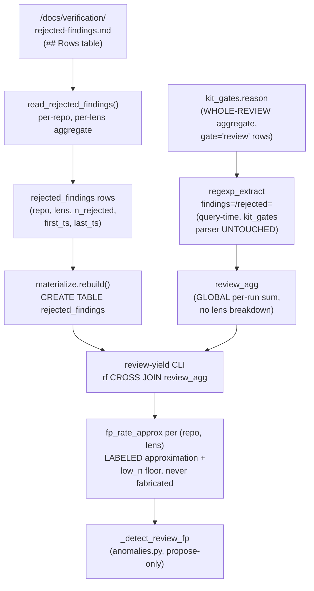

# Spec: `rejected_findings` adapter + `review-yield` FP-rate query (gate-review-absorptions mega-goal, SG-04)

Generated: 2026-07-04
Status: VALIDATED
Lane: full (lane-classify.sh returned `full`; goal file names this design-bearing: over-test
required because "a wrong FP-rate would mis-price review lenses and steer gate-attention
decisions")
Depends-on: gate-review-absorptions sub-goal 02 (dwarves-kit PR #173, MERGED), which shipped the
`docs/verification/rejected-findings.md` file format and the `findings=<K> [suppressed=<S>]
rejected=<M> actor=<name>` gate-ledger emit grammar this sub-goal reads. Builds on the shipped
`tools/ledger-observatory/` package (SPEC-126..136, all merged on `main`), reusing its exact
single-sourced-schema / skip-safe-adapter / read-only-query conventions.

## Problem

The gate-review-absorptions mega-goal gives review lenses a memory (02: a per-repo
`rejected-findings.md` ledger a human appends to when they reject a finding as by-design /
false-positive / won't-fix) and an emit (`findings=/rejected=` KVs inside the `review` gate's
`kit_gates.reason` string). Neither one, on its own, answers the actual operating question: does
a given review LENS (security / architecture / test-coverage / advisor / stale-adr / ...) earn its
attention budget, or does it mostly generate findings a human throws away? Today that is a hand
read of two unrelated files; there is no query.

## Solution

### Approaches considered

1. **New `rejected_findings` table (numbers-only) + a `review-yield` CLI query that regex-extracts
   `findings=`/`rejected=` out of `kit_gates.reason` at query time (CHOSEN).** Matches the exact
   precedent `gate-yield` (SPEC-131) and `defect-correlation`/`deviation-rate` (SPEC-132/133) set:
   `kit_gates`'s own parser is never touched (SPEC-131's grammar is a `| GATE | <phase> |
   ran/skipped/override | <reason> |` line; the `review` phase's reason field is free text to
   that parser, and 02's KV grammar lives entirely inside it), a NEW adapter reads a NEW source
   (the rejected-findings ledger files) with its own schema, and the correlation between the two
   happens at query time via SQL, exactly like `defect-correlation` bridges `kit_gates` to
   `git_fixes`.
2. **Add a `lens`/`findings`/`rejected` column to `kit_gates` itself, parsed out of `reason` at
   materialize time.** Rejected: out of scope per the goal file ("kit_gates' parser stays
   UNTOUCHED") and the ground truth this sub-goal is built on -- the `review` gate's emit is a
   WHOLE-REVIEW aggregate (one call per review run, not one per lens), so there is no per-lens
   value to put in a per-line table; adding empty lens/findings/rejected columns to every OTHER
   gate's rows (build/spec/ship/...) would be schema noise for a fact only one gate ever carries.
3. **Wait for a future per-lens emit before building the query.** Rejected: the goal file
   explicitly calls the per-run denominator an accepted, LABELED approximation for v1 ("a
   lens-level emit is a NAMED follow-on, not this sub-goal"), matching the same "ship a correct
   reader over what exists today" precedent `kit-gates-lens` (SPEC-131) set for the 100%-NULL
   `caught` column before its emitter existed.

### Chosen approach + why

Approach 1. No change to `kit_gates`'s schema or parser (already correct, already merged), a new
adapter following the exact schema.py/adapters.py pattern every other table already uses, and a
query-time bridge that mirrors `defect-correlation`'s own rid-to-git bridging technique (extract a
signal from a free-text field via regex/string match, never re-architect the upstream table).

### Extensibility & boundaries

- If a future per-lens emit lands (the named follow-on), `review-yield`'s query gains a real
  per-lens denominator with no schema change to `rejected_findings` -- only the SQL's `raised`
  computation changes from a global aggregate to a per-lens one.
- The `review_fp` anomaly (part c) reads `review-yield`'s own aggregation shape but is not
  `review-yield` itself; it is a NEW detector appended to `anomalies.DETECTORS`, following the
  exact `_detect_ceremony`/`_detect_memory_hygiene` shape (thresholds, honest-empty on thin data,
  propose-never-autofile).
- Unit boundary: this sub-goal owns `rejected_findings` + `review-yield` + the one `review_fp`
  detector. It does not touch `kit_gates`, `commands/review.md`/`review-team.md` (02's territory,
  already merged), or `03`'s plannotator wrapper.

## Design

New table (`rejected_findings`), new adapter function (`adapters.read_rejected_findings`), new
CLI command (`review-yield`), one new anomaly detector (`_detect_review_fp`), zero changes to any
existing table's schema or parser.



The non-obvious part: `rejected_findings` carries a real per-(repo, lens) numerator, but
`kit_gates` carries NO lens or repo column at all (SPEC-131's `kit_gates` is a single, global,
per-line table; a `review` gate's `reason` names no lens explicitly, only aggregate counts). The
query therefore joins a per-lens fact against a GLOBAL per-run fact -- an approximation, not a true
per-lens rate -- and every output row says so via a constant `approx` column plus per-row
`low_n` labeling, never presented as more precise than it is.

## Technical Design

### Interfaces (I/O contract)

- Inputs / consumes: `<repo>/docs/verification/rejected-findings.md` for each `repo` in
  `config.rejected_findings_repos()` (env `LEDGER_OBS_REPOS`, a comma-separated list of repo root
  paths); `kit_gates.reason` (already materialized by SPEC-131, read via the SAME
  `materialize.query()` path, never a new DuckDB connection).
- Outputs / produces: a `rejected_findings` DuckDB table (columns: `repo, lens, n_rejected,
  first_ts, last_ts`); a `ledger review-yield [--min-n N] [--json|--table]` CLI command producing
  one row per (repo, lens) with the FP-rate approximation; one new `anomalies.py` detector,
  `_detect_review_fp`, wired into the existing `DETECTORS` tuple and `--propose` path.
- Invariants: read-only (adapter only ever opens the ledger files with `Path.read_text`, never
  writes; the query goes through the existing `materialize.query()` guard); `rejected_findings` is
  rebuilt from scratch on every `rebuild()` (delete-and-rematerialize, unchanged contract); a
  repo whose `rejected-findings.md` does not exist contributes ZERO rows (never a fabricated
  0-rejected placeholder row for a lens that was never actually rejected); a malformed row (wrong
  column count, non-`rejected` verdict, unparseable date) is skipped with a counted warning, never
  raises, never silently miscounts a well-formed sibling row; `review-yield`'s FP-rate is `NULL`
  (never `0.0`) when the run-level `raised` denominator is `0`, and the query returns ZERO rows
  (never a fabricated all-NULL row) when `rejected_findings` itself has zero rows.

### Data model changes

New table `rejected_findings`, single-sourced via a new `schemas.REJECTED_FINDINGS_SCHEMA` entry
(the same `(name, type)` list pattern every other table already uses):

```
REJECTED_FINDINGS_SCHEMA = [
    ("repo", "VARCHAR"), ("lens", "VARCHAR"), ("n_rejected", "INTEGER"),
    ("first_ts", "VARCHAR"), ("last_ts", "VARCHAR"),
]
```

One row per (repo, lens) pair that has at least one `rejected` verdict row in that repo's ledger
file. `first_ts`/`last_ts` are the min/max `date` cell among that pair's rows (ISO8601
`YYYY-MM-DD`, lexicographically sortable, same convention `impl_notes`/`learned` already use).
NUMBERS ONLY: `finding-key` and `reason` cells are read only to validate a row's shape (5 cells,
`verdict == rejected`); neither is ever stored in a returned field or column (the contract the
goal file states verbatim: "finding TEXT stays in the repo file").

### API changes

New CLI command `review-yield` (`cli.py`), `--min-n` (default 5, a named dual floor: a
(repo, lens) row is `low_n` when either its own `n_rejected` OR the global `raised` denominator is
under this count) and `--json` (default) / `--table`, the same `_emit()` formatter every other
command uses. One new `anomalies.py` detector, `_detect_review_fp` (thresholds
`review_fp_min_n`=5.0, `review_fp_rate_max`=0.5), appended to `DETECTORS`; inherits `--propose`
for free (the existing stager is detector-agnostic). No change to `rebuild`/`tables`/`show`/
`query`/`render`/`gate-yield`/`defect-correlation`/`deviation-rate`/`memory-sweep`/`digest`.

### Multi-repo source decision (goal file's stated sub-decision)

**Chosen: `LEDGER_OBS_REPOS`, a new dedicated env var (comma-separated list of repo root paths),
NOT a reuse of `_meta/boards.txt`.**

Why not `_meta/boards.txt`: that registry names paths to each repo's `BACKLOG.md`, not repo
roots, and the nesting is inconsistent across its own rows -- `ops-toolkit` and `family-office` and
`dfoundation` point at `_meta/BACKLOG.md` (repo root = two parents up), while `books`, `neko`,
`trading`, `dwarves-kit`, `console-labs`, `properties`, `hedgenotes`, `fromwu`, `webuild` point at
a bare `BACKLOG.md` (repo root = one parent up). Deriving a repo root generically from that file
would need per-row special-casing baked into this tool, coupling a domain-agnostic observatory
adapter to ops-toolkit's own kanban-registry file shape. It also drags in every registered repo
(14+ as of this writing) when `review-yield`'s real scope is the two repos gate-review-absorptions
actually touches.

Why `LEDGER_OBS_REPOS`: it matches the tool's OWN existing convention exactly --
`LEDGER_OBS_GIT_REPO_DIR` / `LEDGER_OBS_MEMORY_REPO_DIR` are each a dedicated, single-purpose env
knob per adapter (see `config.py`'s own doc-comments: "a SEPARATE env knob, so isolating one
source in a test never silently isolates the other"). The one difference from those two knobs is
cardinality: `rejected_findings` is this tool's FIRST genuinely multi-repo-in-one-materialization
adapter (every other repo-scoped adapter is single-repo-per-run, overridden per invocation), a
deliberate exception because a cross-repo FP-rate comparison is the whole point of this sub-goal
-- named explicitly as a "stated sub-decision, not an on-the-fly call" in the goal file. Default:
`~/workspace/<owner>/ops-toolkit,~/workspace/<owner>/dwarves-kit` (the two repos gate-review-
absorptions actually produced ledger files in as of this writing).

### Infrastructure changes

None.

## Task Breakdown

### Phase 1: Foundation
- [x] TASK-001: `schemas.REJECTED_FINDINGS_SCHEMA` (5-column spec) + `config.rejected_findings_repos()`
  (parses `LEDGER_OBS_REPOS`). Acceptance:
  `schemas.column_names(schemas.REJECTED_FINDINGS_SCHEMA) == ["repo","lens","n_rejected","first_ts","last_ts"]`;
  `config.rejected_findings_repos()` returns the 2-element default list when the env var is unset.
- [x] TASK-002: `adapters.read_rejected_findings(repos=None)`: for each repo, reads
  `docs/verification/rejected-findings.md`, parses ONLY the `## Rows` heading's table (never the
  `## Format` section's template row), aggregates per (repo, lens): count + min/max date. Skip-safe
  on a missing file per repo (contributes zero rows, never an error); tolerant of a malformed row
  (wrong cell count, non-`rejected` verdict, unparseable date -- each skipped with a counted
  stderr warning, never raises, never miscounts a well-formed sibling). Acceptance: golden-fixture
  (TASK-004).

### Phase 2: Core
- [x] TASK-003: `materialize.py`: `_REJECTED_FINDINGS_DDL = schemas.ddl(...)`; wire
  `rejected_findings` into `rebuild()`'s load loop + row-count return; `SHOW_ORDER["rejected_findings"]
  = "repo, lens"`. Acceptance: `uv run ledger rebuild` JSON includes a `"rejected_findings"` key;
  `uv run ledger tables` lists it.
- [x] TASK-004: `tests/test-review-yield.sh`: a golden fixture (2+ fixture repos with known
  rejected-findings.md content incl. a malformed row + a non-`rejected`-verdict row + a
  high-n lens; a committed kit_gates fixture ledger dir with known `findings=/rejected=` review
  lines incl. a `suppressed=` token that must NOT be added into `raised`, a skipped review row
  that must NOT be counted, and a non-review gate row that must never leak in) asserting EXACT
  `review-yield` numbers per (repo, lens). Includes the load-bearing honest-zero NC (deliberate
  source-edit break + restore, red -> green) and the division-by-zero guard (a second kit_gates
  state with zero review rows -> every `fp_rate_approx` is `NULL`, never `0.0`). Acceptance:
  `bash tests/test-review-yield.sh` exits 0; the honest-zero NC section is present and shows a
  real red run followed by a real green run.
- [x] TASK-005: `cli.py`: `review-yield` command via `materialize.query()` (no new duckdb import).
  Acceptance: `uv run ledger review-yield --json` returns the golden fixture's exact numbers
  (covered by TASK-004).
- [x] TASK-006: `anomalies.py`: `_detect_review_fp` + `review_fp_min_n`/`review_fp_rate_max` in
  `DEFAULTS`, appended to `DETECTORS`. Acceptance: fires on the golden fixture's high-n lens
  (fp_rate_approx=1.0 >= threshold) via `ledger anomalies --json`; `--propose` stages it into the
  cc-backlog staging buffer only, never the board (reuses the existing generic stager, no new
  write path).

### Phase 3: Polish
- [x] TASK-007: Over-test pass beyond the golden fixture's happy path: a repo entirely absent
  from `docs/verification/` (skip-safe empty contribution), a repo present in `LEDGER_OBS_REPOS`
  but with zero rows in its `## Rows` table (parses fine, contributes zero (repo,lens) rows), a
  `suppressed=` token that must never contribute to `raised`. Record a COVERAGE-DELTA line in the
  canonical proof. Acceptance: COVERAGE-DELTA line present in `docs/proof-of-done.md`'s
  `review-yield-lens` feature row detail.
- [x] TASK-008: Materialize the real corpus (both `ops-toolkit` and `dwarves-kit`) as the first
  real `review-yield` run-table row, honestly labeling any low-n result. Acceptance: a captured
  real 2-repo run in the proof.
- [x] TASK-009: `docs/proof-of-done.md` new feature row (`review-yield-lens`, gate-review-
  absorptions SG-04, this spec) + `docs/verification/review-yield-lens.md` detail file (per-feature,
  does not touch any existing feature row/file). Commit, push, open PR against
  `feat/plannotator-gate-trial`, flip the mega-goal ROADMAP box, overwrite HANDOFF.md, append
  DECISIONS.md. Acceptance: PR open, ROADMAP/HANDOFF/DECISIONS updated + committed on the branch,
  CI green.

## After state

- [x] `rejected_findings` exists as a materialized table, one row per (repo, lens) pair with
  `>= 1` rejected finding across every repo named in `LEDGER_OBS_REPOS`. (Today: no such table.)
- [x] `ledger review-yield [--min-n N] [--json|--table]` returns per-(repo, lens) `n_rejected`,
  the review gate's existing `ran`/`caught` catch data, the global `raised` denominator, a labeled
  `approx` FP-rate, and a `low_n` flag. (Today: no such command; the FP-rate question is a hand
  read of two unrelated files.)
- [x] The honest-zero NC (zero ledger files + zero review emits -> zero rows, never a crash, never
  a fabricated rate) is asserted in a committed test, proven load-bearing by a deliberate
  source-edit break + restore (red -> green captured).
- [x] The real corpus (both repos) is materialized once and its `review-yield` numbers captured,
  honestly labeled low-n.
- [x] A COVERAGE-DELTA row is committed in the canonical proof.

## Acceptance Criteria (global)
- [x] All tasks pass their individual acceptance criteria.
- [x] `bash tests/test-schema-parity.sh && bash tests/test-gate-yield.sh && bash
  tests/test-review-yield.sh` all exit 0 (no regression to the existing suites + the new one
  green).
- [x] No existing `verification/*`/`docs/specs/*` file for any earlier sub-goal is modified.

## Verification

```bash
cd tools/ledger-observatory
uv sync
uv run ledger rebuild
uv run ledger tables
bash tests/test-schema-parity.sh
bash tests/test-gate-yield.sh
bash tests/test-review-yield.sh
```

## Edge Cases
1. A repo named in `LEDGER_OBS_REPOS` whose `docs/verification/rejected-findings.md` does not
   exist: contributes zero rows, never an exception, never a fabricated 0-rejected row for a lens
   that never actually appeared.
2. A `## Rows` table row with fewer than 5 pipe-delimited cells: skipped, counted, never raises,
   never fabricates a lens/date from partial data.
3. A row whose `verdict` cell is not (case-insensitively) `rejected`: skipped, counted (the file's
   own contract says only human rejections ever append a row here; a different verdict is
   unexpected, not silently trusted).
4. A row whose `date` cell is not `YYYY-MM-DD`: skipped, counted, never crashes the whole file's
   parse.
5. `kit_gates` has zero `gate='review'` rows with `outcome IN ('ran','override')` (a fresh
   install, or a repo that has never run review yet): `raised` is `0`; every `fp_rate_approx` in
   the output is `NULL` (never `0.0`), and `low_n` is `TRUE` for every row (the `raised < min_n`
   floor).
6. `rejected_findings` has zero rows entirely (no repo in `LEDGER_OBS_REPOS` has ever logged a
   rejection): `review-yield` returns ZERO rows (never a fabricated all-NULL placeholder row),
   regardless of how much `kit_gates` review activity exists.
7. A `review` gate's `reason` carries `suppressed=<S>` (SPEC-081's auto-suppression axis):
   `suppressed` is never extracted into `raised`; only `findings=`/`rejected=` contribute.
8. A `review` gate row whose `reason` carries no `findings=`/`rejected=` token at all (every real
   review line recorded before 02 shipped its grammar): `try_cast(...)` returns `NULL`,
   `COALESCE`d to `0` at the sum, never a cast exception.
9. A (repo, lens) pair whose `n_rejected` exceeds the global `raised` denominator (a real,
   expected consequence of the numerator being per-lens-cumulative and the denominator being
   per-run-global, not a bug): `fp_rate_approx` reports the resulting value (which can exceed
   `1.0`) exactly, never clamped, never hidden.

## Failure modes

| Failure class | Detection signal | Mitigation / recovery |
|---|---|---|
| Honest-zero NC written vacuously (a query that fabricates a row from empty inputs, silently) | golden-fixture assertion checks for EXACTLY zero rows on the empty-input state, not just "the command ran without error" | required as TASK-004 acceptance; a deliberate source-edit break (change the join direction + the `NULL` branch to `0.0`) documented red -> green in the proof |
| `suppressed=` leaking into the FP-rate numerator or denominator | golden fixture includes a `suppressed=1` token on a review row and asserts the resulting `raised` excludes it | TASK-004 fixture row; edge case 7 |
| Parser crashes on a malformed real-world ledger row instead of tolerating it | TASK-007 over-test feeds a missing-file repo, a zero-row repo, and a malformed-cell row directly at `read_rejected_findings` | acceptance requires all 3 classes to return rows (or an empty list) plus a counted skip, never raise |
| `rejected_findings` schema drifts from its DDL the same way the original `KIT_SCHEMA` bug did | `schemas.assert_parity` runs at load time (same guard `test-schema-parity.sh` already proves is wired) | belt-and-suspenders; TASK-003 wires the SAME call site pattern every other Python-sourced table already uses |

## Out of Scope
- A per-lens emit inside `kit_gates.reason` (a NAMED follow-on per the goal file; today's
  denominator is a deliberate, labeled approximation).
- Any change to `commands/review.md`/`review-team.md`/`advisor.md` or the rejected-findings ledger
  FILE FORMAT (02's territory, already merged).
- Dashboarding (goal file's explicit "Out").
- Auto-filing a backlog row from the `review_fp` anomaly (propose-only, same as every other
  detector in this file).
- A second schema-definition mechanism; `rejected_findings` uses the exact same `schemas.py`
  pattern as every other table.

## Touches
tools/ledger-observatory/**

## Decision Log
- DEC-001: `LEDGER_OBS_REPOS` (a new dedicated env var, comma-separated repo roots) chosen over
  reusing `_meta/boards.txt`, because that registry's paths point at each repo's `BACKLOG.md` at
  an inconsistent nesting depth across its own rows, making a generic repo-root derivation
  unreliable, and because a dedicated env var matches this tool's own established
  one-knob-per-adapter convention (`LEDGER_OBS_GIT_REPO_DIR`/`LEDGER_OBS_MEMORY_REPO_DIR`). See
  "Multi-repo source decision" above for the full reasoning.
- DEC-002: `rejected_findings`'s numerator (per repo, per lens) is joined against a GLOBAL
  `raised` denominator (summed across ALL `gate='review'` `kit_gates` rows, not broken down by
  lens), because `kit_gates` carries no lens or repo column in v1 (SPEC-131's table is a single
  global per-line table; the `review` gate's reason names no lens). This is a deliberate,
  documented approximation (per-lens numerator over a per-run denominator), surfaced via a
  constant `approx` column in every `review-yield` row, never silently presented as an exact
  per-lens rate.
- DEC-003: `suppressed=<S>` (SPEC-081's confidence-gate auto-suppression) is read by neither the
  `review-yield` query nor the `review_fp` anomaly detector; only `findings=`/`rejected=` ever
  contribute to `raised`. Per the goal file: suppression is a DIFFERENT axis (an automated
  confidence gate) from a human's `rejected=` decision, and mixing the two into one FP-rate would
  conflate "the tool didn't surface this" with "a human looked at it and said no".
- DEC-004: `fp_rate_approx` is never clamped to `[0, 1]`. A (repo, lens) pair's cumulative
  historical `n_rejected` can legitimately exceed the current `raised` window's total (a
  numerator/denominator time-scope mismatch inherent to DEC-002's approximation), and reporting
  the resulting `> 1.0` value honestly is the same "honest-negative" discipline `gate-yield`'s
  FP-NC already established for a legitimately-skipped gate: report the real number, never
  filter it to look tidier.
- DEC-005: spec-validate self-review (2026-07-04), 6-lens pass over this design before code:
  - Security/injection lens: no auth/secret surface; the only "untrusted input" is markdown table
    cell text read from repo-local files this tool's own operator controls, never interpolated
    into SQL (the `--min-n` integer is the only value ever spliced into the SQL string, and it is
    typed `int` by typer before the f-string ever sees it, so it cannot carry SQL text). No
    finding.
  - Failure-mode lens: the honest-zero and division-by-zero paths were under-specified in the
    first draft (which only said "never fabricate a rate" without naming which branch of the
    query produces zero rows vs. `NULL`). Fixed: Edge Cases 5/6 now name the exact mechanism (an
    aggregate-with-COALESCE always yields 1 row, so the JOIN's DRIVING side, `rejected_findings`,
    is what must be empty for zero output rows -- pinned in "Design" and in the deliberate-break
    plan in Failure modes).
  - Assumption lens: the draft assumed `_meta/boards.txt` reuse was viable without checking its
    actual path shapes; verified live (checked all 14 registered rows) before writing DEC-001 --
    the inconsistency claim is a confirmed fact, not a guess.
  - Scope lens: confirmed this sub-goal touches only `tools/ledger-observatory/**`; no dwarves-kit
    file, no `commands/review*.md`, no change to `kit_gates`'s schema or parser.
  - Solution-design lens: confirmed the query-time regex-extraction approach mirrors
    `defect-correlation`'s existing rid-to-git bridge exactly (extract from free text via SQL,
    never re-architect the upstream table) rather than inventing a fourth bridging convention.
  - Design-record lens: added the `## Design` section with a mermaid flowchart (this file) before
    flipping Status to VALIDATED, matching SPEC-131's own DEC-004 precedent for this exact
    reviewer.
- DEC-006: finished-diff review (`kit:code-reviewer`, 2026-07-04) found `anomalies.parse_thresholds`
  accepted non-finite (`nan`/`inf`) values, which `_detect_review_fp` -- the first detector to
  interpolate a threshold VALUE (not a Typer-`int`-typed CLI option) directly into SQL text --
  would then splice unvalidated into its query. Not an injection (a `float()`-cast value cannot
  carry SQL metacharacters), but a confusing DuckDB parse error instead of a clean CLI rejection.
  Fixed with a `math.isfinite` guard in `parse_thresholds` (applies to every threshold key, since
  the function is shared infra my new detector is the first to expose to this input shape), plus
  3 new test assertions (`T-nonfinite`, suite grew 36 -> 39). No other CRITICAL/MAJOR findings
  (score 9/10); full detail in `docs/verification/review-yield-lens.md`'s `## Review` section.

## Amendments
(none)

## Review
Self-review via a 6-lens spec-validate pass, 2026-07-04 (DEC-005). Verdict: APPROVED after the
Design-record lens's flowchart addition. Status flipped DRAFT -> VALIDATED. A second,
finished-diff review (`kit:code-reviewer`, security + architecture/correctness lens) is recorded
in `docs/verification/review-yield-lens.md`'s own `## Review` section per the repo's "a
draft-stage review and a finished-diff review catch different bug classes" precedent
(harness-observatory SG-04 DECISIONS.md): 9/10, no CRITICAL/MAJOR findings, one LOW finding
fixed (`parse_thresholds` non-finite-value guard, DEC-006 below).

## Open questions
(none)
