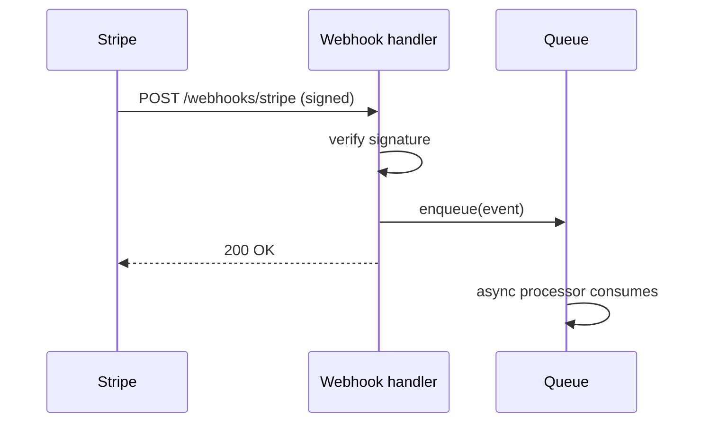

# Spec: fixture -- design-bearing spec with a FILLED Design block
Generated: 2026-07-03
Status: DRAFT
Lane: normal
Design-bearing (fixture declaration): yes

## Problem

Adds a brand-new webhook-ingestion component that receives Stripe payment events over a new
external integration, validates the signature, and enqueues them for async processing. This is
a new component, a new external integration, and an irreversible choice (the queue's message
schema), so it is design-bearing by every trigger in ADR-0031 §1.

## Solution

### Approaches considered
1. A synchronous handler that processes the webhook inline. Tradeoff: Stripe's retry timeout
   is tighter than our downstream processing time.
2. An async queue-backed handler: validate + enqueue, process later. Tradeoff: adds a queue
   dependency but decouples Stripe's timeout from our processing time. Chosen.

### Chosen approach + why
Approach 2, because Stripe's webhook timeout is shorter than our worst-case processing time.

### Extensibility & boundaries
- Load-bearing dimension: event volume. The queue absorbs bursts; a new event TYPE is a new
  handler, not a schema change.
- Unit boundaries: the signature-validation step and the enqueue step are independently
  testable.

### Architecture
See `## Design` below.

## Design

### Approaches considered + chosen
Same as `## Solution` above: approach 2 (async queue-backed handler), chosen because Stripe's
webhook timeout is tighter than worst-case downstream processing time.

### Diagram (pick by fit, mermaid-first)

### ADR link(s)
Fixture only -- would link `docs/decisions/0031-understanding-gate.md` in a real spec.

### Boundaries & failure modes
| Failure class | Detection signal | Mitigation / recovery |
|---|---|---|
| Invalid signature | 400 response, no enqueue | Stripe's own retry/backoff; alert on rate spike |
| Queue unavailable | enqueue raises | 500 to Stripe, triggers Stripe's built-in retry |

## Technical Design

### Interfaces (I/O contract)
- Consumes: Stripe webhook POST body + signature header.
- Produces: a queued message for the async processor.

## After state
- [ ] Webhook events are validated and enqueued instead of processed inline.

## Acceptance Criteria (global)
- [ ] All tasks pass their individual acceptance criteria

## Verification
`echo fixture-only, no real command`

## Edge Cases
1. An invalid Stripe signature is rejected with a 400, never enqueued.

## Out of Scope
- Nothing; this is a test fixture for `tests/test-design-record.sh`, not a real spec.

## Decision Log
- DEC-001: fixture only.

## Open questions
(none)
