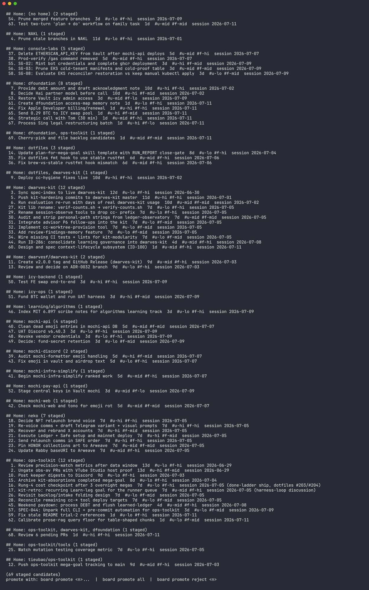

# Proof of done: SPEC-196 staging drain (harness-loop SG-06)

Date: 2026-07-12. Branch `feat/loop-06-staging-drain` (stacked on
`feat/loop-04-surface-consol`). Worktree
`.claude/worktrees/agent-a3610fdd7b8e413db`. Gate ledger rid `loop-06-staging-drain`
(lane `full`, think/design/design-critique/design-record recorded SKIPPED per the goal
file's `Design: obvious` line).

Rollback: `git revert` the branch's commits. Pure addition (two new files, one 3-line
`learn.sh` case-arm edit, one narrowed NC in `test-bin-forwarders.sh`); no schema, no
state migration, no write path touched besides the new expiry relabel.

## (a) render, real-shaped data (rung 2 proof)

Captured against a **copy** of the real 69-candidate
`~/workspace/tieubao/ops-toolkit/_meta/backlog-staging.md` -- the live file was never
opened for writing (confirmed: `diff` against the live file both before and after this
run is empty; every Source date on the live corpus today is < 30d old, so no expiry
fires on it and none is expected).

```
Command: cp ~/workspace/tieubao/ops-toolkit/_meta/backlog-staging.md <copy>
         BACKLOG_STAGE_STAGING=<copy> bash bin/learn drain
Exit: 0
Output: 20 Home groups, 69 candidates, oldest-first within each group, numbered 1-69
        over the staged subset (matches board promote's own numbering, see (b))
```

Raw text: `docs/verification/fixtures/loop-06-staging-drain/drain-render-real-shaped.txt`
(committed, 115 lines).

Freeze-PNG:



## (b) numbering-parity NC: drain's index == board promote's index

`test-learn-drain.sh` AC2 asserts this on a fixture; spot-checked directly against the
real 69-candidate copy too:

```
Command: BACKLOG_STAGE_STAGING=<copy> bash bin/learn drain | grep 'Sync spec-index'
Output:    3. Sync spec-index to live dwarves-kit  12d  #u-lo #f-hi  session 2026-06-30
Command: BACKLOG_STAGE_STAGING=<copy> BACKLOG_STAGE_BACKLOG=<copy-backlog> \
         python3 lib/board/bin/add-backlog list | sed -n '3p;4p;60p;63p;69p'
Output: 3. Sync spec-index to live dwarves-kit
        4. Prune stale branches in NAKL
        60. Design and spec context-lifecycle subsystem (ID-100)
        63. Test two-turn 'plan → do' workflow on family task
        69. Cherry-pick and file backlog candidates
```

Every index drain prints for a candidate matches the index `board promote` prints for
the same candidate on the same file. `board promote <n>` is always safe to run on a
number `learn drain` just showed.

## (c) NEGATIVE CONTROL: expiry (31d expires, 5d does not)

Fixture: `docs/verification/fixtures/loop-06-staging-drain/expiry-before.md` (2 rows: one
Source 31 days old, one 5 days old, both `[staged]`).

```
Command: BACKLOG_STAGE_STAGING=<fixture> bash bin/learn drain
Exit: 0
Output: ## Home: repo-b (1 staged)
          1. Recent candidate inside the window  6d  #u-lo #f-hi  session <5d-date>

        (1 staged candidate)
        promote with: board promote <n>...  |  board promote all  |  board promote reject <n>

        1 candidate staged >30d moved to [expired] (never deleted).
```

Post-run file: `docs/verification/fixtures/loop-06-staging-drain/expiry-after.md`.
`expiry-drain-stdout.txt` captures the exact stdout above.

## (d) NEGATIVE CONTROL: move-not-delete (byte-diff)

`docs/verification/fixtures/loop-06-staging-drain/expiry-bytediff.patch` (`diff -u`
before -> after):

```diff
@@ -2,7 +2,7 @@

 Candidates auto-extracted from sessions. Review + promote by hand.

-## [staged] Old candidate past the window
+## [expired] Old candidate past the window
 - Intent: do the old thing
 - Approach: just do it
 - Tags: #u-hi #f-mid
```

Exactly one line pair changed across the whole file: the bracket token on the expired
block's header, `staged` -> `expired`. The title, every field, the second (still-staged)
block, and every byte of surrounding markdown are untouched. Nothing is deleted --
`test-learn-drain.sh` AC4c additionally asserts programmatically that every original body
line is still present somewhere in the post-run file.

## (e) NEGATIVE CONTROL: idempotency

```
Command: (re-run bin/learn drain on the same, already-drained fixture)
Result:  diff -q <after-first-drain> <after-second-drain>  ->  identical (exit 0, no diff output)
```

A second immediate run changes nothing: the expired block no longer matches
`state == "staged"`, so `expire_stale` skips it (confirmed also as `test-learn-drain.sh`
AC5).

## (f) NEGATIVE CONTROL: promote-unchanged (add-backlog untouched)

`lib/board/bin/add-backlog` received **zero code changes**. Its existing
`state == "staged"` filter already excludes `[expired]` rows:

```
Command: bash tests/test-learn-drain.sh   (AC6a-d)
  PASS AC6a expired candidate absent from board promote's numbered list
  PASS AC6b remaining staged candidate still listed
  PASS AC6c board promote still promotes the first remaining staged candidate
  PASS AC6d the promoted candidate is the recent one, not the expired one
```

## (g) `--days` override (AC7)

```
Command: (fixture: one [staged] row, Source 5 days old) bin/learn drain --days 3
Result:  the 5d row moves to [expired] under a 3-day window (default 30d would leave it
         staged) -- confirms the window is a real, overridable parameter, not hardcoded.
```

## (h) honest-empty (AC8)

```
Command: BACKLOG_STAGE_STAGING=<nonexistent path> bin/learn drain
Exit: 0
Output: no staging file (<path>); nothing staged.
File:   never created (the read-only path never touches disk)
```

## Full suites

```
Command: bash tests/test-learn-drain.sh          -> TOTAL: 23  PASS: 23  FAIL: 0
Command: bash tests/test-bin-forwarders.sh        -> all 30 passed, 0 skipped
Command: bash tests/test-weekend-batch.sh         -> TOTAL: 45  PASS: 45  FAIL: 0  SKIP: 0
Command: bash tests/test-hooks.sh                 -> Passed: 453 / 453
Command: bash tests/test-meta.sh                  -> Passed: 683 / 683
Command: bash tests/test-docs-wiring.sh           -> 22/22 passed
Command: bash tests/test-e2e.sh                   -> Passed: 20 / 20, Golden run green
Command: bash tests/test-tier4-close.sh           -> ALL PASS
Command: all 48 CI-listed tests/test-*.sh          -> 48/48 PASS, 0 FAIL
```

## Deviations from a strict reading of the file fence

`lib/learn/learn.sh` (the `drain)` case arm + usage comment) and
`tests/test-bin-forwarders.sh` (the `learn drain` NC block only) were edited despite not
literally matching the `drain*`/`staging-format*` glob. Both are line-disjoint from
SG-05's corresponding edits in the same two files (its `propose)` arm and `learn propose`
NC block). Full reasoning: `docs/implementation-notes/loop-06-staging-drain.md`,
2026-07-12 05:20 entry.

## Review

Not yet run (this PR is opened for lead review per the mega-goal's stacked-PR contract;
it reviews after SG-04).
