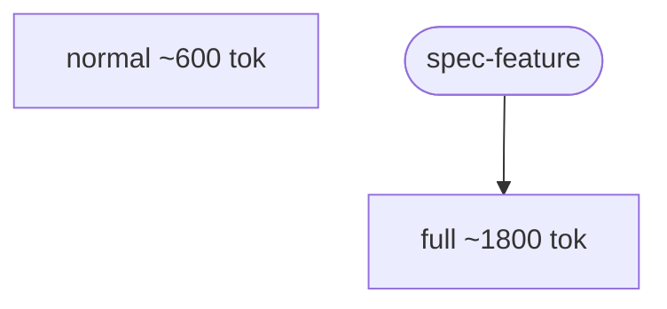

# Proof of done: token accounting + efficiency metrics (SPEC-110, kit-face wave)

Capture-gated runs now record a durable TOKENS ledger line and `lane-telemetry` surfaces per-lane
token efficiency; the default `claude -p` path is byte-unchanged and honestly reports `usage=?`.

## Acceptance criteria

| # | Criterion | Result |
|---|---|---|
| 1 | `gate-ledger tokens <rid> ...` writes a sanitized `| TOKENS |` line | PASS |
| 2 | The TOKENS marker is INVISIBLE to gate enforcement (check() still PASSES with it present) | PASS |
| 3 | `handoff_gen sum-usage` sums ASSISTANT-only usage from a stream-json capture | PASS |
| 4 | NEGATIVE CONTROL: a `type:"result"` cumulative-usage line is NOT double-counted | PASS |
| 5 | WIRING: a real orchestrate CAPTURE run CALLS `gate-ledger tokens` (TOKENS line with the run's sum) | PASS |
| 6 | NEGATIVE CONTROL: the default no-capture path writes NO TOKENS line (`usage=?`, never fake zero) | PASS |
| 7 | `lane-telemetry report` token section: median tokens-to-done/lane, cache %, run-granularity rework % | PASS |
| 8 | `report` shows `usage=?` for uncaptured runs (excluded from medians, not zero-filled) | PASS |
| 9 | `render --mermaid` annotates each lane node with median tokens; ASCII `render` byte-unchanged | PASS |
| 10 | SPEC-087 default-invocation pin intact; no thresholds (5-run baseline note) | PASS |
| 11 | All 12 CI suites green | PASS |

## Implementation

- `lib/gate-ledger.sh`: `tokens()` verb + dispatch case (sanitized, `| TOKENS |` marker,
  gate-invisible by the `$2=="GATE"` reader filter).
- `lib/handoff/handoff_gen.py`: `sum_usage()` + `sum-usage <transcript>` CLI (assistant-only via
  `cc._is_assistant`; existing `handoff_gen.py <transcript> --dir ...` interface unchanged).
- `lib/orchestrate.sh`: `_rid_for` shared helper (factored from `_emit_start`); capture-gated
  post-session token hook (`$slog` non-empty -> `sum-usage` -> `gate-ledger tokens`); default path
  untouched.
- `lib/lane-telemetry.sh`: `_token_agg` (rid->lane join, portable insertion-sort median, cache eff,
  rework share); `report` token section; `render --mermaid` mode (single-line median map; sanitized
  mermaid IDs).
- `tests/fixtures/handoff-det/usage-with-result.jsonl` (result-line NC).

## Confirmation run-table

| Case | Command | Expected | Observed |
|---|---|---|---|
| tokens verb + cost | `gate-ledger tokens trun in=1200 out=80 cache_read=4000 cache_create=0 cost=0.05` | TOKENS line, cost decimal kept | PASS (test-ledger-durability) |
| gate-invisible | `check normal trun` with a TOKENS line present | PASS (all gates ran) | PASS |
| sanitize | `tokens ... in=1,2ab out=-5 cache_read=x cache_create=9` | `in=12 out=5 cache_read=0 cache_create=9` | PASS |
| sum-usage seed | `handoff_gen.py sum-usage seed.jsonl` | `in=7200 out=480 cache_read=24000 cache_create=0` | PASS |
| result-line NC | `sum-usage usage-with-result.jsonl` | `in=100 out=10 cache_read=50 cache_create=0` (999999 ignored) | PASS |
| WIRING (capture run) | `DETERMINISTIC_HANDOFF=1 CLAUDE_CMD=claude-dh orchestrate run` (goal has **Branch:**) | TOKENS line w/ seed sum in `<rid>.log` | PASS |
| no-capture NC | default `orchestrate run` (no capture) | NO TOKENS line | PASS |
| report section | `lane-telemetry report` over a mixed corpus | per-lane med/cache/rework + `usage=?` | PASS |
| render mermaid | `lane-telemetry render --mermaid` | mermaid block, lane nodes annotated | PASS |
| render ASCII NC | `lane-telemetry render` (no flag) | ASCII, no mermaid block | PASS |
| all CI suites | 12 suites | green | all pass |

## Run detail (captured 2026-07-03)

```
$ python3 lib/handoff/handoff_gen.py sum-usage tests/fixtures/handoff-det/seed.jsonl
in=7200 out=480 cache_read=24000 cache_create=0
$ python3 lib/handoff/handoff_gen.py sum-usage tests/fixtures/handoff-det/usage-with-result.jsonl
in=100 out=10 cache_read=50 cache_create=0                     # result line's 999999 NOT summed

# report token section (mixed corpus: full x2, normal x1, bug x1, normal-no-tokens x1):
  token efficiency (4/5 runs captured; 1 usage=? [no stream capture]):
    lane            med-tok    cache
    bug                1000      71%
    full               1800      78%
    normal              600      66%
    rework share (bug-lane tokens / total, run-granularity v1): 19%

# render --mermaid:


# CI suites: test-hooks pass; e2e 20/20; review-team-plants pass; orchestrate ALL PASS (+4 SPEC-110);
# role-classify 15/15; lane-classify 23/23; lane-telemetry 25/25 (+7); mega-merge 30/30;
# ledger-durability 35/35 (+3); meta 603/603; meta-agent 72/72; proof-visual-evidence 4/4.
```

## Sidechain probe (goal item 6)

`isSidechain` is present on every stream-json entry; `usage` is per-assistant-message. Per-round /
per-subagent separation is therefore POSSIBLE (filter by `isSidechain`+`parentUuid`) but v1 sums all
assistant usage into the RUN total (run-granularity) by design. Per-round rework share = a viable
follow-up (mega NOTES), not an impossibility.

## Reproduce

```bash
cd dwarves-kit
python3 lib/handoff/handoff_gen.py sum-usage tests/fixtures/handoff-det/seed.jsonl
bash tests/test-orchestrate.sh && bash tests/test-lane-telemetry.sh && bash tests/test-ledger-durability.sh
```
